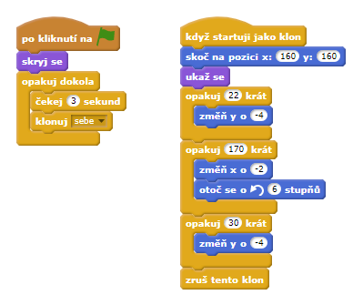
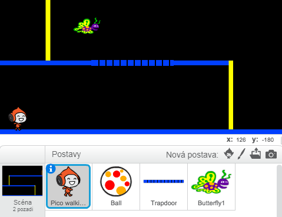
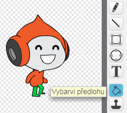

---
title: Dodgeball
level: Scratch 2
language: cs-CZ
stylesheet: scratch
embeds: "*.png"
materials: ["Club Leader Resources/*","Project Resources/*"]
...

# Úvod { .intro }

V tomto projektu se naučíš, jak vytvořit plošinovku, kde se musíš vyhýbat pohybujicím se míčům a dostat se až na konec levelu (úrovně).

<div class="scratch-preview">
  <iframe allowtransparency="true" width="485" height="402" src="http://scratch.mit.edu/projects/embed/39740618/?autostart=false" frameborder="0"></iframe>
  
</div>

# Krok 1: Pohyb postavy { .activity }

Nejdřív vytvoříme postavu která se může pohybovat doprava a doleva a která taky může šplhat po tyčích.

## Postup { .check }


+ Vytvoř nový projekt ve Scratchi a smaž kocoura tak, aby byl projekt prázdný. Webový scratch editor najdeš na <a href="http://jumpto.cc/scratch-new">jumpto.cc/scratch-new</a>.

+ Pro tento projekt bys měl mít složku 'Project Resources', kde bude obrázek s pozadím, který použiješ. Přesvědč si že víš kde tato složka je, pokud ne, zeptej se vedoucího.

	

+ Přidej obrázek 'background.png' jako nové pozadí scény, nebo si nakresli vlastní! Pokud budeš kreslit vlastní úroveň, ujisti se ze tyče a podlahy mají jiné barvy, a že tam jsou dveře (nebo něco jiného) kam musíš se svou postavičkou dojít. Takhle nějak by měl tvůj projekt vypadat:

	

+ Přidej novou postavu, která bude "panáček". Lepší je vybrat si postavu s více kostýmy, aby se dalo udělat, že postava zdánlivě chodí.

	

+  K pohybování panáčkem budeme používat šipky. Když hráč zmáčkne pravou šipku, chceš, aby se tvoje postava otočila doprava, posunula se o několik kroků a přepnula se do dalšího kostýmu:

```blocks
  po kliknutí na ⚑
  opakuj dokola
    když <klávesa [šipka vpravo v] stisknuta?> tak
      natoč se směrem (90 v)
      posuň se o (3) kroků
      další kostým
    end
  end
```
+ Vyzkoušej pohyb své postavy kliknutím na vlajku a pak podržením šipky doprava. Hýbe se panáček doprava? Vypadá to, jako že chodí?

	

+ Na pohyb postavy doleva, budeme potřebovat další `když` {.blockcontrol} blok uvnitř tvého cyklu `opakuj dokola` {.blockcontrol}, který to zařídí. Nezapomeň vyzkoušet svůj nový kód, aby ses ujistil, že funguje! Pokud se tvoje postava otočí vzhůru nohama ve chvíli, když jde doleva, přidej blok `nastav způsob otáčení` {.blockcontrol} nad blokem `opakuj dokola` {.blockcontrol}:

```blocks
  po kliknutí na ⚑
  nastav způsob otáčení na [jen vlevo-vpravo v]
  opakuj dokola
    když <klávesa [šipka vpravo v] stisknuta?> tak
      natoč se směrem (90 v)
      posuň se o (3) kroků
      další kostým
    end
  end
```

+ Pro šplhání po tyči se panášek musí pohnout maličko nahoru, když je zmáčknuta šipka nahoru a postava se dokýká správné barvy. Přidej tento kód dovnitř bloku `opakuj dokola` {.blockcontrol}:

```blocks
  když <<klávesa [šipka nahoru v] stisknuta?> a <dotýká se barvy [#FFFF00] ?>> tak
    změň y o (4)
  end
```
+ Vyzkoušej to - můžeš vyšplhat po žlutých tyčích a dostat se na konec úrovně?

	

## Ulož svůj projekt { .save }

## Výzva: Dokončení úrovně {.challenge}
Dokážeš přidat kód ke tvé postavě, aby nečo řekla, `když` {.blockcontrol} se dostane ke hnědým dveřím?


## Ulož svůj projekt { .save }

# Krok 2: Gravitace a skákání { .activity }

Uděláme pohyb postavy více realistický tím, že přidáme gravitaci a umožníme postavě skákat.

## Postup { .check }

+ Možná sis všiml že tvoje postava může chodit i mimo podlahy a zůstat ve vzduchu. Zkus vyjít stranou z podlahy a pozoruj co se stane.

	

+ Abychom to napravili, přidáme do hry gravitaci. Vytvoř novou proměnnou nazvanou `gravitace` {.blockdata}. Tuto proměnnou můžeš ze scény skrýt, pokud chceš.

	

+ Přidej následující nový blok kódu, který nastaví gravitaci na zápornou hodnotu, a pak použije tuto na změnu y-pozice tvé postavy.

```blocks
  po kliknutí na ⚑
  nastav [gravitace v] na [-4]
  opakuj dokola
    změň y o (gravitace)
  end
```

+ Klikni na vlajku, a pak přetáhni svou postavu na vršek tvé scény. Co se stane? Funguje gravitace, jak jsi očekával(a)?

	

+ Gravitace by neměla hýbat s postavou skrz podlahu nebo tyč! Přidej blok `když` {.blockcontrol} do kódu, aby gravitace fungovala, jen pokud bude postava ve vzduchu. Kód pro gravitaci by měl vypadat asi takto:

```blocks
  po kliknutí na ⚑
  nastav [gravitace v] na [-4]
  opakuj dokola
    když <není <<dotýká se barvy [#0000FF] ?> nebo <dotýká se barvy [#FFFF00] ?>>> tak
      změň y o (gravitace)
    end
  end
```

+ Vyzkoušej gravitaci znovu. Zastaví se pád postavy, když stojí na podlaze nebo se drží tyče? Vyzkoušej spadnout z kraje hodní podlahy a dopadnout na dolní, funguje to?

	

+ Pojďme taky zařídit, aby postava skočila když hráč zmáčkne mezerník. Velmi jednoduchý způsob, jak to zařídit je pohnout postavou několikrát nahoru pomocí takovéhoto kódu:

```blocks
  po stisku klávesy [mezerník v]
  opakuj (10) krát
    změň y o (4)
  end
```

  Protože gravitace stále tlačí postavu dolů o 4 pixely, musíš zvolit číslo větší než 4 ve bloku `změň y o (4)` {.blockmotion}. Změň toto číslo tak, aby jsi byl spokojený s tím, jak tvoje postava skáče.

+ Až budeš tento kód zkoušet, všimni si, že pohyb postavy není moc plynulý. Aby bylo skákání plynulejší, budeš muset hýbat postavou o čím dále menší počet pixelů, dokud se její pohyb nahoru zastaví.

+ Na to vytvoříme další proměnnou `výška skoku` {.blockdata}. Můžeš tuto proměnnou opět skrýt, pokud chceš.

+ Smaž kód skákání, který jsme přidali k postavě, a nahraď tímto kódem:

```blocks
  po stisku klávesy [mezerník v]
  nastav [výška skoku v] na [8]
  opakuj dokud nenastane <(výška skoku) = [0]>
    změň y o (výška skoku)
    změň [výška skoku v] o (-0.5)
  end
```

  Tento kód hýbe postavou o 8 pixelů, poté o 7,5 pixelů, poté 7 pixelů a tak dále, dokud postava neskončí skok. Toto pomůže aby byly skoky o hodně plynulejší.

+ Změň počáteční hodnotu tvé proměnné `výška skoku` {.blockdata} a vyzkoušej program tak, aby jsi byl spokojen s výškou skoku tvé postavy.

## Ulož svůj projekt { .save }

## Výzva: vylepšené skákání {.challenge}
Tvoje postava může skočit kdykoliv je zmáčknutý mezerník, i když je postavička ve vzduchu. Vyzkoušej to podržením mezerníku. Dokážeš to opravit tak, aby mohla postava skočit pouze `když` {.blockcontrol} se dotýká modré podlahy?

## Ulož svůj projekt { .save }

# Krok 3: Uhýbání míčům { .activity .new-page}

Teď, když už tvoje postava chodí, přidáme nějaké míče, kterým se bude muset tvoje postava vyhnout.

## Postup { .check }

+ Vytvoř novou "postavu" míče. Vyber si jakýkoliv typ míče, který se ti bude líbit.

	

+ Změň velikost míče tak, aby přes něj mohla tvoje postava skočit. Zkus míč přeskočit, abys vyzkoušel(a), že to jde.

	

+ Přidej následující kód k míči:

	

  Tento kód vytvoří nový klon míče každé 3 vteřiny. Každý nový klon se pohybuje po vrchním podlaží.

+ Klikni na vlajku abys to vyzkoušel.

	

+ Přidej další kód do "postavy" míče, aby se mohl pohybovat přes všechny 3 podlaží.

	

+ Nakonec budeš také potřebovat kód pro případ, že byla tvoje postava zasažena míčem. K "postavě" míče přidej tento kód:

```blocks
  když startuji jako klon
  opakuj dokola
    když <dotýká se [Pico walking v] ?> tak
      rozešli všem [zásah v]
    end
  end
```

+ Taky budeš potřebovat přidat kód ke tvé postavě panáčka, aby se vrátila na začátek, když je zasažena:

```blocks
  po obdržení zprávy [zásah v]
  natoč se směrem (90 v)
  skoč na pozici x: (-210) y: (-120)
```

+ Vyzkoušej panáčka a ujisti se, že se vrátí na začátek, když je zasažena míčem.

## Ulož svůj projekt { .save }

## Výzva: náhodné míče {.challenge}
Všechny míče, kterým se musí postava vyhnout, vypadají stejně a objevují se pravidelně každé 3 sekundy. Dokážeš to vylepšit tak, aby:

+ nevypadaly všechny stejně?
+ objevovaly se po uplynutí různé doby?
+ měli náhodné velikosti?


## Ulož svůj projekt { .save }

# Krok 4: Lasery! { .activity .new-page}

Udělejme hru trochu těžší tím, že přidáme lasery!

## Postup { .check }

+ Přidej do hry novou "postavu", která se bude jmenovat 'Laser'. Měl by mít dva kostýmy, které nazveme 'zapnuto' a 'vypnuto'.

	

+ Umísti svůj nový laser mezi 2 podlahy, kamkoliv se ti zlíbí.

	

+ Přidej kód k laseru, aby se mu přepínaly kostýmy.

```blocks
  po kliknutí na ⚑
  opakuj dokola
    změň kostým na [zapnuto v]
    čekej (2) sekund
    změň kostým na [vypnuto v]
    čekej (2) sekund
  end
```

  Pokud chceš, můžeš použít `čekej` {.blockcontrol} `náhodné číslo` {.blockoperators} sekund mezi výměnou kostýmu.

+ A na konec přidej k laseru kód pro odeslání zprávy 'zasaženo', pokud se laser dotkne postavy. Tento kód bude stejný, jako kód který jsi přidal k míči.

  K panáčkovi nemusíš přidat už nic - on už ví, co má dělat, pokud je zasažen!

+ Vyzkoušej svou hru aby ses ujistil, že se dokážeš dostat přes laser. Změň číslo u `čekej` ve kódu, pokud je to moc jednoduché nebo naopak moc obtižné.

## Výzva: více překážek {.challenge}
Pokud si stále myslíš, že je hra příliš jednoduchá, můžeš do úrovně přidat další překážky. Můžeš přidat cokoliv budeš chtít a tady je několik nápadů:

+ Létající smrtící motýl;
+ Podlahy které se objevují a mizí;
+ Padající tenisové míčky kterým musíš uhnout.



Můžes dokonce udělat více než jedno pozadí a přesunout se do další úrovně, když postava dojde k hnědým dveřím:

```blocks
  když <dotýká se barvy [#714300] ?> tak
    změň pozadí na [next backdrop v]
    skoč na pozici x: (-210) y: (-120)
    čekej (1) sekund
  end
```

## Ulož svůj projekt { .save }

## Výzva: vylepšená gravitace {.challenge}

Tvoje hra má ještě jednu malou chybičku: gravitace nemá vliv na postavu, pokud se _jakákoliv_ její část dotýká modré podlahy - dokonce i hlava! Můžeš toto vyzkoušet když vyšplháš skoro až nahoru po tyčí a pak pohybem doleva.


Uměl bys tuto chybu opravit? Aby to bylo možné, musíš dát postavě jinak barevné kalhoty (ve _všech_ kostýmech)...



... a poté nahradit kód:

```blocks
  <dotýká se barvy [#0000FF] ?>
```

kódem:

```blocks
  <barva [#00FF00] se dotýká barvy [#0000FF] ?>
```

Nezapomeň svojí opravu otestovat, abys si byl jist, že jsi chybu opravil!

## Ulož svůj projekt { .save }

## Výzva: více životů {.challenge}
Uměl bys dát hráči 3 `životy` {.blockdata} namísto pouhého odesíání na začátek hry? Takhle nějak by hra mohla fungovat:

+ Na začátku má hráč 3 životy;
+ Po každém zásahu se odečte jeden život, a poté se vrátí postava na začátek;
+ Pokud již nejsou k dispozici žádné další životy, hra končí.

## Ulož svůj projekt { .save }
