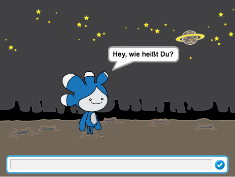
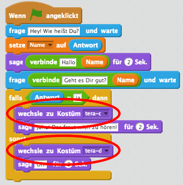
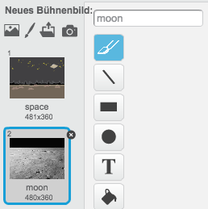
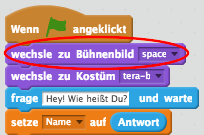
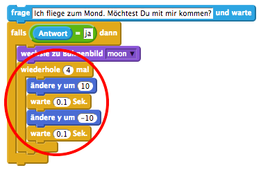

---
title: SprechBot
level: Scratch 1
language: de-DE
stylesheet: scratch
embeds: "*.png"
materials: ["Club Leader Resources/*"]
...

# Einführung { .intro }

In diesem Projekt wirst Du lernen, wie Du Deinen eigenen sprechenden Roboter programmieren kannst!

<div class="scratch-preview">
  <iframe allowtransparency="true" width="485" height="402" src="http://scratch.mit.edu/projects/embed/26762091/?autostart=false" frameborder="0"></iframe>
  
</div>

# Schritt 1: Dein SprechBot { .activity }

## Arbeitsschritte { .check }

+ Bevor Du damit beginnst Deine SprechBots zu erstellen, musst Du Dich entscheiden, welche Persönlichkeit diese haben sollen.
	+ Wie sollen sie heißen?
	+ Wo leben sie?
	+ Sind sie glücklich? Ernst? Lustig? Schüchtern? Freundlich?

+ Starte ein neues Scratch-Projekt und lösche die Katzenfigur, so dass Dein Projekt leer ist. Du findest das Scratch-Bearbeitungsprogramm online auf <a href="http://jumpto.cc/scratch-new">jumpto.cc/scratch-new</a>.

+ Wähle eine dieser Figuren aus und füge sie Deinem Projekt hinzu:

	

+ Wähle einen Hintergrund aus, der zu der Persönlichkeit Deines SprechBots passt. Hier ist ein Beispiel, wobei Dein Hintergrund auch ganz anders aussehen kann:

	

## Speichere Dein Projekt { .save }

# Schritt 2: Ein sprechender Roboter { .activity }

Jetzt, wo Du einen SprechBot mit einer echten Persönlichkeit hast, lass uns ihm das Sprechen beibringen!

## Arbeitsschritte { .check }

+ Klicke auf Deine SprechBot-Figur und füge ihr diesen Code hinzu:

	```blocks
		Wenn ich angeklickt werde
		frage [Hey! Wie heißt Du?] und warte
		sage [Was für ein hübscher Name!] für (2) Sek.
	```

+ Klicke auf deinen SprechBot, um den Code zu testen. Wenn Du aufgefordert wirst Deinen Namen zu sagen, tippe diesen in die Box am unteren Rand der Bühne ein.

	

+ Dein SprechBot antwortet nun jedes Mal einfach `Was für ein hübscher Name!`. Personalisiere die Antwort Deines SprechBots, indem Du die Antwort des Nutzers gebrauchst. Ändere den Code des SprechBots, so dass dieser wie folgt aussieht.

	```blocks
		Wenn ich angeklickt werde
		frage [Hey! Wie heißt Du?] und warte
		sage <verbinde [Hallo] (Antwort)> für (2) Sek.
	```

Um den letzten Block zu erstellen, wirst du zunächst auf den grünen `verbinde` {.blockoperators}´-Block klicken und ihn in den `sage` {.blocklooks}-Block ziehen müssen.

	

Du kannst dann den Text `hello` zu, sagen wir mal, `Hallo` ändern, und den hellblauen `Antwort` {.blocksensing}-Block (aus dem Bereich 'Fühlen') in den `world`-Text ziehen.

	

+ Teste dieses neue Programm. Funktioniert es so, wie Du es erwartet hast? Kannst Du eines der Probleme lösen, die Du entdeckst? (Tipp: Du kannst versuchen irgendwo ein Leerzeichen einzufügen!)

+ Vielleicht möchtest Du den Namen des Nutzers in einer Variable speichern, damit Du diesen später an anderer Stelle nutzen kannst. Erstelle eine neue Variable namens `Name` {.blockdata}. Wenn Du vergessen hast wie man das macht, wird Dir das Ballons-Projekt auf die Sprünge helfen.

+ Die Information, die Du eingegeben hast, ist in einer speziellen Variable namens `Antwort` {.blocksensing} bereits gespeichert worden. Gehe in die Fühlen-Block-Gruppe und klicke auf den Antwort-Block, so dass ein Vermerk auftaucht. Der aktuelle Wert in `Antwort` {.blocksensing} sollte in der oberen linken Ecke der Bühne angezeigt werden.

+ Sobald Du Deine neue Variable erstellt hast, stelle sicher, dass der Code Deines SprechBots so aussieht:

	```blocks
		Wenn ich angeklickt werde
		frage [Hey! Wie heißt Du?] und warte
		setze [name v] auf (Antwort)
		sage <verbinde [Hi] (name)> für (2) Sek.
	```

+ Wenn Du Dein Programm nochmals testest, wirst Du feststellen, dass die Antwort in der `Name` {.blockdata}-Variable gespeichert worden ist und in der oberen linken Ecke der Bühne angezeigt wird. Die `Name` {.blockdata}-Variable sollte nun den gleichen Wert enthalten wie die `Antwort` {.blocksensing}-Variable.

	

	Wenn Du die Variable lieber nicht auf der Bühne sehen möchtest, kannst Du auf das Kontrollkästchen neben der Namensvariablen in dem 'Skripte'-Reiter klicken, um diese zu verbergen.

## Speichere Dein Projekt { .save }

## Herausforderung: Mehr Fragen { .challenge }

Programmiere Deinen SprechBot so, dass er eine weitere Frage stellt. Kannst die Antwort in einer Variablen speichern?


## Speichere Dein Projekt { .save }

# Schritt 3: Entscheidungen treffen { .activity }

Du kannst Deinen SprechBot so programmieren, dass er eine Entscheidung basierend darauf trifft, was der Nutzer antwortet.

## Arbeitsschritte { .check }

+ Lass uns Deinen SprechBot dazu bringen eine Frage zu stellen, die mit `ja` oder `nein` beantwortet werden kann. Hier ist ein Beispiel, aber Du kannst auch eine andere Frage wählen, wenn Du möchtest:

	```blocks
		Wenn ich angeklickt werde
		frage [Hey! Wie heißt Du?] und warte
		setze [name v] auf (Antwort)
		sage <verbinde [Hallo ] (Name)> für (2) Sek.
		frage <verbinde [Geht es Dir gut?] (Name)> und warte
		falls ((Antwort) = [ja]) dann
			sage [Juhu! Das freut mich zu hören!] für (2) Sek.
		end
	```

	Bemerke, dass jetzt, wo Du den Namen des Nutzers in einer Variablen gespeichert hast, Du ihn sooft verwenden kannst, wie Du möchtest!

+ Um das Spiel korrekt zu testen, müsstest Du es zwei Mal spielen - ein Mal, wo Du als Antwort `nein` eingibst und ein Mal, wo Deine Antwort `ja` lautet. Du solltest nur dann eine Antwort vom SprechBot erhalten, `wenn` {.blockcontrol} die Antwort `ja` ist.

+ Das Problem mir Deinem SprechBot ist, dass er nicht antwortet, wenn der Nutzer `nein` sagt. Du kannst das Problem schnell lösen, indem Du den `wenn` {.blockcontrol}-Block zu einem `wenn/sonst` {.blockcontrol}-Block änderst, so dass der Code folgendermaßen aussieht:

	```blocks
		Wenn ich angeklickt werde
		frage [Hey! Wie heißt Du?] und warte
		setze [name v] auf (Antwort)
		sage <verbinde [Hallo ] (Name)> für (2) Sek.
		frage <verbinde (Name) [, geht es Dir gut?]> und warte
		falls ((Antwort)=[ja]) dann
			sage [Juhu! Das freut mich zu hören!] für (2) Sek.
		sonst
			sage [Oh!] für (2) Sek.
		end
	```

+ Wenn Du Deinen Code erneut testest, wirst Du sehen, dass Du sowohl eine Antwort erhältst, wenn Du `ja`, als auch wenn Du `nein` eingibst. Dein SprechBot sollte `Juhu! Das freut mich zu hören!` nur sagen, wenn die Antwort `ja` lautet und `Oh!`, wenn Du etwas anderes als `ja` eintippst.

	

+ Du kannst zu jeder Art von Code einen `wenn` {.blockcontrol}- oder `sonst` {.blockcontrol}-Block einfügen, nicht nur zum Code, der Deinen Roboter zum Sprechen bringt. Du könntest beispielsweise das Kostüm bzw. den Ausdruck des SprechBots passend zu der Antwort wechseln.

	Wenn Du Dir die Kostüme Deines SprechBots anschaust, sieht Du, dass es mehr als eins gibt. (Wenn nicht, kannst Du jederzeit selbst welche hinzufügen!)

	

	Du kannst diese Kostüme als Teil der Antwort Deines SprechBots benutzen, indem Du diesen Code hinzufügst:

	

+ Teste Dein Programm und Du solltest sehen, dass sich die Reaktion des SprechBots entsprechend der Antwort verändert.

	

## Speichere Dein Projekt { .save }

## Herausforderung: Mehr Entscheidungen { .challenge }

Programmiere Deinen SprechBot, um eine andere Frage zu stellen - etwas, das mit `ja` oder `nein` beantwortet werden kann. Kannst Du Deinen SprechBot dazu bringen auf diese Frage zu antworten?


## Speichere Dein Projekt { .save }

# Schritt 4: Ort ändern { .activity }

Du kannst den SprechBot so programmieren, dass er den Ort wechselt.

## Arbeitsschritte { .check }

+ Füge einen weiteren Hintergrund zu Deiner Bühne hinzu, zum Beispiel den Mond-Hintergrund.

	

+ Du kannst den SprechBot nun programmieren den Ort zu wechseln, indem Du ihm diesen Code hinzufügst:

	```blocks
  frage [Ich fliege zum Mond. Möchtest Du mit mir kommen?] und warte
falls ((Antwort) = [ja]) dann
   wechsle zu Bühnenbild [moon v]
Ende
	```

+ Du musst darüber hinaus sicherstellen, dass Dein SprechBot im Weltraum ist wenn Du beginnst mit ihm zu sprechen. Füge diesen Block an den Anfang Deines SprechBot-Codes hinzu:

	

+ Teste Dein Programm und antworte mit `ja`, wenn Du danach gefragt wirst, ob Du zum Mond fliegen möchtest. Du solltest nun sehen, dass sich die Umgebung des SprechBots ändert.

	

+ Ändert sich der Aufenthaltsort des SprechBots, wenn Du `nein` als Antwort eintippst? Was passiert, wenn Du `Ich bin mir nicht sicher` antwortest?

+ Du kannst auch diesen Code in Deinen `wenn` {.blockcontrol}-Block hinzufügen, um Deinen SprechBot vier Mal hoch- und runterspringen zu lassen, wenn die Antwort `ja` lautet:

	```scratch
  wiederhole (4) mal
   ändere y um (10)
   warte (0.1) Sek.
   ändere y um (-10)
   warte (0.1) Sek.
Ende
	```

	

+ Teste erneut Deinen Code. Springt Dein SprechBot auf und ab, wenn Du `ja` antwortest?

## Speichere Dein Projekt { .save }

## Herausforderung: Mache Deinen eigenen SprechBot {.challenge}
Nutze, was Du bisher gelernt hast, um die Programmierung Deines interaktiven SprechBots zu vervollständigen. Hier sind einige Ideen:


Sobald Du Deinen SprechBot fertiggestellt hast, lass Deine Freunde oder Familie ein Gespräch mit ihm führen. Mögen sie Deinen Roboter? Haben Sie irgendwelche Probleme festgestellt? Sind sie überrascht, dass der SprechBot sprechen kann?

## Speichere Dein Projekt { .save }

## Community Contributed Translation { .challenge .pdf-hidden }

This project was translated by Anastasia Heilmann. Our amazing translation volunteers help us give children around the world the chance to learn to code.  You can help us reach more children by translating a Code Club project via [Github](https://github.com/CodeClub/curriculum_documentation/blob/master/contributing.md) or by getting in touch with us at hello@codeclubworld.
