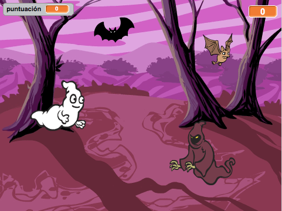
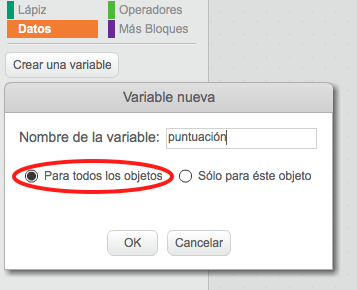
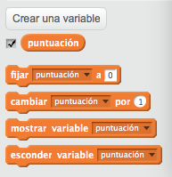
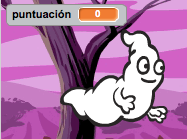
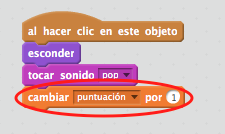
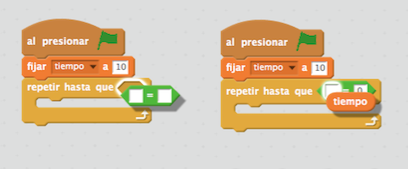
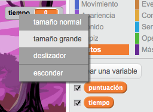

---
title: Cazafantasmas
level: Scratch 1
language: es-ES
stylesheet: scratch
embeds: "*.png"
materials: ["Recursos para el líder del Club/*.*"]
...

## Nota: { .challenge .pdf-hidden }
El Proyecto “Globos” se ha movido a la sección [Proyectos Scratch Adicionales](http://projects.codeclub.org.uk/en-GB/03_scratch_bonus/index.html.

# Introducción { .intro }

¡Vas a crear un juego para atrapar fantasmas!

<div class="scratch-preview">
  <iframe allowtransparency="true" width="485" height="402" src="http://scratch.mit.edu/projects/embed/60787262/?autostart=false" frameborder="0"></iframe>
  
</div>

# Paso 1: Animar un fantasma { .activity }

## Lista de tareas de la actividad { .check }

+ Crea un nuevo proyecto de Scratch, y borra el objeto gato para que tu proyecto esté vacío. Puedes encontrar el editor en línea de Scratch en <a href="http://jumpto.cc/scratch-new">jumpto.cc/scratch-new</a>.

+ Añade un nuevo objeto de un fantasma, y un escenario acorde.

	

+ Añade este código a tu fantasma, para que continuamente aparezca y desaparezca:

	```blocks
		al presionar bandera verde
		por siempre
   			esconder
   			esperar (1) segundos
   			mostrar
   			esperar (1) segundos
		fin
	```

+ Prueba el código de tu fantasma haciendo clic en la bandera verde.

## Guarda tu proyecto { .save }

# Paso 2: Fantasmas aleatorios { .activity }

¡Tu fantasma es muy fácil de atrapar, porque no se mueve!

## Lista de tareas de la actividad { .check }

+ En lugar de quedarse en la misma posición, puedes hacer que Scratch elija coordinadas x e y al azar. Añade un bloque `ir a` {.blockmotion} al código de tu fantasma, para que sea como éste:

	```blocks
		al presionar bandera verde
		por siempre
			esconder
			esperar (1) segundos
			ir a x:(número al azar entre (-150) y (150)) y:(número al azar entre (-150) y (150))
			mostrar
			esperar (1) segundos
		fin
	```

+ Vuelve a probar tu fantasma, y deberías de ver cómo aparece cada vez en una posición diferente.

## Guarda tu proyecto { .save }

## Desafío: Más aleatoriedad {.challenge}
¿Puedes hacer que tu fantasma `espere` {.blockcontrol} un intervalo de tiempo al azar antes de aparecer? ¿Puedes usar el bloque `fijar tamaño ` {.blocklooks} para hacer que el tamaño de tu fantasma cambie al azar cada vez que aparezca?

## Guarda tu proyecto { .save }

# Paso 3: Cazar fantasmas { .activity }

¡Vamos a hacer que el jugador pueda atrapar fantasmas!

## Lista de tareas de la actividad { .check }

+ Para que el jugador pueda atrapar un fantasma, añade este código:

	```blocks
		al hacer clic en este objeto
		esconder
	```

+ Prueba tu proyecto. ¿Puedes atrapar fantasmas cuando aparecen? Si te parece difícil cazarlos, puedes jugar al juego en modo pantalla completa haciendo clic en este botón:

	

## Desafío: Añadir un sonido { .challenge }
¿Puedes hacer que se oiga un sonido cada vez que se caza un fantasma?

## Guarda tu proyecto { .save }

# Paso 4: Añadir puntuación { .activity .new-page }

Vamos a hacer las cosas más interesantes con un contador de puntos.

## Lista de tareas de la actividad { .check }

+ Para contar la puntuación del jugador, necesitas un sitio donde ponerla. Una __variable__ es un sitio para almacenar información que cambia, como la puntuación.

	Para crear una nueva variable, haz clic en la pestaña “Programas”, selecciona `Datos` {.blockdata} y a continuación haz clic en “Crear una Variable”.

	

	Llama a la nueva variable “puntuación”. Asegúrate de que esté disponible para todos los objetos, y haz clic en “OK” para crearla. A continuación verás nuevos bloques de código que pueden usarse con tu variable `puntuación` {.blockdata}.

	

	También verás la puntuación en la parte superior izquierda del escenario.

	

+ Cuando empieza un nuevo juego (haciendo clic en la bandera), deberías hacer que la puntuación del jugador sea 0:

	```blocks
	al presionar bandera verde
	fijar [puntuación v] a [0]
	```

+ Cuando el jugador atrape un fantasma, tendrás que añadir 1 su puntuación:

	

+ Ejecuta tu programa de nuevo y atrapa algunos fantasmas. ¿Cambia tu puntuación?

## Guarda tu proyecto { .save }

# Paso 5: Añadir un cronómetro { .activity }

Puedes hacer que tu juego sea más interesante dándole al jugador sólo 10 segundos para que atrape tantos fantasmas como le sea posible.

## Lista de tareas de la actividad { .check }

+ Puedes usar otra variable para mostrar el tiempo que queda. Haz clic en el escenario y crea una nueva variable que se llame “tiempo”:

	

+ Así es como debería de funcionar el cronómetro:

	+ El cronómetro debería de empezar en 10 segundos;
	+ El cronómetro debería de contar hacia atrás cada segundo;
	+ El juego debería de parar cuando el cronómetro llegue a 0.

	Éste es el código para hacerlo, y que puedes añadir a tu __escenario__:

	```blocks
		al presionar bandera verde
		fijar [tiempo v] a [10]
		repetir hasta que <(tiempo) = [0]>
			esperar (1) segundos
			cambiar [tiempo v] por (-1)
		fin
		detener [todos v]
	```

	Así es como se añade el código `repetir hasta`{.blockcontrol}`tiempo`{.blockdata}`= 0`{.blockoperators}:

	

+ Arrastra el visor de la variable “tiempo” al lado derecho del escenario. También puedes hacer clic con el botón derecho en el visor de la variable y elegir "tamaño grande” para cambiar el modo en el que se muestra el tiempo.

	

+ Pídele a un amigo que pruebe tu juego. ¿Cuántos puntos puede conseguir? Si tu juego es demasiado fácil, puedes:

	+ Darle menos tiempo al jugador;
	+ Hacer que los fantasmas no aparezcan tan a menudo;
	+ Hacer que los fantasmas sean más pequeños.

	Prueba tu juego algunas veces hasta que te parezca que tiene el nivel adecuado de dificultad.

## Guarda tu proyecto { .save }

## Desafío: Más objetos {.challenge}
¿Puedes añadir otros objetos a tu juego?


Tendrás que pensar sobre los objetos que añadas. Piensa en:

+ ¿Cómo es de grande?
+ ¿Aparecerá más o menos a menudo que los fantasmas?
+ ¿Cómo aparecerá/sonará cuando sea atrapado?
+ ¿Cuántos puntos conseguirás (o perderás) si lo atrapas?

Si necesitas ayuda para añadir otro objeto, ¡puedes volver a seguir los pasos anteriores!

## Guarda tu proyecto { .save }

## Community Contributed Translation { .challenge .pdf-hidden }

This project was translated by María Alejandra Aguada from Translators Without Borders. Screenshots in Spanish were provided by Montse Verdaguer. Our amazing translation volunteers help us give children around the world the chance to learn to code.  You can help us reach more children by translating a Code Club project via [Github](https://github.com/CodeClub/curriculum_documentation/blob/master/contributing.md) or by getting in touch with us at hello@codeclubworld.