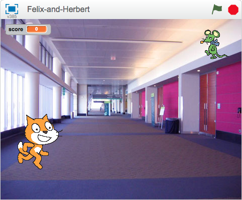

---
title: Félix y Hérbert
level: Nivel 1
language: es-ES
stylesheet: scratch
embeds: "*.png"
note: "notas para coordinadores.md"
...

# Introducción { .intro}
Vamos a crear un juego en el que __el gato Félix__ y __el ratón Hérbert__ juegan a pillarse. Tú controlarás a Hérbert con el ratón para evitar que lo pille Félix. Cuanto más tiempo puedas evitarlo, más puntos te dará el juego, pero ten cuidado porque ¡perderás puntos si te pilla!



# PASO 1: Félix sigue al puntero del ratón { .activity}

## Progreso { .check}

+ **Crea un proyecto nuevo.**

+ Haz click en **escenario** y cambia a la pestaña `Fondos` {.blocklightgrey}. Haz click en el botón `Elegir un fondo de la biblioteca` {.blocklightgrey} y selecciona el fondo interiores/hall. Borra el fondo blanco original.

+ Haz click en el objeto Gato, y después pulsa la `i` azul que hay arriba a la izquierda. Cambia el nombre del objeto a **Félix**.
+ Asegúrate de que Félix sólo gira a la izquierda o a la derecha pulsando el botón: 
+ **Crea este programa para Félix**:

```blocks
				al presionar BANDERA VERDE
    			por siempre
			        apuntar hacia [puntero del ratón v]
			        mover (10) pasos
			        siguiente disfraz
			        tocar tambor (62) durante (0.1) pulsos
```

##Prueba tu proyecto { .flag}

**Haz click en la bandera verde.**

¿Sigue Félix al puntero del ratón? ¿Parece que está caminando cuando se mueve? ¿Se mueve a la velocidad correcta?

##Guarda tu proyecto { .save}


#**Paso 2:**   Félix persigue a Hérbert {.activity}

**Ahora, queremos que Félix persiga a Hérbert el ratón en vez de al puntero del ratón.**

##Progreso { .check}

+ Crea otro objecto usando el botón `Elegir un objecto desde la biblioteca` {.blockgrey} y elije **animales/mouse1**.
+ Cambia el nombre del nuevo objeto a **Hérbert**.
+ Cambia a la pestaña __Disfraces__, haz click en el disfraz en el editor de dibujos. Aparecerá una caja alrededor del dibujo. Arrastra una de las esquinas para hacer que Hérbert sea más pequeño que Félix. 
+ Asegúrate de que Hérbert sólo mira a la derecha y a la izquierda.
+ **Dale éste programa a Hérbert:**

```blocks
  al presionar BANDERA VERDE
    por siempre
      ir a [puntero del ratón v]
      apuntar hacia [Félix v]
```

##Prueba tu proyecto { .flag}

**Haz click en la bandera verde.**

¿Se mueve Hérbert cuando mueves el puntero del ratón? ¿Persigue Félix a Hérbert?

##Guarda tu proyecto { .save}


#**Paso 3:**   Félix dice cuando ha pillado a Hérbert {.activity}

**Queremos que Félix sepa cuando ha pillado a Hérbert y nos lo diga.**

##Progreso { .check}

+ **Cambia el programa de Félix para que sea así:**

```blocks
  al presionar BANDERA VERDE
  por siempre
    apuntar hacia [puntero del ratón v]
    mover (10) pasos
    siguiente disfraz
    tocar tambor (62) durante (0.1) pulsos
    si <¿tocando [Hérbert v]?> entonces
      decir [Te pillé!] por (1) segundos
    end
   end
```

##Prueba tu proyecto { .flag}

**Haz click en la bandera verde.**

¿Dice Félix cuando ha pillado a Hérbert?

##Guarda tu proyecto { .save}

#**Paso 4:**  Hérbert se convierte en un fantasma cuando le pillan {.activity}

**En vez de que Félix lo diga, queremos que Hérbert se convierta en un fantasma cuando le pillan.**

##Progreso { .check}

+ **Cambia el programa de Félix para que envíe éste mensaje cuando pilla a Hérbert:**

```blocks
  al presionar BANDERA VERDE
  por siempre
    apuntar hacia [puntero del ratón v]
    mover (10) pasos
    mover (20) pasos
    siguiente disfraz
    tocar tambor (62 v) durante (0.1) pulsos
    si <¿tocando [Hérbert v]?> entonces
      enviar [pillado v]
      tocar tambor (17 v) durante (0.2) pulsos
      esperar (1) segundos
    end
   end
```

+ Crea un nuevo disfraz para Hérbert: Seleccionalo, ve a la pestaña Disfraces y haz click en el botón `Elegir un disfraz desde la biblioteca` {.blocklightgrey}. Selecciona el disfraz **fantasía/ghost2-a**.

+ Haz el disfraz más pequeño, seleccionándolo en el Editor y arrastra una esquina de la caja que aparece para cambiar su tamaño.

+ Cambia el nombre de los disfraces de Hérbert para que el disfraz de ratón se llame ‘vivo‘ y el de fantasma ‘muerto‘.

+ **Crea un nuevo script para que Hérbert se convierta en un fantasma cuando le pillen:**

```blocks
  al recibir [pillado v]
    cambiar el disfraz a [muerto v]
    esperar (1) segundos
    cambiar el disfraz a [vivo v]

```

##Prueba tu proyecto { .flag}

**Haz click en la bandera verde.**

¿Se convierte Hérbert en un fantasma cuando le pillan?
¿Hace Félix el sonido correcto en el momento adecuado?
¿Se queda Félix quieto el tiempo suficiente para que Hérbert se aleje?

##Guarda tu proyecto { .save}

#**Paso 5:**  Mantener puntuación {.activity}

**Vamos a añadir un marcador para ver cómo de bien se nos da mantener a Hérbert vivo.
Empezaremos con 0 puntos y ganaremos un punto cada segundo. Si Félix pilla a Hérbert perdemos 100 puntos.**

##Progreso { .check}

+ Crea una variable, para todos los objetos, llamada Puntos. Haz cliz en `Datos` {.blockorange} en la pestaña Programas, crea una variable y llámala `puntos` {.blockorange}, asegurándote de que "Para todos los objetos" está seleccionado.
+ **En el escenario, añade estos dos programas:**


```blocks
al presionar BANDERA VERDE
   fijar [puntos v] a [0]
   por siempre
      cambiar [puntos v] por (1)
      esperar (1) segundos
   end

al recibir [pillado v]
cambiar [puntos v] por (-100)
```

##Prueba tu proyecto { .flag}

**Haz click en la bandera verde.**

¿Ganas un punto cada segundo?
¿Pierdes 100 puntos cuando te pillan?
¿Qué pasa si pillas a Hérbert antes de que el marcador llegue a 100? ¿Vuelve el marcador a 0 cuando empiezas el juego de nuevo?

##Guarda tu proyecto { .save}

**¡Bien hecho! ¡Has terminado! Ahora puedes disfrutar el juego**

No olvides que puedes compartir el juego con tu familia y amigos pulsando el botón `Compartir` {.blockgrey} en la barra de herramientas
