---
title: Paint Box
level: Scratch 1
language: nl-NL
stylesheet: scratch
embeds: "*.png"
materials: ["Club Leader Resources/*","Project Resources/*"]
...

# Introductie { .intro }

In dit project leer je hoe je jouw eigen tekenprogramma maakt!

<div class="scratch-preview">
  <iframe allowtransparency="true" width="485" height="402" src="http://scratch.mit.edu/projects/embed/63473366/?autostart=false" frameborder="0"></iframe>
  
</div>

# Stap 1: Maak een potlood { .activity }
Laten we beginnen met het maken van een potlood welke jij kan gebruiken om dingen te tekenen op het speelveld.

## Activiteiten Checklist { .check }

+ Begin een nieuw Scratch project en verwijder de kat, zodat jouw project leeg is. Je kan de online Scratch editor vinden via <a href="http://jumpto.cc/scratch-new">jumpto.cc/scratch-new</a>.

+ Voeg de 'pencil' sprite toe aan jouw project.

	 

+ Klik op 'Uiterlijken', and delete the 'pencil-b' costume.

	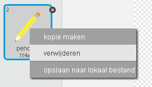 

+ Verander de naam van jouw uiterlijk naar 'pencil-blue' en gebruik het 'kleur een vorm' gereedschap om het potlood blauw te maken. 

	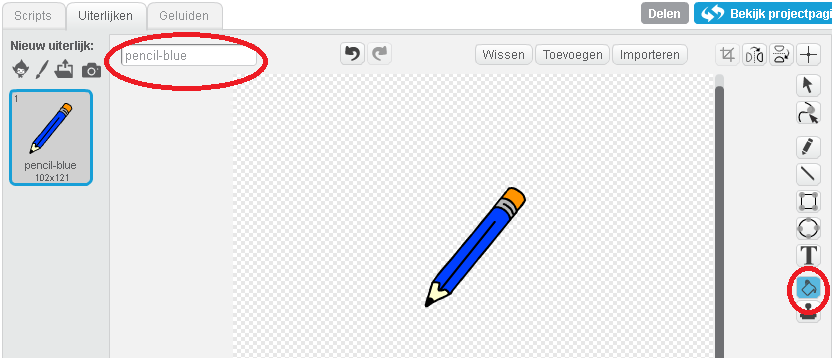 

+ Omdat je de muis gaat gebruiken om te tekenen, wil je dat het potlood de muis volgt door middel van `herhaal` {.blockcontrol}. Voeg het volgende programma toe aan jouw potlood sprite:

	```blocks
		wanneer ⚑ wordt aangeklikt
		herhaal
			ga naar [mouse pointer v]
		einde
	```

+ Probeer jouw programma uit door op de vlag te klikken en daarna de muis over het speelveld te bewegen. Werkt het zoals jij had verwacht?

+ Is het jouw opgevallen dat het midden van potlood de muis volgt, niet de punt van het potlood?

	

	Om dit op te lossen klik jet op het 'pencil-blue' uiterlijk van jouw pencil sprite en klik je op 'Middelpunt van uiterlijk'.

	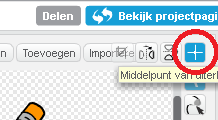

+ Je zou een draadkruis over jouw uiterlijk moeten zien verschijnen. Nu kan je net onder de punt van het potlood klikken, zodat dat punt het middelpunt van de sprite wordt.

	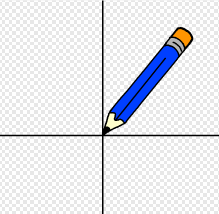

+ Klik op de 'Scripts' tab en probeer jouw potlood opnieuw uit - werkt het deze keer beter dan de vorige keer?

+ Vervolgens gaan wij jouw potlood laten tekenen `als` {.blockcontrol} op de muis wordt geklikt. Voeg het volgende programma toe aan jouw pencil sprite:

	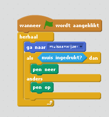	

+ Probeer jouw programma opnieuw uit. Beweeg het potlood deze keer over het speelveld en houdt de muisknop ingedrukt. Kan je tekenen met jouw potlood?

	

## Sla jouw project op { .save }

# Stap 2: Gekleurde potloden { .activity }

Laten we verschillende kleuren potloden aan jouw project toevoegen en laten we de gebruiker toestaan om te kiezen welke hij wilt gebruiken!

## Activiteiten Checklist { .check }

+ Klik op jouw pencil sprite, klik op 'Uiterlijken' en kopieer jouw 'pencil-blue' uiterlijk.

	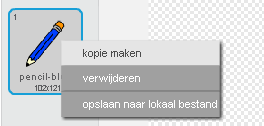

+ Hernoem jouw nieuwe uiterlijk 'pencil-green', en kleur het potlood groen.

	

+ Maak nog twee nieuwe sprites, die je gaat gebruiken om het blauwe of groene potlood te selecteren.

	

+ Wanneer er op het groene selectie icoon wordt geklikt, moet je via `zend signaal` {.blockevents} een boodschap sturen naar de pencil sprite, waarin je deze verteld dat hij van uiterlijk en kleur moet veranderen.

	Om dit te doen voeg je eerst het volgende programma toe aan het groene selectie icoon:

	```blocks
		wanneer op deze sprite wordt geklikt
		zend signaal [green v]
	```

	Om het `zend signaal` {.blockevents} blok te maken, klik op de pijl-omlaag en selecteer 'nieuw bericht...'.

	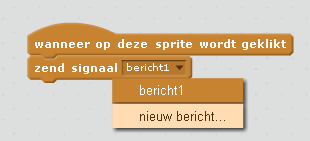

	Je kan dan 'green' typen om jouw nieuwe bericht te maken.

	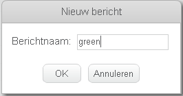

+ Je moet nu nog jouw pencil sprite vertellen wat hij moet doen wanneer hij het bericht ontvangt. Voeg het volgende programma toe aan jouw pencil sprite:

	```blocks
		wanneer ik signaal [green v] ontvang
		verander uiterlijk naar [pencil-green v]
		maak penkleur [#00ff00]
	```

	Om het potlood in te stellen op kleur 'green', klik op het gekleurde vakje in het `maak penkleur` {.blockpen} blok en klik tenslotte op het groene selectie icoon om groen te kiezen als jouw potloodkleur.

+ Je kan nu hetzelfde doen met het blauwe potlood icoon, door het volgende programmatoe te voegen aan de blauwe selectie sprite:

	```blocks
		wanneer op deze sprite wordt geklikt
		zend signaal [blue v]
	```

	...en het volgende programm toe te voegen aan de potlood sprite:

	```blocks
		wanneer ik signaal [blue v] ontvang
		verander uiterlijk naar [pencil-blue v]
		maak penkleur [#0000ff]
	```

+ Tenwslotte moet je jouw pencil sprite vertellen welk uiterlijk en potloodkleur gekozen moet worden, evenals het scherm op te schonen op het moment dat jouw project wordt gestart. Voeg de volgende programma blokken toe aan het begin van het `wanneer vlag wordt aangeklikt` {.blockevents} programma (voor de `herhaal` {.blockcontrol} loop):

	```blocks
		wis alles
		verander uiterlijk naar [blue-pencil v]
		maak penkleur [#0000ff]
	```

	Als je dat wilt, kan je met een andere kleur potlood beginnen!

+ Probeer jouw programma uit. Kan je wisselen tussen een blauw en een groen potlood?

	

## Sla jouw project op { .save }

# Step 3: Fouten maken { .activity .new-page }

Soms worden er fouten gemaakt, dus laten we een knop om te wissen en een gum aan ons project toevoegen!

## Activiteiten Checklist { .check }

+ We beginnen met een knop toe te voegen die het speelveld leeg maakt. Om dit te doen, voeg je de 'X-block' letter sprite toe aan het speelveld en maak deze rood van kleur.

	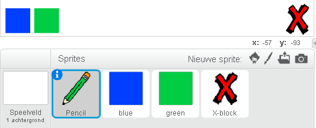

+ Voeg de volgende programma blokken toe aan jouw nieuwe wis-knop om het speelveld leeg te maken, zodra erop geklikt wordt.

	```blocks
		wanneer op deze sprite wordt geklikt
		wis alles
	```

	Het valt je misschien op dat je geen boodschap hoeft te verdenden om het speelveld leeg te maken, omdat iedere sprite dat kan doen!

+ Je kan ook een gum maken. Als het goed is heeft de clubleider jou 'Resources' map gegeven of staat deze al op de computer. Klik op 'Upload uiterlijk' en voeg de 'eraser.svg' afbeelding toe.

	
	
	Als je de eraser.svg afbeelding niet hebt, kan je in plaats hiervan ook een nieuw wit potlood maken!

+ Je moet ook de gum afbeelding aan jouw speelveld als een nieuwe selectie sprite. Nu zou jouw speelveld er zo uit moeten zien:

	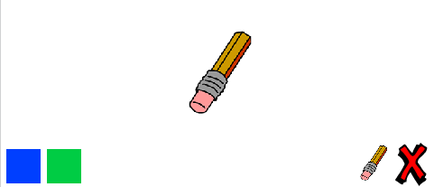

+ Je kan het volgende programm toevoegen aan de gum selectie sprite, om het potlood naar een gum te laten veranderen.

	```blocks
		wanneer op deze sprite wordt geklikt
		zend signaal [eraser v]
	```

+ Zodra het potlood deze boodschap ontvangt, kan je een gum maken door het potlood-uiterlijk te veranderen naar een gum, en de potloodkleur te wijzigen in dezelfde kleur als het speelveld!

	```blocks
		wanneer ik signaal [eraser v] ontvang
		verander uiterlijk naar [eraser v]
		maak penkleur [#FFFFFF]
	```

+ Probeer jouw nieuwe project uit, om te controleren of je op jouw speelveld kan gummen en je jouw speelveld kan wissen.

	

+ Er is nog een probleem met het potlood - Je kan overal op het speelveld tekenen, zelfs in de buurt van en over de selectie icoontjes!

	

	Om dit op te lossen, moeten we het potlood vertellen dat het alleen mag tekenen als er op de muis wordt geklikt _en_ als de y-positie van de muis groter is dan -110 (`muis y`{.blocksensing}`> -110` {.blockoperators}). Verander jouw potlood's `als` {.blockcontrol} instructie zodat het er als volgt uitziet:

	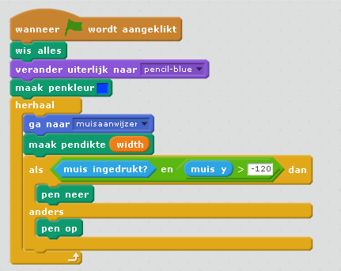

+ Probeer jouw project uit; het zou nu niet meer mogelijk moeten zijn om in de buurt van de selectie blokjes te tekenen.

	

## Sla jouw project op { .save }

# Stap 4: De breedte van het potlood wijzigen { .activity .new-page }

Laten we de gebruiker toestaan te tekenen met een aantal verschillende potlood formaten.

## Activiteiten Checklist { .check }

+ Als eerste moeten we een variablele toevoegen die we 'width' gaan noemen. Als je niet zeker meet weet hoe dit moet, kan het 'Ghostbusters' project jouw verder helpen.

+ Voeg het volgende programma blok toe aan de `herhaal` {.blockcontrol} loop van programma van jouw potlood:

	```blocks
		maak pendikte (width)
	```

	De breedte van jouw potlood zal nu herhaaldelijk worden ingesteld op de waarde van jouw 'breedte' variabele.

+ Je kan de weergave van deze variabele veranderen, door met de rechter muistoets op de variabele in jouw speelveld te klikken en op 'schuif' te klikken.

	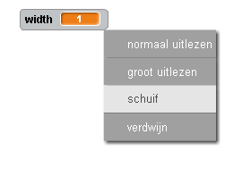

	Je kan de schuifregelaar slepen om zo de waarsde van de variabele te wijzigen.

	

+ Probeer jouw project uit en kijk of je de breedte van jouw potlood kan aanpassen.

	

	Als je dat wilt, kan je een minimum en een maximum waarde toekennen aan de 'width' variabele. Om dit te doen klik je weer rechts op de variabele en klik je op 'stel min en max van schuif in'. Geef het minumum en maximum van jouw variabele een zinvolle waarde, zoals  1 en 20.

	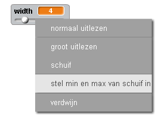

	Probeer jouw 'width' variabele net zolang uit tot je tevreden bent over de breedte.

## Sla jouw project op { .save }

## Uitdaging: Sneltoetsen { .challenge }
Kan je sneltoetsen via jouw toetsenbord maken voor jouw opdrachten? Bijvoorbeeld:

+ b = overschakelen naar blauw potlood
+ g = overschakelen naar groen potlood
+ e = overschakelen naar gum
+ c = scherm wissen

Je kan de gebruiker ook toestaan de breedte van het potlood in te stellen door middel van de pijltjes toetsen!

## Sla jouw project op { .save }

## Uitdaging: nog meer potloden { .challenge }
Kan je ook nog een rood, geel en zwart potlood toevoegen aan jouw tekenprogramma? Je vindt alle afbeeldingen die je nodig hebt in jouw 'Resources' map. Vergeet niet om sneltoetsen toe te wijzen voor deze nieuwe potloden!

Kan je al jouw potloden gebruiken om een tekening te maken?


## Community Contributed Translation { .challenge .pdf-hidden }

This project was translated by Jeroen Dekker. Our amazing translation volunteers help us give children around the world the chance to learn to code.  You can help us reach more children by translating a Code Club project via [Github](https://github.com/CodeClub/curriculum_documentation/blob/master/contributing.md) or by getting in touch with us at hello@codeclubworld.
