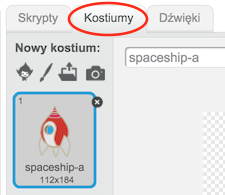
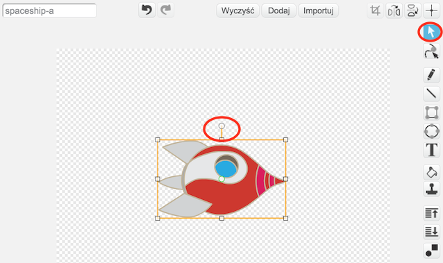
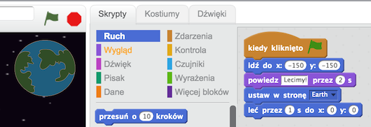
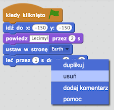
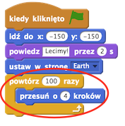
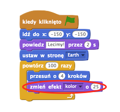
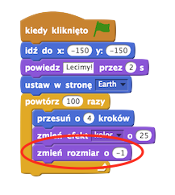
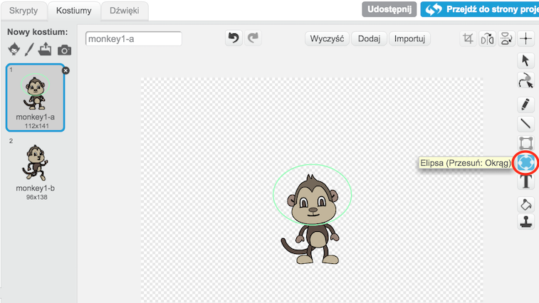
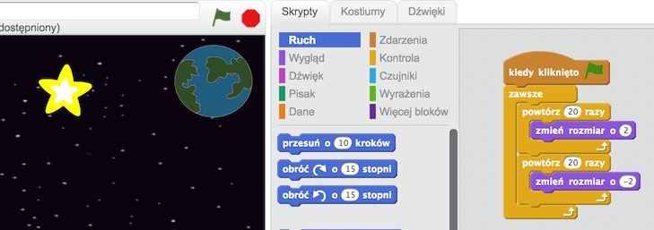

---
title: Zagubiona w kosmosie
level: Scratch 1
language: pl-PL
stylesheet: scratch
embeds: "*.png"
materials: ["Zasoby Lidera Klubu/*.*"]
...

# Wstęp { .intro }

Nauczysz się jak zaprogramować swoją własną animację!

<div class="scratch-preview">
  <iframe allowtransparency="true" width="485" height="402" src="http://scratch.mit.edu/projects/embed/26818098/?autostart=false" frameborder="0"></iframe>
  
</div>

# Krok 1: Animowanie statku kosmicznego { .activity .new-page}

Zróbmy rakietę lecącą w kierunku Ziemi!

## Zadania do wykonania { .check }

+ Rozpocznij w Scratchu nowy projekt, a następnie usuń duszka-kota, aby uzyskać pusty projekt. Edytor Scratch online możesz znaleźć tutaj: <a href="http://jumpto.cc/scratch-new">jumpto.cc/scratch-new</a>.

+ Dodaj do swojej sceny duszki "Statek kosmiczny" (ang. spaceship) oraz "Ziemia" (ang. Earth). Zmień także tło swojej sceny na "Gwiazdy" (ang. Stars). Tak powinna wyglądać Twoja scena:

	

+ Kliknij na swoją rakietę, a następnie na zakładkę "Kostiumy".

	

+ Użyj narzędzia "strzałka" do wybrania obrazka. Następnie kliknij na okrągłym uchwycie do obracania i obróć obrazek tak, aby rakieta "leżała na boku".

	

+ Dodaj poniższy kod do duszka rakiety:

	

	Zmień liczby w blokach kodu, aby były dokładnie takie jak na powyższym obrazku.

+ Gdy klikniesz na zieloną flagę, aby uruchomić swój kod, zauważysz, że statek kosmiczny mówi, obraca się i porusza w kierunku środka sceny.

	

	Pozycja ekranu `x:(0) y:(0)` {.blockmotion} to środek sceny. Pozycja `x:(-150) y:(-150)` {.blockmotion} przesuwa się w stronę dolnego lewego rogu, natomiast pozycja `x:(150) y:(150)` {.blockmotion} jest blisko górnego prawego narożnika.

	

	Gdy będziesz potrzebował współrzędnych pozycji na scenie, najedź kursorem myszy na pozycję, której współrzędnych potrzebujesz - wyświetlą się one poniżej sceny po prawej stronie.

	

+ Wypróbuj swoją animację klikając na zieloną flagę znajdującą się tuż nad sceną.

	

## Wyzwanie: Udoskonalanie animacji {.challenge}
Czy możesz tak zmienić liczby w swoim kodzie, aby:
+ Rakieta poruszała się, dopóki nie dotknie Ziemi?
+ Rakieta poruszała się wolniej w kierunku Ziemi?

Będziesz musiał zmienić liczby w tym bloku:

```blocks
	leć przez (1) s do x:(0) y:(0)
```

## Zapisz swój projekt { .save }

# Krok 2: Animowanie z użyciem pętli { .activity .new-page }

Inną metodą na animację rakiety jest powiedzieć jej, aby poruszyła się wielokrotnie na małą odległość.

## Zadania do wykonania { .check }

+ Usuń blok `leć` {.blockmotion} ze swojego kodu poprzez kliknięcie na nim prawym przyciskiem myszy i wybranie opcji "usuń". Możesz ten blok także usunąć przeciągając go z powrotem w obszar wyboru bloków kodu. 

	

+ Kiedy już usuniesz powyższy blok, dodaj zamiast niego poniższy kod:

	

	Bloku `powtórz` {.blockcontrol} używa się, aby powtórzyć coś wielokrotnie i jest także nazywany __pętlą__ (ang. loop).

+ Gdy klikniesz na flagę, aby przetestować nowy kod, zobaczysz, że robi on praktycznie to samo co wcześniej.

+ Możesz zrobić ciekawe rzeczy dodając więcej kodu do środka pętli. Dodaj blok `zmień efekt kolor o 25` {.blocklooks} (z sekcji "Wygląd") wewnątrz pętli, aby stopniowo zmieniać kolor wraz z ruchem rakiety:

	

+ Naciśnij flagę, aby zobaczyć swoją nową animację.

	

+ Możesz także sprawić, żeby rakieta zmiejszała się zbliżając się do Ziemi.

	

+ Przetestuj swoją animację. Co się dzieje gdy klikniesz na flagę po raz kolejny? Czy kiedy Twoja rakieta startuje, ma odpowiednią wielkość? Aby naprawić swoją animację, możesz użyć tego kodu:

	```blocks
		ustaw rozmiar na (100)%
	```

## Zapisz swój projekt { .save }

# Krok 3: Latająca małpa { .activity .new-page }

Dodaj do swojej animacji małpę, która zagubiła się w kosmosie! 

## Zadania do wykonania { .check }

+ Rozpocznij dodając duszka małpę z biblioteki.

	

+ Gdy klikniesz na swoją nową małpę, a następnie na zakładkę "Kostiumy", możesz edytować wygląd małpy. Wybierz narzędzie "Elipsa" i narysuj biały hełm wokół głowy małpy.

	

+ Teraz kliknij na zakładkę "Skrypty" i dodaj poniższy kod do małpy, aby kręciła się powoli w nieskończoność.

	```blocks
		kiedy kliknięto zieloną flagę
		zawsze
		    obróć @ o (1) stopni
		koniec
	```

	Blok `zawsze` {.blockcontrol} jest innym rodzajem pętli, takim, który nigdy się nie kończy.

+ Kliknij na flagę, aby przetestować swoją małpę. Będziesz musiał później wcisnąć przycisk stop (znajdujący się obok flagi), aby zakończyć animację.

	

# Krok 4: Odbijająca się asteroida { .activity .new-page }

Dodaj latającą asteroiodę do swojej animacji.

## Zadania do wykonania { .check }

+ Dodaj duszka "skałę" (ang. rock) do swojej animacji.

	

+ Dodaj ten kod do swojej skały, aby odbijała się wokół sceny:

	```blocks
		kiedy kliknięto zieloną flagę
		ustaw w stronę [Earth v]
		zawsze
			przesuń o (2) kroków
			jeżeli na brzegu, odbij się
	```

+ Naciśnij flagę, aby przetestować asteroidę. Czy odbija się od sceny?

# Krok 5: Mrugające gwiazdy { .activity .new-page }

Wykorzystajmy połączenie różnych pętli, aby zrobić mrugającą gwiazdę.

## Zadania do wykonania { .check }

+ Dodaj duszka "gwiazdę" (ang. star) do swojej animacji.

	

+ Dodaj poniższy kod do swojej gwiazdy:

	

+ Kliknij na flagę, aby przetestować animację gwiazdy. Co robi dodany kod? Cóż, gwiazda robi się trochę większa 20 razy, a następnie zmniejsza się o trochę 20 razy, powracając do początkowego rozmiaru. Te dwie pętle są wewnątrz pętli `zawsze` {.blockcontrol}, dzięki czemu animacja ta się powtarza w nieskończoność.

## Zapisz swój projekt { .save }

## Wyzwanie: Zrób swoją własną animację {.challenge}
Zatrzymaj swoją animację kosmosu, a następnie naciśnij na menu "Plik" i wybierz "Nowy", aby rozpocząć nowy projekt.

Użyj tego, czego się nauczyłeś podczas tego projektu, aby zrobić swoją własną animację. To może być cokolwiek chcesz, ale postaraj się, aby Twoja animacja pasowałą do tego, co wybierzesz. Poniżej znajdują się dwa przykłady:


## Zapisz swój projekt { .save }
