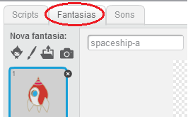
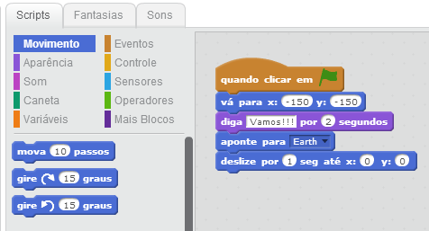
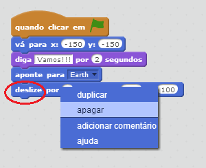
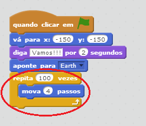
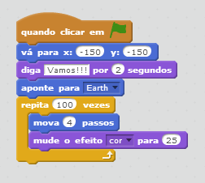
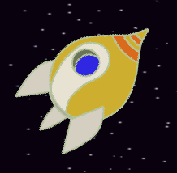
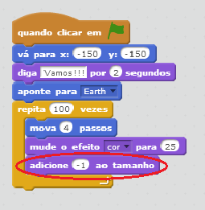
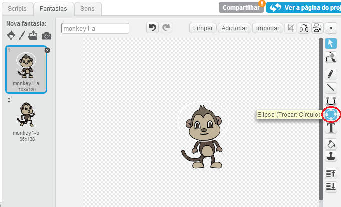
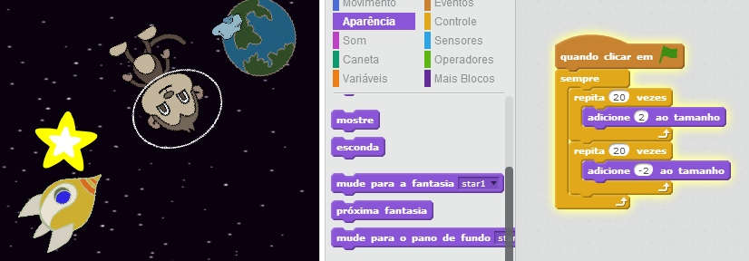

---
title: Perdido no espaço
level: Scratch 1
language: pt-BR
stylesheet: scratch
embeds: "*.png"
materials: ["Club Leader Resources/*"]
...

# Introdução { .intro }

Você vai aprender a programar sua própria animação!

<div class="scratch-preview">
  <iframe allowtransparency="true" width="485" height="402" src="http://scratch.mit.edu/projects/embed/26818098/?autostart=false" frameborder="0"></iframe>
  
</div>

# Passo 1: Animando uma nave espacial { .activity .new-page}

Vamos fazer uma nave espacial que voa em direção à Terra!

## Lista de atividades { .check }

+ Inicie um novo projeto Scratch e apague o gato para que seu projeto fique vazio. Você pode encontrar o editor do Scratch on-line em <a href="http://jumpto.cc/scratch-new">jumpto.cc/scratch-new</a>.

+ Adicione os sprites 'Spaceship' e 'Earth' no seu palco. Você também deve adicionar o pano de fundo 'Stars'. O seu palco deverá ficar assim:

	

+ Clique no ator da nave espacial, e clique na aba 'Fantasias'.

	

+ Use a ferramenta da seta para selecionar a imagem. Em seguida, clique sobre a alça de rotação e gire até que a imagem esteja de lado.

	

+ Adicione este código ao seu ator de nave espacial:

	

	Altere os números nos blocos de código, de modo que o código fique exatamente igual à imagem acima.

+ Se você clicar sobre os blocos de código, você vai ver a nave espacial falar, girar e mover-se em direção ao centro do palco.

	

	A posição da tela `x:(0) y:(0)` {.blockmotion} é o centro do palco. Uma posição como `x:(-150) y:(-150)` {.blockmotion} está localizado na parte inferior esquerda do palco, e uma posição como `x:(150) y:(150)` {.blockmotion} está localizado na parte superior-direita.

	

	Se você precisar saber as coordenadas de uma posição no palco, mova o mouse para a posição desejada e anote as coordenadas que serão exibidas abaixo do palco.

	

+ Experimente a sua animação, clicando na bandeira verde logo acima do palco.

	

## Desafio: Melhorar a sua animação {.challenge}
Você pode alterar os números em seu código de animação, de modo que:
+ A nave espacial se mova até que toque a Terra?
+ A nave espacial se mova mais lentamente em direção à Terra?

Você precisará alterar os números neste bloco:

```blocks
	deslize por (1) sec até x:(0) y:(0)
```

## Salve seu projeto { .save }

# Passo 2: Animando usando repetições { .activity .new-page }

Outra maneira de animar a nave espacial é dizer para ela se mover uma pequena quantidade, várias vezes.

## Lista de atividades { .check }

+ Apague o bloco `deslize` {.blockmotion} do seu código, clicando com o botão direito sobre o bloco e 'apagar'. Você também pode apagar o código arrastando-o de volta para a área de blocos de código

	

+ Uma vez que você tenha removido o seu código, adicione este código:

	

	O comando de bloco `repita` {.blockcontrol} é usado para repetir algo muitas vezes, e também é conhecido como um __loop__.

+ Se você clicar na bandeira para experimentar este novo código, você verá que ele faz praticamente a mesma coisa que antes.

+ Você pode adicionar mais código ao seu __loop__ para fazer coisas interessantes. Adicione o bloco de código `mude o efeito cor para para 25` {.blocklooks} no __repetição__ (a partir da seção 'Aparência'), para alterar repetidamente a cor da nave espacial conforme ela se move:

	

+ Clique na bandeira para ver sua nova animação.

	

+ Você também pode fazer a sua nave espacial ficar menor à medida que se move em direção à Terra.

	

+ Teste sua animação. O que acontece se você clicar na bandeira pela segunda vez? Isto faz a sua nave espacial começar do tamanho certo? Você pode utilizar este bloco de código para corrigir sua animação:

	```scratch
	mude o tamanho para (100) %
	```

## Salve seu projeto { .save }

# Passo 3: Macaco flutuante{ .activity .new-page }

Vamos adicionar um macaco para sua animação que está perdido no espaço! 

## Lista de atividades { .check }

+ Comece adicionando o sprite de macaco da biblioteca.

	

+ Se você clicar sobre o seu novo sprite de macaco e, em seguida, clicar em 'Fantasias', você pode editar a aparência do macaco. Clique na ferramenta 'Círculo' e desenhe um capacete de astronauta branco na cabeça do macaco.

	

+ Agora clique 'Scripts' e adicione este código no macaco, de modo que ele gire lentamente para sempre:

	```blocks
	quando clicar em ⚑
		sempre
		    gire ↻ (1) graus
		end
	```

	O bloco de código `sempre` {.blockcontrol} é outro comando de repetição (__loop__), mas que nunca termina.

+ Clique na bandeira para testar seu macaco. Você terá que clicar no botão stop (ao lado da bandeira) para acabar com essa animação.

	

# Passo 4: Saltando asteróides { .activity .new-page }

Vamos adicionar alguns asteróides em sua animação.

## Lista de atividades { .check }

+ Adicione um sprite 'rock' para a sua animação.

	

+ Adicione este código em sua pedra, para fazê-lo saltar ao redor do estrado:

	```scratch
	quando clicar em ⚑
	aponte para [Earth v]
	sempre
		mova (2) passos
		se tocar na borda, volte
	end
	```

+ Clique na bandeira para testar sua pedra. Será que bate na borda do palco?

# Passo 5: Estrelas que brilham { .activity .new-page }

Vamos combinar loops para fazer uma estrela brilhante.

## Lista de atividades { .check }

+ Adicionar o sprite "Star" para a sua animação

	

+ Adicione este código a sua estrela:

	

+ Clique na bandeira para testar esta animação. O que este código faz? Bem, a estrela é aumentada ligeiramente 20 vezes, e em seguida, é diminuida 20 vezes voltando ao seu tamanho original. Estes 2 loops estão dentro de um loop `sempre` {.blockcontrol} e então desta forma a animação fica se repetindo.

## Salve seu projeto { .save }

## Desafio: Faça a sua própria animação {.challenge}
Pare sua animação, e clique em 'Arquivo' e 'Novo' para começar um novo projeto.

Use o que você aprendeu neste projeto para fazer sua própria animação. Pode ser qualquer coisa que você quiser, mas tente fazer a sua animação coincidir com o que você aprendeu hoje. Aqui estão alguns exemplos:


## Salve seu projeto { .save }

## Community Contributed Translation { .challenge .pdf-hidden }

This project was translated by Silvio Casagrande. Our amazing translation volunteers help us give children around the world the chance to learn to code.  You can help us reach more children by translating a Code Club project via [Github](https://github.com/CodeClub/curriculum_documentation/blob/master/contributing.md) or by getting in touch with us at hello@codeclubworld.
