---
title: Lousa Mágica
level: Scratch 1
language: pt-BR
stylesheet: scratch
embeds: "*.png"
materials: ["Club Leader Resources/*","Project Resources/*"]
...

# Introdução { .intro }

Neste projeto, você irá fazer seu próprio programa de pintura!

<div class="scratch-preview">
  <iframe allowtransparency="true" width="485" height="402" src="http://scratch.mit.edu/projects/embed/63473366/?autostart=false" frameborder="0"></iframe>
  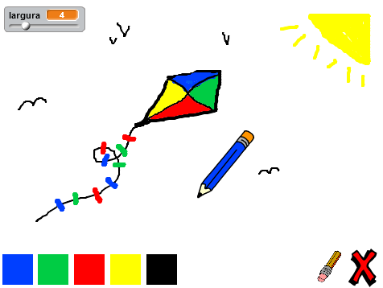
</div>

# Passo 1: Fazendo um lápis { .activity }

Vamos começar criando um lápis, que pode ser usado para desenhar no palco.

## Checklist da Atividade { .check }

+ Comece um novo projeto Scratch, e delete o ator gato de forma que seu projeto fique vazio. Você pode encontrar o editor online do Scratch em <a href="http://jumpto.cc/scratch-new">jumpto.cc/scratch-new</a>.

+ Adicione o ator lápis no seu projeto.

	

+ Clique em 'Fantasias', e delete a fantasia 'lapis-b'.

	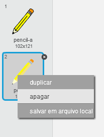

+ Renomeie sua fantasia para 'lapis-azul', e use a ferramenta 'Colorir uma forma' para deixar o lápis azul.

	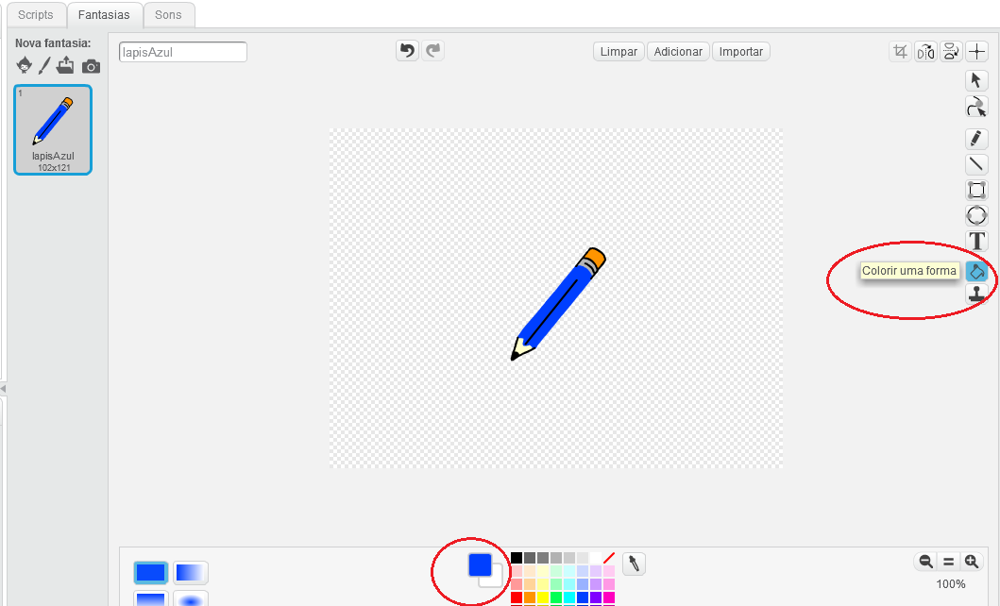

+ Como você usará o mouse para desenhar, que vai querer que o lápis siga o mouse `sempre` {.blockcontrol}. Adicione este código para o lápis:

	```blocks
		quando clicar em ⚑
		sempre
  	 		vá para [mouse pointer v]
		end
	```

+ Teste esse código clicando na bandeira e então mova o mouse em volta do palco. Funcionou como esperado?

+ Você notou que é o centro da lápis, e não a ponta, que segue o ponteiro do mouse?

	

	Para arrumar isso, clique na fantasia 'lapis-azul' do ator lápis, e clique em 'Especificar centro da fantasia'.

	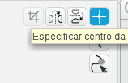

+ Você deve perceber que uma mira aparece na fantasia. Agora você pode clicar logo abaixo da ponta do lápis, para definir este ponto como centro da fantasia.

	

+ Clique na aba 'Scripts', e teste seu lápis novamente - ele funciona melhor que antes?

+ Agora, vamos fazer seu lápis desenhar `se` {.blockcontrol} se o mouse tiver sido clicado. Adicione este código para o seu lápis:

	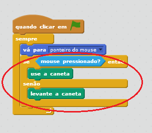

+ Teste seu código novamente. Agora, mova o lápis pelo palco e pressione o botão do mouse. Você consegue desenhar com seu lápis?

	

## Salve seu projeto { .save }

# Passo 2 2: Lápis coloridos { .activity }

Vamos adicionar diferentes cores de lápis ao seu projeto, e permitir que o usuário escolha entre elas!

## Checklist da atividade { .check }

+ Clique no ator lápis, clique em 'Fantasias' e duplique a fantasia 'lapis-azul'.

	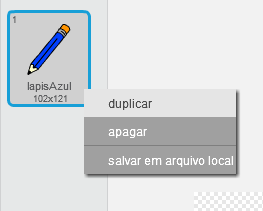

+ Renomeie sua nova fantasia para 'lapis-verde', e mude a cor do lápis para verde.

	

+ Crie dois novos atores, os quais você usará para selecionar o lápis azul ou verde.

	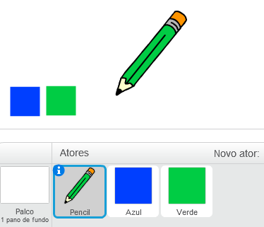

+ Quando o seletor verde é clicado, você precisa `enviar` {.blockevents} uma mensagem para o ator lápis, dizendo para ele mudar sua fantasia e a cor do lápis.

	Para fazer isso, primeiro adicione este código para o ícone do seletor verde:

	```blocks
		quando este ator for clicado
		envie [green v] a todos
	```

	Para criar o bloco `envie` {.blockevents}, clique na seta para baixo e selecione 'nova mensagem'.

	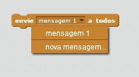

	Você pode digitar 'verde' para criar sua nova mensagem.

	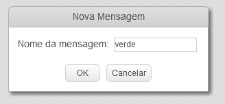

+ Você precisa contar para seu ator lápis o que fazer quando ele receber a mensagem. Adicione este código para o lápis:

	```blocks
		quando eu ouvir [green v]
		mude para a fantasia [pencil-green v]
		mude a cor da caneta para [#00ff00]
	```

	Para fazer com que o lápis pinte de verde, clique na caixa colorida do comando `mude a cor da caneta para` {.blockpen}, e clique no ícone do seletor verde para escolher verde para a cor do seu lápis.

+ Você pode, agora, fazer o mesmo para o ícone do lápis azul, adicionando este código para o seletor azul:

	```blocks
		quando este ator for clicado
		envie [blue v] a todos
	```

	...e adicionando esté código para o lápis:

	```blocks
		quando eu ouvir [blue v]
		mude para a fantasia [pencil-blue v]
		mude a cor da caneta para [#0000ff]
	```

+ Finalmente, você precisa contar para o lápis qual fantasia e cor escolher, bem como limpar a tela, quando seu projeto é iniciado. Adicione esté código no começo do  código do lápis `Quando clicar em` {.blockevents} (antes do loop `sempre` {.blockcontrol}):

	```blocks
		apague tudo
		mude para a fantasia [blue-pencil v]
		mude a cor da caneta para [#0000ff]
	```

	Se você quiser, você pode começar com uma cor diferente de lápis

+ Teste seu projeto. Você pode mudar entre as cores azul e verde?

	

## Salve seu projeto { .save }

# Passo 3: Cometendo erros { .activity .new-page }

Algumas vezes erros acontecem, então vamos acrescentar um botão 'limpar' e uma borracha ao seu projeto!

## Checklist da Atividade { .check }

+ Vamos acrescentar um botão para limpar ao seu palco. Para fazer isso, acrescente o ator letra X ao seu palco, seu nome é 'X-block', e mude sua cor para vermelho.

	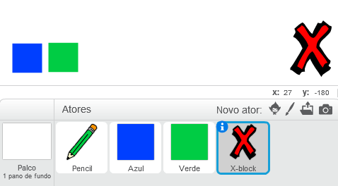

+ Acrescente este código ao seu novo botão Cancelar para limpar o palco, quando este botão for clicado.

	```blocks
		quando este ator for clicado
		apague tudo
	```

	Perceba que você não precisa enviar uma mensagem para limpar o palco, qualquer ator pode fazer isto!

+ Você também pode criar uma borracha. Se seu líder do clube tiver fornecido uma pasta 'Recursos', clique em 'Carregue fantasia a partir de arquivo' e acrescente a imagem 'eraser.svg'.

	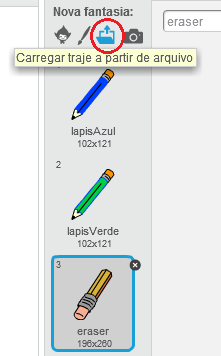

	Se você não tiver a imagem eraser.svg, crie um lápis branco e o utilize!

+ Você deve acrescentar a imagem da borracha como um  seletor. É assim que seu palco deve ficar:

	

+ Você pode acrescentar este código ao ator borracha, para dizer ao lápis para se trocar por uma borracha.

	```blocks
		quando este ator for clicado
		envie [eraser v] a todos
	```

+ Quando o lápis receber esta mensagem, você pode criar uma borracha simplesmente trocando a fantasia de lápis para a fanstasia de borracha e mudando a cor do lápis para a mesma cor do seu palco.

	```blocks
		quando eu ouvir [eraser v]
		mude para a fantasia [eraser v]
		mude a cor da caneta para [#FFFFFF]
	```

+ Teste seu projeto, para ver se você pode limpar e apagar o palco.

	

+ Ainda temos mais um problema com o lápis - você pode desenhar em qualquer lugar do palco, incluindo a área dos botões seletores!

	

	Para consertar isto, você tem que dizer ao lápis para desenhar apenas se o mouse estiver clicado _e_ se a posição y for maior que -120 (`posição y do mouse`{.blocksensing}`> -120` {.blockoperators}). Mude o comando `se` {.blockcontrol} do seu lápis para isto:

	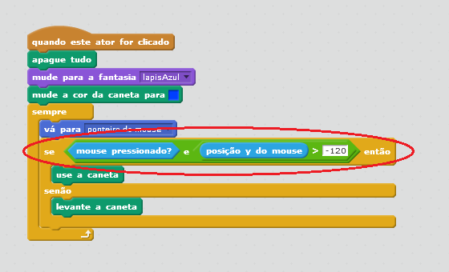

+ Teste seu projeto; agora você não conseguirá mais desenhar perto dos seletores.

	

## Salve seu projeto { .save }

# Step 4: Mudando o tamanho do lápis { .activity .new-page }

Vamos permitir ao usuário desenhar usando diversas grossuras do traço do lápis.

## Checklist da Atividade { .check }

+ Primeiro, adicione uma nova variável chamada 'largura'. Se você não tiver certeza de como fazer isso, o projeto 'Balloons' ajudará você.

+ Adicione esta linha _dentro_ do loop `sempre` {.blockcontrol} do código do seu lápis:

	```blocks
		mude o tamanho da caneta para (largura)
	```

	A largura do seu lápis terá o valor da variável 'largura'.

+ Você pode mudar o valor armazenado nessa variável clicando com o botão direito na sua variável e clicando em 'controle deslizante'.

	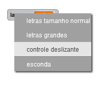

	Agora, você pode arrastar o controle deslizante da variável para mudar seu valor.

	

+ Teste seu projeto, e veja se você consegue modificar a largura do lápis.

	

	Se você preferir, você pode escolher um valor mínimo e máximo para a variável 'largura'. Para fazer isso, clique com o botão direito novamente na sua variável e clique em 'definir cursor mín. e máx.'. Escolha os valores mínimo e máximo 1 e 20 para sua variável para ter um controle mais sensível.
	
	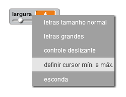

	Continue testando sua variável 'largura' até você ficar feliz.

## Salve seu projeto { .save }

## Desafios: Atalhos { .challenge }
Você consegue criar novos atalhos de teclado para seus comandos? Por exemplo:

+ b = mudar para azul
+ g = mudar para verde
+ e = mudar para borracha
+ c = limpar tela

Você também poderia permitir ao usuário mudar o tamanho do lápis com as setas do teclado!

## Salve seu projeto { .save }

## Desafio: Mais canetas { .challenge }
Você consegue adicionar canetas vermelhas, amarelas e pretas para seu programa de desenhar? Você encontrará todas as imagens que precisar na pasta 'Resources'. Lembre de adicionar atalhos de teclado para essas novas cores!

Você consegue usar suas canetas para desenhar uma foto?


