---
title: Banda de Rock
level: Scratch 1
language: pt-BR
stylesheet: scratch
embeds: "*.png"
materials: ["Club Leader Resources/*.*"]
...

# Introdução { .intro }

Neste projeto você vai aprender como codificar os seus próprios instrumentos musicais!

<div class="scratch-preview">
  <iframe allowtransparency="true" width="485" height="402" src="http://scratch.mit.edu/projects/embed/26741186/?autostart=false" frameborder="0"></iframe>
  
</div>

# Passo 1: Atores (Sprites) { .activity }

Antes que você possa começar a animar, é preciso adicionar uma 'coisa' para animar. No Scratch, estas "coisas" são chamados __sprites__ ou __fantasias__. 

## Lista de atividades { .check }

+ Primeiro, abra o editor do Scratch. Você pode encontrar o editor Scratch on-line em <a href="http://jumpto.cc/scratch-new">jumpto.cc/scratch-new</a>. A aparência é como esta:

	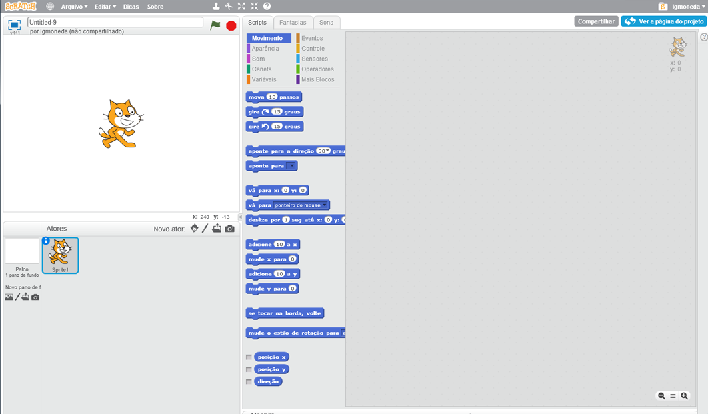

+ O sprite que você pode ver (um gato), é o mascote do Scratch. Vamos nos livrar dele, clicando com o botão direito e, em seguida, clicando em 'apagar'.

	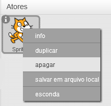

+ Em seguida, clique 'Escolher ator da biblioteca' para abrir uma lista de todos os sprites de Scratch.

	

+ Role para baixo até ver um tambor. Clique no tambor e em 'OK' para adicioná-lo ao seu projeto.

	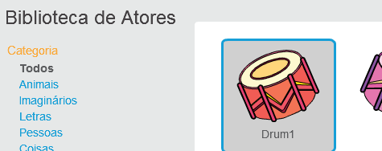

+ Clique no ícone 'reduzir', e em seguida, clique no tambor algumas vezes para reduzir o seu tamanho.

	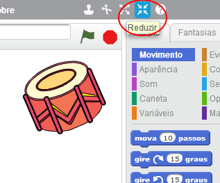

## Salve seu projeto { .save }

Dê a seu programa um nome, digitando o nome na caixa de texto acima do 'cenário'.

Você pode, em seguida, clicar em "Arquivo" e depois "Salvar agora" para salvar seu projeto.

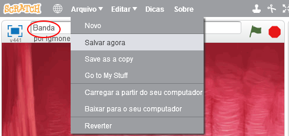

# Passo 2: área de Atuação { .activity }

O __cenário__ é a área à esquerda, e é o lugar onde o seu projeto ganha vida. Pense nisso como uma área de atuação, assim como um palco!

## Lista de atividades { .check }

+ No momento, o palco é branco e parece muito chato! Vamos adicionar um pano de fundo para o palco, clicando 'Escolher pano de fundo da biblioteca'.

	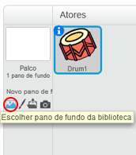

+ Clique em 'Interior' à esquerda, e em seguida, em uma cortina de fundo e clique 'OK'.

	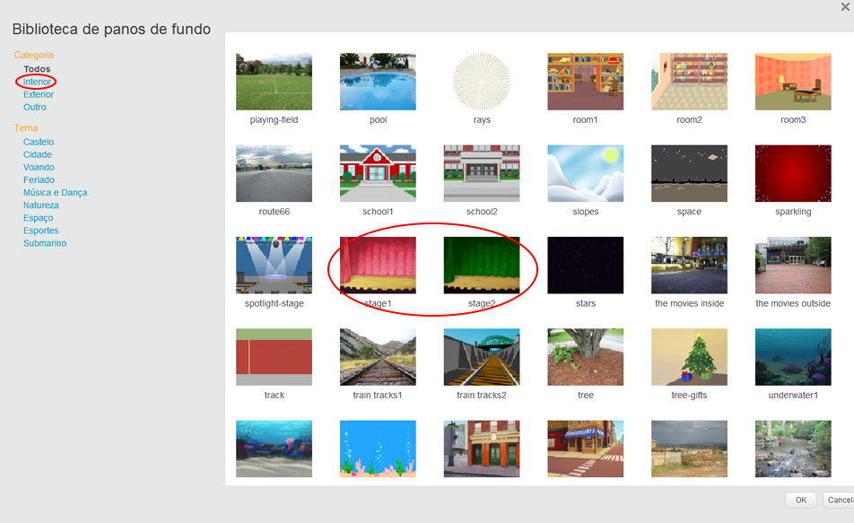

+ Seu palco deve agora estar parecido como este:

	

# Passo 3: Fazendo um tambor { .activity }

Vamos codificar seu tambor para fazer um som quando é batido.

## Lista de atividades { .check }

+ Você pode encontrar os blocos de código na aba 'Scripts' e todos eles são codificados por cores! 

	Clique no tambor e em seguida arraste estes 2 blocos na área do código à direita. Verificar se eles estão ligados entre si (como blocos de Lego):

	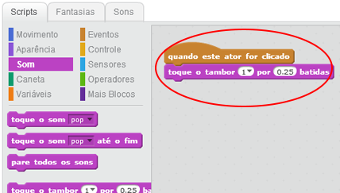

+ Clique no tambor para experimentar o seu novo instrumento!

+ Você também pode alterar a forma como o tambor fica quando este é clicado, criando uma nova Fantasia. Clique na aba 'Fantasias' e você verá a imagem do tambor.

	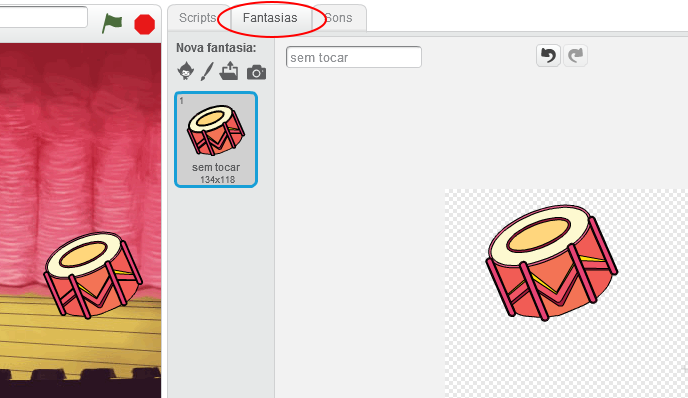

+ Clique com o botão direito do mouse sobre a Fantasia e clicar em 'duplicar' para criar uma cópia da Fantasia.

	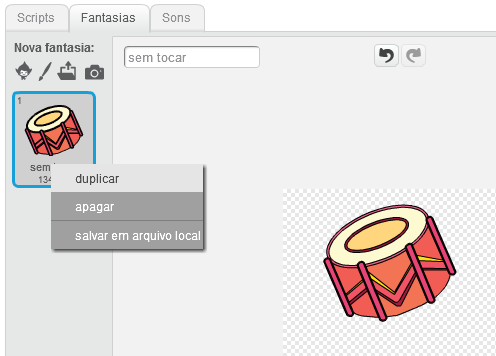

+ Clique na nova Fantasia (chamado 'drum2') e em seguida selecione a ferramenta de linha. E você pode desenhar linhas para fazer parecer que o tambor está fazendo um som.

	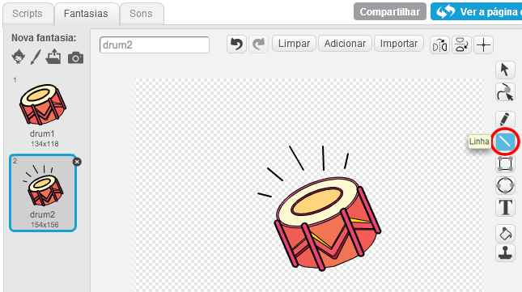

+ Os nomes das Fantasias não são muito úteis no momento. Mude o nome das duas Fantasias para 'sem tocar' e 'tocando'. você pode digitar o novo nome de cada Fantasia na caixa de texto.

	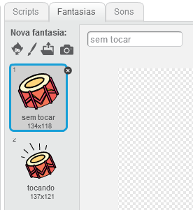

+ Agora que você tem duas Fantasias diferentes para seu tambor, você pode escolher qual Fantasia será exibida! Adicione dois blocos para o seu tambor:

	

	O bloco de código para alterar a Fantasia é na secção `Aparência` {.blocklooks}.

+ Teste o seu tambor. Quando clicado, o tambor deve agora parecer como se tivesse sido tocado!

## Salve seu projeto { .save }

##Desafio: Melhorar o seu tambor { .challenge }

+ Você consegue alterar o som do tambor quando é clicado?


+ Você também pode fazer um som quando a barra de espaço é pressionada? Você vai precisar usar este bloco `Eventos` {.blockevents}:

```blocks
	quando pressionar tecla [espaço v]
```

Você pode copiar seu código existente clicando com o botão direito sobre ele e clique 'duplicar'.

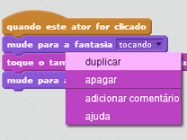

## Salve seu projeto { .save }

# Passo 4: Fazendo um cantor { .activity .new-page }

Vamos adicionar um cantor a sua banda!

## Lista de atividades { .check }

+ Adicionar mais 2 sprites para o seu palco; um cantor e um microfone.

	

+ Antes que você possa faze-lo cantar, você precisa adicionar um som para seu sprite. Certifique-se de que você selecionou o seu cantor, em seguida, clique na aba Sons e então clique em 'Escolha o som da biblioteca':

	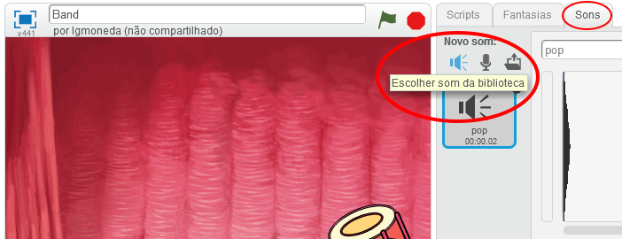

+ Se você clicar 'Vocais' do lado esquerdo, então você vai ser capaz de escolher um som adequado para adicionar ao seu sprite.

	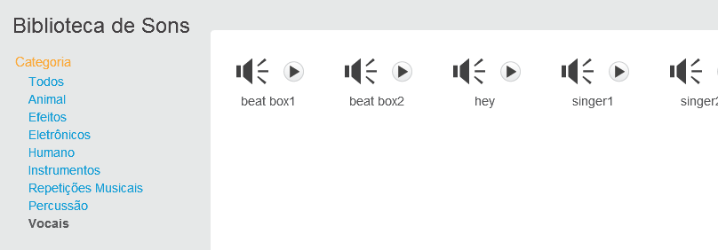

+ Agora que foi adicionado o som, você pode adicionar este código ao seu cantor:

	```blocks
		quando este ator for clicado
		toque o som [singer 1v] até o fim
	```

+ Clique no seu cantor para testar se ela canta quando clicado.

## Salve seu projeto { .save }

##Desafio: Mudando a Fantasia de seu cantor { .challenge }
Você pode fazer com que seu cantor pareça que está cantando quando você clicar nele? Se você precisar de ajuda, você pode usar as instruções para a criação de um tambor acima.


Lembre-se de testar se o novo código funciona!

## Salve seu projeto { .save }

##Desafio: Faça a sua própria banda { .challenge }
Use o que você aprendeu neste projeto para fazer a sua própria banda! Você pode criar qualquer instrumentos que você gosta, mas ouça os sons e instrumentos para ter algumas idéias.


Os seus instrumentos não tem que fazer sentido. Por exemplo, você poderia fazer um piano feito de bolinhos!


Bem como a utilização de fantasias existentes, você também pode criar suas próprias fantasias.


Se você tiver um microfone você pode gravar os seus próprios sons, ou mesmo usar uma webcam para fazer seus instrumentos!


## Salve seu projeto { .save }

## Community Contributed Translation { .challenge .pdf-hidden }

This project was translated by Silvio Casagrande. Our amazing translation volunteers help us give children around the world the chance to learn to code.  You can help us reach more children by translating a Code Club project via [Github](https://github.com/CodeClub/curriculum_documentation/blob/master/contributing.md) or by getting in touch with us at hello@codeclubworld.

