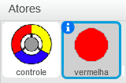
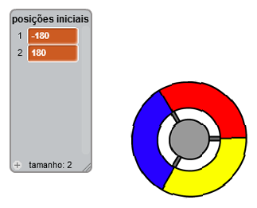
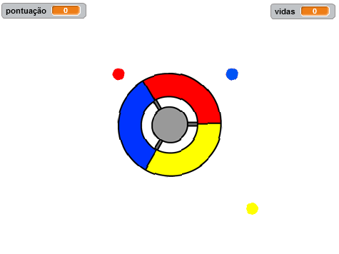
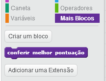
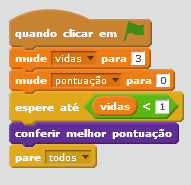

---
title: Capturando Bolinhas
level: Scratch 2
language: pt-BR
stylesheet: scratch
embeds: "*.png"
materials: ["Club Leader Resources/*", "Project Resources/*"]
beta: true
...

# Introdução { .intro }

Neste projeto vocês vão criar um jogo, no qual o jogador terá que capturar as bolinhas das diferentes cores com as partes certas de um controle redondo e colorido.

<div class="scratch-preview">
  <iframe allowtransparency="true" width="485" height="402" src="http://scratch.mit.edu/projects/embed/44942820/?autostart=false" frameborder="0"></iframe>
  
</div>

# Passo 1: Criando o controle { .activity }

Vamos começar criando o controle, que será usado para capturar as bolinhas. 

## Lista de atividades { .check }

+ Comece um novo projeto no Scratch, apague o ator do gato, assim o seu projeto ficará vazio. Você pode encontrar uma versão online do Scratch em <a href="http://jumpto.cc/scratch-new">jumpto.cc/scratch-new</a>.

+ Se o instrutor do seu clube tiver dado para você uma pasta chamada 'Recursos', clique em 'Carregar ator a partir de arquivo' e adicione a imagem 'controle.svg'. Você deve colocar seu controle no meio do cenário. 

	
	
	Se você não tem essa imagem, você pode desenhá-la! 
	
+ Girar o controle para a direita quando a seta para a direita for pressionada:

	```blocks
		quando clicar em ⚑
		sempre
		   se <tecla [seta para a direita v] pressionada?> então
		      gire ↻ (3) graus
		   end
		end
	```
+ Teste seu controle, ele deve girar para a direita.

## Salve seu projeto { .save }

## Desafio: Girando para esquerda {.challenge}
Você consegue fazer o seu controle girar para a esquerda quando a seta para a esquerda for pressionada? 

## Salve seu projeto { .save }

# Passo 2: Coletando Bolinhas { .activity }

Adicione algumas bolinhas para que o jogador possa coletar com o controle.

## Lista de atividades { .check }

+ Crie um novo ator chamado 'vermelha'. Esse ator deve ser um ponto vermelho e pequeno. 

	

+ Adicione este script à sua bolinha vermelha, assim será criado um clone dela (uma cópia) de tempos em tempos:

	```blocks
		quando clicar em ⚑
		espere (2) seg
		sempre
		   crie clone de [este ator v]
		   espere (escolha número entre (5) e (10)) seg
		end
	```

+ Quando cada clone é criado, você quer que ele apareça em um dos quatro cantos do cenário.

	

	Para fazer isso, crie uma lista de variáveis chamda  `posições iniciais` {.blockdata} e clique em `(+)` para adicionar os valores `-180` e `180`.

	

+ Você pode usar esses dois itens da sua lista para escolher um canto aleatório do cenário. Adicione esse código ao ator da sua bolinha, então cada clone vai para um canto aleatório e irá se mover lentamente na direção do controle.

	```blocks
		quando eu começar como clone
		vá para x:(item (random v) de [posições iniciais v]) y:(item (random v) de [posições iniciais v])
		aponte para [controle v]
		mostre
		repita até que <tocar em [controle v]?>
		   mova (1) passos
		end
	```

	O código acima escolhe `-180` ou `180` para a posição x e y, ou seja, cada clone irá começar em um dos cantos do cenário. 

+ Teste seu projeto. Você deve ver várias bolinhas vermelhas aparecendo em cada canto do cenário e indo na direção do controle. 

	

+ Crie duas novas variáveis chamadas `vidas` {.blockdata} e `pontuação` {.blockdata}.

+ Adicione o código ao seu cenário para definir a quantidade de `vidas` {.blockdata} para 3 e a `pontuação` {.blockdata} para zero no começo do jogo.

+ Você precisa adicionar o código no final do código para bola vermelha, em `quando eu começar como clone` {.blockcontrol}, assim 1 será adicionado à `pontuação` {.blockdata} do jogador se as cores combinarem, ou 1 é subtraido das `vidas` {.blockdata} do jogador se as cores forem diferentes. 

	```blocks
		mova (5) passos
		se <tocou na cor [#FF0000]?> então
		   adicione a [pontuação v] (1)
		   toque o som [pop v]
		senão
		   adicione a [vidas v] (-1)
		   toque o som [laser1 v]
		end
		apague este clone
	```

+ Adicione este código ao final do script do cenário, então o jogo termina quando o jogador perde todas as vidas: 

	```blocks
		espere até <(vidas) < [1]>
		pare [todos v]
	```

+ Teste seu jogo para ter certeza que o código funciona como esperado. 

## Salve seu projeto { .save }

## Desafio: mais bolinhas! {.challenge}
Duplique o ator 'vermelha' duas vezes (com o botão direito do mouse), e dê o nome dos novos atores de 'amarela' e 'azul'.


Edite esses atores (incluindo seu código), para que cada cor do ponto combine com a cor certa no controlador. Lembre de testar seu projeto, confira se você ganha os pontos e perde as vidas da maneira correta, também verifique se seu jogo não está muito fácil ou difícil.



## Salve seu projeto { .save }

# Passo 3: Aumentando a dificuldade { .activity .new-page}

Vamos fazer com que o jogo fique mais difícil de acordo com a sobrevivência do jogador, ao reduzir o intervalo entre a aparição das bolinhas. 

## Lista de atividades { .check }

+ Crie uma nova variável chamada `atraso` {.blockdata}.

+ No seu cenário, crie um novo script que define o atraso com um número grande, então reduza este número lentamente. 

	```blocks
		quando clicar em ⚑
		mude [atraso v] para (8)
		repita até que <(atraso) = (2)>
		   espere (10) seg
		   adicione a [atraso v] (-0.5)
		end
	```

	Repare que esse código é bem parecido com aquele do cronômetro dos jogos! 
	
+ Finalmente, você pode usar essa variável `atraso` {.blockdata} no script da sua bolinha vermelha, amarela e azul. Remova o código que faz com que seja esperado um número aleatório de segundos entre a criação dos clones e substitua pela nossa nova variável `atraso` {.blockdata}:

	```blocks
		espere (atraso) seg
	```

+ Teste a sua nova variável `atraso` {.blockdata}, e veja se o atraso entre a criação das bolinhas diminui lentamente. Está funcionando para as 3 cores de bolinhas? Você pode ver o valor do `atraso` {.blockdata} diminuindo?

## Salve seu projeto { .save }

## Desafio: Bolinhas mais rápidas {.challenge}
Você consegue melhorar o seu jogo adicionando uma variável `velocidade` {.blockdata}, então as bolinhas começam a mover-se um passo por vez e vão aumentando a sua velocidade constantemente? Funcionará de uma maneira muito parecida com a variável `atraso` {.blockdata} utilizada acima, e você pode utilizar o código dessa parte para ajudá-lo.

## Salve seu projeto { .save }

# Passo 4: Melhor pontuação { .activity }

Vamos salvar a melhor pontuação, assim os jogadores podem saber se estão indo bem. 

## Lista de atividades { .check }

+ Crie uma nova variável chamada `melhor pontuação` {.blockdata}.

+ Clique no cenário, e cria um novo bloco personalizado chamado `conferir melhor pontuação` {.blockmoreblocks}.

	

+ Logo antes do final do jogo, adicione o seu novo bloco personalizado. 

	

+ Adicione este código ao seu bloco personalizado para guardar a `pontuação` {.blockdata} atual como a `melhor pontuação` {.blockdata} `se` {.blockcontrol} ela for a maior pontuação até então:

	```blocks
		defina [conferir melhor pontuação]
		se <(pontuação) > (melhor pontuação)> então
		   mude [melhor pontuação v] para (pontuação)
		end
	```

+ Teste o código que você acabou de adicionar. Jogue e verifique se a `melhor pontuação` {.blockdata} é atualizada corretamente.

## Salve seu projeto { .save }

## Desafio: Melhore o seu jogo! {.challenge}

Você acha que consegue melhorar seu jogo? Por exemplo, você poderia criar bolinhas especias que:

+ dobram sua pontuação;
+ diminuem a velocidade das bolinhas;
+ esconde todas as outras bolinhas na tela!

## Salve seu projeto { .save }

## Desafio: Menu do jogo {.challenge}
Você consegue adicionar um menu (com botões) ao seu jogo? Você conseguiria adicionar uma tela de instruções, ou uma tela separada para mostrar a pontuação mais alta? Se precisar de ajuda com essa parte, o projeto do jogo da tabuada poderá te ajudar!
