---
title: Crie seu próprio mundo
level: Scratch 2
language: pt-BR
stylesheet: scratch
embeds: "*.png"
materials: ["Club Leader Resources/*","Project Resources/*"]
...

# Introdução { .intro }

Neste projeto, você aprenderá como criar o seu próprio jogo de aventura em mundo aberto. 

<div class="scratch-preview">
  <iframe allowtransparency="true" width="485" height="402" src="http://scratch.mit.edu/projects/embed/34248822/?autostart=false" frameborder="0"></iframe>
  
</div>

# Passo 1: Criando o jogador com código { .activity }

Vamos começar criando um jogador que possa se movimentar pelo seu mundo. 

## Lista de atividades { .check }

+ Crie um novo projeto Scratch. Delete o ator gato para ter um projeto vazio. Você pode encontrar o editor online do Scratch em <a href="http://jumpto.cc/scratch-new">jumpto.cc/scratch-new</a>.

+ Para este projeto, você deve receber uma pasta chamada 'Recursos do projeto', contendo todas as images que você precisará. Veja se você consegue encontrar essa pasta, peça ajuda ao instrutor, caso não consiga encontrá-la. 

	

+ Adicione a imagem 'room1.png' como o novo pano de fundo do palco, e a imagem 'player.png' como um novo ator. Se você não tiver essas imagens, você pode desenhá-las. É assim que seu projeto deve ser: 

	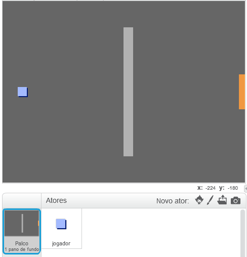

+ Vamos usar as setas direcionais para movimentar o jogador. Quando o jogador pressiona a seta para cima, nós queremos que o personagem vá para cima, fazendo com que a coordenada y mude. Adicione esse código ao seu ator: 

	```blocks
		quando clicar em ⚑
		sempre
		   se <tecla [seta para acima v] pressionada?> então
		      adicione (2) a y
		   end
		end
	```

+ Teste o seu jogador clicando na bandeira verde e depois pressionando a seta para cima. O personagem se move para cima? 

	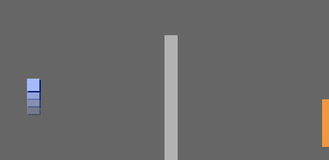

+ Para movimentar o personagem para a esquerda, adicione outro bloco `se` {.blockcontrol} ao seu personagem, que mudará a coordenada x:

	```blocks
		quando clicar em ⚑
		sempre
		   se <tecla [seta acima v] pressionada?> então
		      adicione (2) a y
		   end
		   se <tecla [seta para a esquerda v] pressionada?> então
		      adicione (-2) a x
		   end
		end
	```

## Desafio: Movimentando para todas as direções {.challenge}
Vamos lá, adicione mais código ao seu personagem para fazê-lo movimentar-se para cima, baixo, esquerda e direita. Alguns você já fez, se precisar de ajuda para as outras direções, reveja o que já foi feito! 

## Salve seu projeto { .save }

+ Teste o seu personagem novamente, você verá que ele consegue atravessar as paredes cinzas. 

	

+ Para arrumar isso, você precisa movimentar o jogador, mas fazer com que ele vá para trás se bater em uma parede. Aqui está o código que você precisará: 

	```blocks
		quando clicar em ⚑
		sempre
		   se <tecla [seta acima v] pressionada?> então
		      adicione (2) a y
		      se <tocou na cor [#BABABA]?> então
			 adicione (-2) a y
		      end
		   end
		end
	```

	Repare que os novos blocos `se`{.blockcontrol}`tocou na cor`{.blocksensing} estão _dentro_ do bloco `se`{.blockcontrol}`tecla [seta acima v] pressionada?`{.blocksensing}.

+ Teste esse novo código tentando movimentar-se através das paredes. Você não deve ser capaz de passar por elas! 

	

+ Vamos fazer o mesmo para a seta direcional para a esquerda, movimentando o personagem para trás, caso ele toque a parede. É assim que o código do personagem deve estar: 

	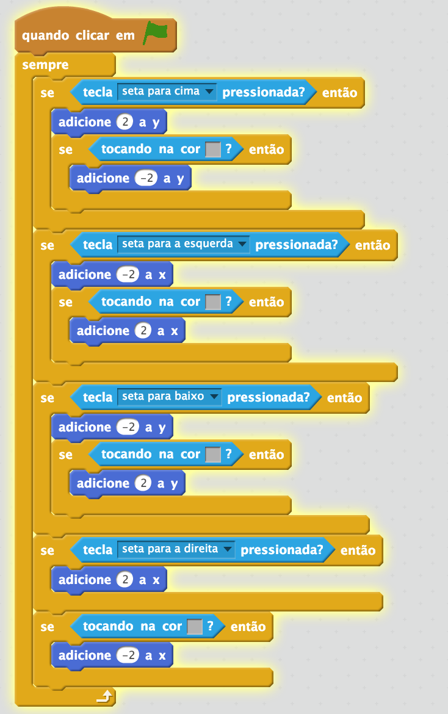

## Desafio: Arrumando a movimentação do jogador {.challenge}
Adicione todo o código necessário para o seu personagem não consiga atravessar as paredes em nenhuma das direções. Use o código que você já escreveu para te ajudar nisso! 

## Salve seu projeto { .save }

# Passo 2: Codificando o seu mundo { .activity }

Vamos agora fazer com que o personagem possa atravessar portas e entrar em outras salas! 

## Lista de atividades { .check }

+ Adicione mais dois panos de fundo ao seu cenário ('room2.png' e 'room3.png'), então você terá 3 panos de fundo no total. Confira se eles estão na ordem correta, isso vai te ajudar mais tarde. 

	

+ Você precisará de uma nova variável chamada `sala` {.blockdata}, para manter registro de qual sala o personagem está. 

	

+ Quando o personagem tocar a porta laranja na primeira sala, o próximo pano de fundo tem que ser mostrado, e o jogador deve ser reposicionado para a parte esquerda do cenário. Aqui está o código que você precisará, ele deverá estar nos scripts do personagem e dentro do bloco de loop `sempre` {.blockcontrol}:

	```blocks
		se <tocando na cor [#F2A24A]?> então
		   mude para o pano de fundo [próximo pano de fundo v]
		   vá para x:(-200) y:(0)
		   adicione a [sala v] (1)
		end
	```

+ Adicione esse código ao _inicio_ do código do seu personagem (antes do bloco de loop `sempre` {.blockcontrol}) para ter certeza de que tudo será reiniciando quando a bandeira verde é clicada: 

	```blocks
		mude [sala v] para (1)
		vá para x:(-200) y:(0)
		mude para o pano de fundo [room1 v]
	```

+ Clique na bandeira verde e movimente o personagem com as setas até a porta laranja. Seu personagem vai para a próxima tela? A variável `sala` {.blockdata} muda para 2?

	

## Desafio: Movendo-se para a sala anterior {.challenge}
Você consegue fazer o personagem voltar para a sala anterior quando ele toca a porta amarela? Lembre-se que esse código será _muito_ parecido com aquele que você fez para o personagem ir para a próxima sala, a da porta laranja. 

## Salve seu projeto { .save }

# Passo 3: Sinalizações { .activity }

Vamos adicionar pistas ao seu mundo, elas guiarão o jogador ao longo da jornada. 

## Lista de atividades { .check }

+ Carregue a imagem 'sign.svg' como um novo ator, dê como nome 'sinalização'.

	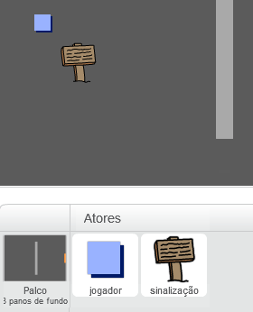

+ Essa sinalização será visível apenas na sala 1, então vamos adicionar um pouco de código às 'sinalição' pra que isso aconteça: 

	```blocks
		quando clicar em ⚑
		sempre
		   se <(sala) = [1]> então
		      mostre
		   senão
		      esconda
		   end
		end
	```

+ Teste essa sinalização ao mudar de uma sala para a outra. Ele deve aparecer apenas na sala 1.

	

+ Uma sinalização não ajuda muito se ela não disser nada! Vamos adicionar código (em um bloco separado) para mostrar uma mensagem se o aventureiro encostar na sinalização:

	```blocks
		quando clicar em ⚑
		sempre
		   se <tocando em [jogador v]?> então
		      diga [Bem-vindo! Você consegue encontrar o tesouro?]
		   senão
		      diga []
		   end
		end
	```
+ Teste a sua sinalização, você deve ver a mensagem quando o personagem tocar o ator do sinal. 

	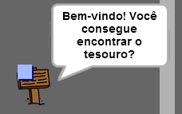

## Salve seu projeto { .save }

## Desafio: Tesouro! {.challenge}
Você pode adicionar um ator para um baú de tesouro, usando a imagem 'chest.svg'. Este tesouro deve ser colocado na sala 3 e quando o jogador encostar nela deve aparecer a mensagem "Muito bem!".

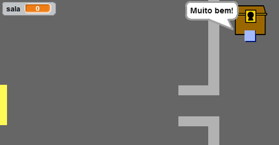

## Salve seu projeto { .save }

# Passo 4: Pessoas { .activity }

Vamos adicionar outras pessoas ao mundo para que o jogador interaja com elas. 

## Lista de atividades { .check }

+ Adicione um novo ator, utilize a imagem 'person.png'.

	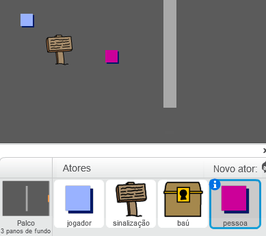

+ Adicione esse código, assim a pessoa falará com o jogador. Esse código é bem parecido com aquele que usamos para a sinalização: 

	```blocks
		quando clicar em ⚑
		vá para x:(-200) y:(0)
		sempre
		   se <tocando em [jogador v]?> então
		      diga [Você sabia que pode entrar pelas portas amarela e laranja?]
		   senão
		      diga []
		   end
		end
	```

+ Você também pode fazer com que essa pessoa ande! Utilizando esses dois blocos: 

	```blocks
		mova (1) passos
		se tocar na borda, volte
	```

	A pessoa vai se comportar de modo diferente, dependendo de onde você colocar esses blocos dentro do loop `sempre` {.blockcontrol} ou do  bloco `se` {.blockcontrol}. Tente das duas formas, veja qual você prefere.

	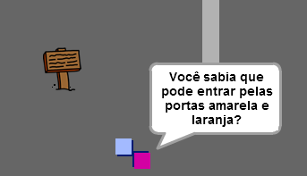

+ Você deve ter percebido que a sua pessoa fica de ponta cabeça. Para arrumar isso, clique no ator e no ícone de informação (`i`{.blockmotion}), então mude o estilo de rotação.

	

## Desafio: Melhorando a nossa pessoa {.challenge}
Você consegue arrumar o código para que a pessoa apareça apenas na sala 1? Lembre-se de testar seu código! 

## Salve seu projeto { .save }

+ Você também pode adicionar patrulheiros inimigos, que fazem com que o jogo termine se o jogador encostar neles. Adicione um novo ator, mude o seu estilo de rotação da mesma forma que você fez com o ator 'pessoa'.

+ Adicione código para o inimigo para que ele apareça somente na sala 2. 

+ Você também terá que adicionar código para que o inimigo se mova, e para que o jogo termine se o jogador encostar no inimigo. É mais fácil fazer isso tudo em blocos de código separados. O código para o inimigo deve se parecer com este: 

	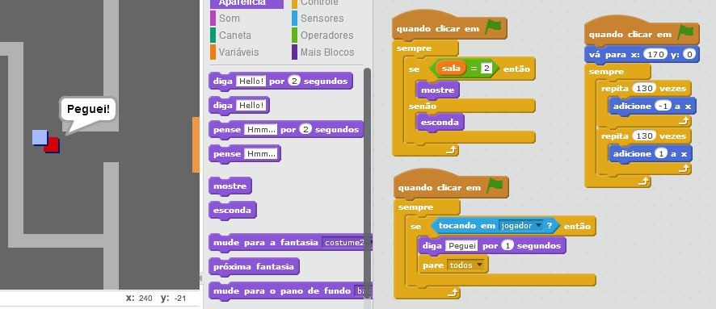

+ Teste seu inimigo, veja se ele:
	+ É visível apenas na sala 2;
	+ Faz uma patrulha pela sala;
	+ O jogo termina se o jogador encosta nele; 
	
## Salve seu projeto { .save }

## Desafio: Mais inimigos {.challenge}
Você consegue criar mais um inimigo para a sala 3, que patrulha pra cima e pra baixo e pelo vão da parede? 


## Salve seu projeto { .save }

# Passo 5: Coletando moedas { .activity }

## Lista de atividades { .check }

+ Adicione uma nova variável chamada `moedas` {.blockdata} ao seu projeto.

+ Adicione um novo ator chamado 'moeda' ao seu projeto.


+ Adicione código para a sua moeda, assim ela apareça apenas na sala 1. 

+ Adicione o código abaixo ao ator moeda, para que seja adicionado 1 à variável `moedas` {.blockdata} toda vez que elas tiverem sido coletadas:

	```blocks
		quando clicar em ⚑
		espere até <tocando em [jogador v]?>
		adicione a [moedas v] (1)
		pare [outros scripts do ator v]
		esconda
	```

	O bloco `pare [outros scripts do ator v]` {.blockcontrol} é necessário para que a moeda pare de aparecer no cenário após ter sido coletada. 
	
+ Você também terá que adicionar código para definir a sua variável `moedas` {.blockdata} para 0 assim que o jogo começar. 

+ Teste seu projeto - coletar a moeda deve mudar a sua pontuação para 1. 

## Desafio: Mais moedas {.challenge}
Você consegue adicionar mais moedas ao seu jogo? Elas podem estar em salas diferentes, e algumas moedas podem até estarem protegidas por inimigos. 

# Passo 6: Portas e chaves { .activity }

## Lista de atividades { .check }

+ Crie um novo ator utilizando a imagem 'key-blue.svg'. Mude o seu cenário para o pano de fundo 3, e coloque a chave em um local difícil de chegar. 

 	

+ Certifique-se que sua chave é visível apenas na sala 3. 

+ Crie uma nova lista chamada `inventário` {.blockdata}. Essa lista irá guardar os itens que o jogador coletar. 

+ O código para coletar a chave é bem parecido com aquele para coletar as moedas. A diferença é que você precisa adicionar a chave ao seu inventário. 

	```blocks
		quando clicar em ⚑
		espere até <tocando em [player v]?>
		adiciona [chave azul] a [inventário v]
		pare [outros scripts do ator v]
		esconda
	```

+ Teste a sua chave, veja se consegue coletá-la e ela aparece em seu inventário. Lembre-se de adicionar código ao seu palco para que o inventário esteja vazio quando a partida começar. 

	```blocks
		apague (todos v) de [inventário v]


	```

+ Crie um novo ator usando a imagem 'door-blue.png', e coloque a porta azul no vão que há entre as duas paredes. 

	

+ Adicione código para a sua porta, assim ela será visível apenas na sala 3. 

+ Você precisará esconder a sua porta azul para que ela apareça apenas quando o jogador tiver pegado a chave azul e ela estiver em seu inventário. 

	```blocks
		quando clicar em ⚑
		espere até <[inventário v] contém [chave azul]>
		pare [outros scripts do ator v]
		esconda
	```

+ Teste o seu projeto, veja se você consegue coletar a chave azul e abrir a porta. 

## Salve seu projeto { .save }

## Desafio: Crie seu pŕoprio mundo {.challenge}
Você agora pode continuar criando o seu mundo. Aqui vão algumas ideias: 

+ Modifique o cenário do seu jogo, as imagens usadas e os seus gráficos; 
+ Adicione sons e música ao seu jogo;
+ Adicione mais personagens, inimigos, sinalizações e moedas;
+ Adicione portas vermelhas e amarelas, que precisam de chaves próprias para serem abertas;
+ Adicione mais salas ao seu mundo;
+ Adicione outros itens úteis ao seu jogo;
+ Use as moedas para conseguir informações de outras pessoas; 

	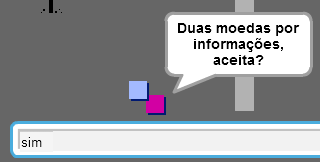

+ Você poderia adicionar uma porta no norte e outra ao sul, então o jogador pode ir em salas que estejam nas quatro direções. Por exemplo, se você tiver 9 salas, você pode pensar nelas como um tabuleiro 3x3 (como um jogo da velha). Você então poderia adicionar 3 ao número da sala para ir para outra sala na parte de baixo. 

	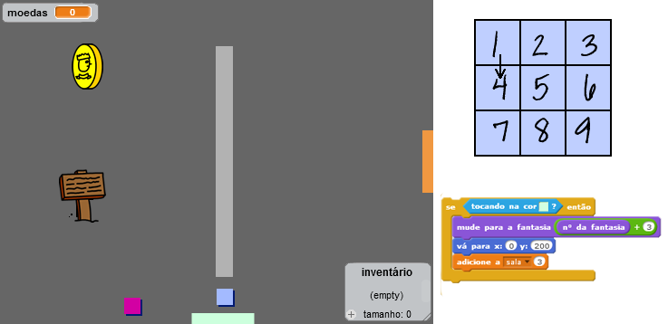

## Salve seu projeto { .save }

## Community Contributed Translation { .challenge .pdf-hidden }

This project was translated by Luis Moneda. Our amazing translation volunteers help us give children around the world the chance to learn to code.  You can help us reach more children by translating a Code Club project via [Github](https://github.com/CodeClub/curriculum_documentation/blob/master/contributing.md) or by getting in touch with us at hello@codeclubworld.

