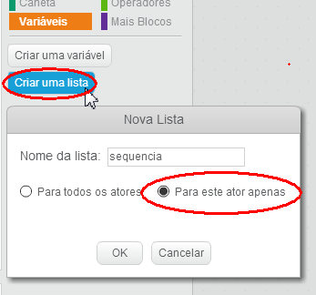
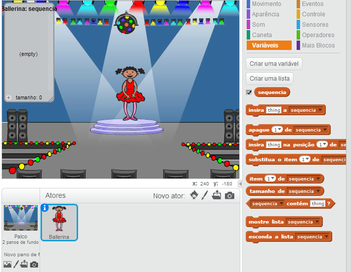
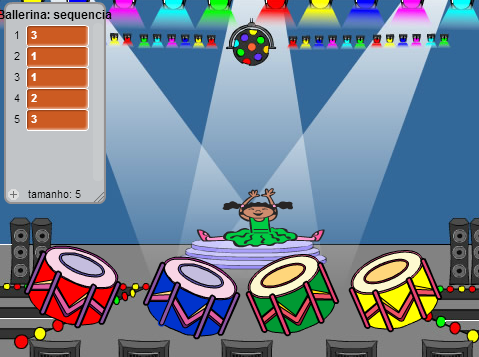
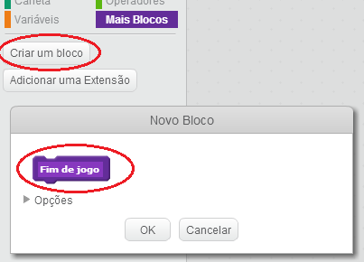
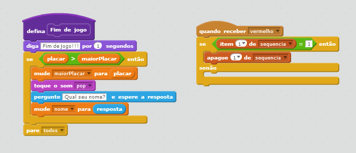
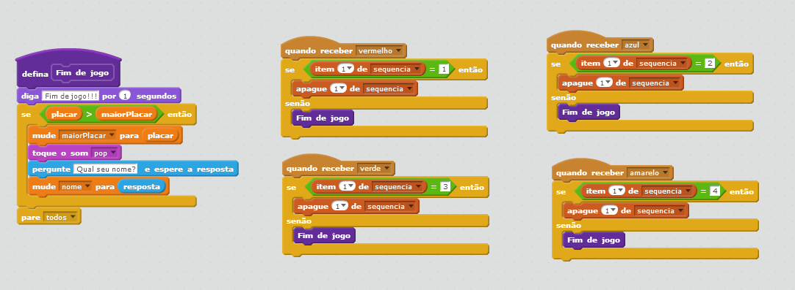
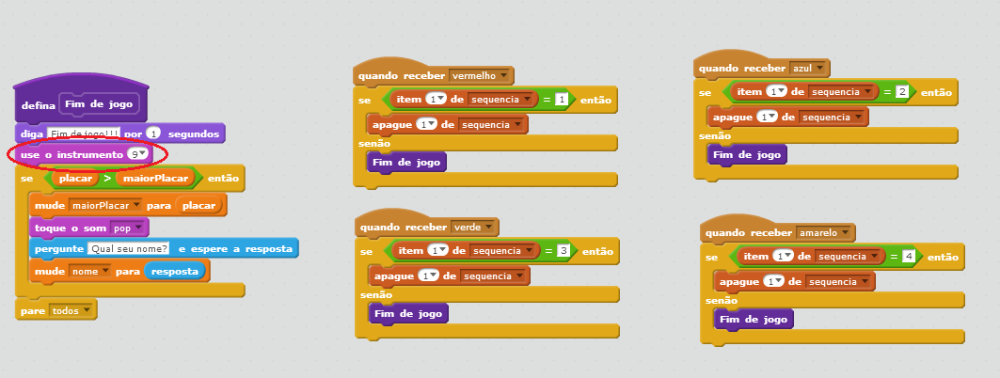
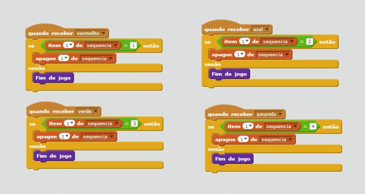

---
title: Jogo da Memória
level: Scratch 2
language: pt-BR
stylesheet: scratch
embeds: "*.png"
materials: ["Club Leader Resources/*"]
...

## Projeto de contribuição pela comunidade { .challenge .pdf-hidden }
Este projeto foi criado por Erik e sua filha Ruth. Se você quiser contribuir com um projeto seu, [entre em contato conosco em Github](https://github.com/CodeClub).

# Introdução { .intro }

Neste projeto, você criará um jogo de memória onde você tem que memorizar e repetir uma sequência de cores aleatórias!

<div class="scratch-preview">
  <iframe allowtransparency="true" width="485" height="402" src="http://scratch.mit.edu/projects/embed/34874510/?autostart=false" frameborder="0"></iframe>
  
</div>

# Passo 1: Cores Aleatórias { .activity }

Primeiro vamos criar um personagem que possa mudar de cor seguindo uma sequência aleatória de cores, que o jogador tentará memorizar.

## Lista de Atividades { .check }

+ Crie um novo projeto Scratch. Delete o ator gato para ter um projeto vazio. Você pode encontrar o editor online do Scratch em <a href="http://jumpto.cc/scratch-new">jumpto.cc/scratch-new</a>

+ Escolha um ator e um pano de fundo. Seu ator não precisa ser uma pessoa, mas ele tem que poder mudar de cor.

	

+ No seu jogo você usará um número diferente para representar cada cor:

	+ 1 = vermelho;
	+ 2 = azul;
	+ 3 = verde;
	+ 4 = amarelo.

	Dê a seu ator 4 fantasias coloridas, cada uma com uma das cores acima. Garanta que as fantasias sigam a mesma ordem das cores acima.

	

+ Para criar uma sequência aleatória, você precisa criar uma __lista__. Uma lista é apenas uma variável que armazena vários dados __em ordem__. Crie uma nova lista chamada `sequencia` {.blockdata}. Já que apenas seu ator precisa ver a lista, podemos selecionar 'Para este ator apenas'.

	

	Você verá uma lista vazia no seu cenário no lado esquerdo ao alto, e verá também vários blocos de código para usar com a lista.

	

+ Adicione este código ao seu ator, para inserir um número aleatório a sua lista (e mostrar a respectiva fantasia) 5 vezes:

	```blocks
		quando clicar em ⚑
		apague (todos v) de [sequencia v]
		repita (5) vezes
			adiciona (número aleatório entre (1) e (4)) a [sequencia v]
			mude para a fantasia (item (ultimo v) de [sequencia v])
			espere (1) seg
		end
	```

	Note que você também acrescentou código para limpar a lista no início.

## Desafio: Acrescentando som {.challenge}

Teste seu projeto algumas vezes. Você perceberá que as vezes o mesmo número é escolhido duas vezes (ou mais) seguidamente, tornando a sequência mais difícil de memorizar. Você consegue fazer um som de tambor cada vez que  o ator muda de fantasia?

Você consegue tocar um som de tambor diferente dependendo do número aleatório gerado? Será um código _muito_ parecido com o código que muda a fantasia.

## Salve seu projeto { .save }

# Passo 2: Repetindo a sequência { .activity }

Vamos adicionar 4 botões, para que o jogador repita a sequência que ele tentou memorizar.

## Lista de atividades { .check }

+ Acrescente 4 atores que farão papel de botões no seu projeto. Altere seus 4 atores, de modo que cada um deles tenha uma das 4 cores.

	

+ Quando o tambor vermelho for clicado, você precisará enviar uma mensagem para seu ator, para que ele saiba que o tambor vermelho foi clicado. Adicione este código ao tambor vermelho:

	```blocks
		quando este ator for clicado
		envie [vermelho v] a todos
	```

+ Quando o ator receber a mensagem, ele deve verificar se o número 1 está no início da lista (o que significa que vermelho é a próxima cor na sequência). Se for, você pode remover este número da lista, já que ele foi memorizado corretamente. Caso contrário, será fim de jogo!

	```blocks
	quando receber [vermelho v]
	se <(item (1 v) de [sequencia v]) = [1]> então
		apague (1 v) de [sequencia v]
	senão
		diga [Fim de jogo!] por (1) segundos
		pare [todos v]
	end
	```

+ Você pode mostrar luzes piscantes quando a lista estiver vazia, já que isto significa que a sequência toda foi memorizada corretamente. Acrescente este código no final do código `quando clicar em ⚑` {.blockevents} do seu ator:

	```blocks
		espere até <(tamanho de [sequencia v]) = [0]>
		envie [venceu v] a todos e espere
	```

+ Clique no seu palco, e acrescente este código para fazer com que o pano de fundo mude de cor quando o jogador ganhar.

	```blocks
		quando eu receber [venceu v]
		toque o som [drum machine v]
		repita (50) vezes
			adicione ao efeito [cor v] (25)
			espere (0.1) seg
		end
		apague os efeitos gráficos
	```

## Desafio: Criando 4 botões {.challenge}
Repita os passos acima para os seus botões azul, verde e amarelo. Que código permanecerá igual? E qual código mudará para cada botão?

Você também pode acrescentar sons quando os botões forem pressionados.

Lembre de testar o código que você acrescentou! Você consegue memorizar a sequência de 5 cores? A sequência é diferente a cada vez?

## Salve seu projeto { .save }

# Passo 3: Múltiplos níveis { .activity .new-page }

Até o momento, o jogador tem apenas 5 cores para memorizar. Vamos melhorar seu jogo, de modo que o tamanho da sequência aumente.

## Lista de atividades { .check }

+ Crie uma nova variável chamada `placar` {.blockdata}.

	

+ A variável `placar` {.blockdata} será usada para decidir o tamanho da sequência que o jogador deverá memorizar. Para começar, o placar será 3. Acrescente este bloco de código ao início do código `quando clicar em ⚑` {.blockevents} do seu ator:

	```blocks
		mude [placar v] para [3]
	```

+ Ao invés de sempre criar uma sequência de 5 cores, queremos que o `placar` {.blockdata} determine o tamanho da sequência. Mude o bloco `repita` {.blockcontrol} do seu ator (para criar a sequência) para:

	```blocks
		repita (placar) vezes
		end
	```

+ Se a sequência foi memorizada corretamente, você deve acrescentar 1 ao placar, para aumentar o tamanho da sequência.

	```blocks
		adicione a [placar v] (1)
	```

+ E por fim, você precisa acrescentar um loop  `sempre` {.blockcontrol} ao redor do código para gerar a sequência, desta maneira uma nova sequência é criada para cada nível. É assim que o código do ator deve ficar:

	```blocks
		quando clicar em ⚑
		mude [placer v] para [3]
		sempre
			apague (todos v) de [sequencia v]
			repita (placer) vezes
				adiciona (escolha número entre (1) e (4)) a [sequencia v]
				mude para a fantasia (item (ultimo v) de [sequencia v])
				espere (1) seg
			end
			espere até <(tamanho de [sequencia v]) = [0]>
			envie [venceu v] a todos e espere
			adicione a [placer v] (1)
		end
	```

+ Peça a seus amigos que testem seu jogo. Lembre de esconder a lista da `sequencia` {.blockdata} antes de jogar de verdade!

## Salve seu projeto { .save }

# Passo 4: Maior Placar { .activity }

Vamos salvar o maior placar, assim você pode jogar contra seus amigos.

## Lista de atividades { .check }

+ Acrescente 2 novas variáveis ao seu projeto, chamada `maior placar` {.blockdata} e `nome` {.blockdata}.

+ Quando o jogo terminar (porque um botão errado foi pressionado), você precisa verificar se o placar do jogador atual é maior que o placar mais alto até o momento. Se for, você precisa salvar o placar como maior placar, e armazenar o nome do jogador. Aqui está como o código do botão vermelho deve ficar:

	```blocks
		quando receber [vermelho v]
		se <(item (1 v) de [sequencia v]) = [1]> então
			apague (1 v) de [sequencia v]
		senão
			diga [Fim de jogo!] por (1) segundos
			se <(placar) > (maior placar)> então
				mude [maior placar v] para (placar)
				pergunte [Placar mais alto! Qual seu nome?] e espere a resposta
				mude [name v] para (resposta)
			end
			pare [todos v]
		end
	```

+ Você precisará acrescentar este código aos 3 outros botões também! Você percebeu que o código de 'Fim de jogo' em cada um dos 4 botões é idêntico?

	

+ Se você tiver que mudar qualquer coisa neste código, como acrescentar um som ou mudar a mensagem 'Fim de jogo!', você terá que mudar 4 vezes! Isso pode ser irritante, e gasta muito tempo.

	Ao invés disto, você pode definir seus próprios blocos, e reusá-los em seu projeto! Para fazer isto, clique em `mais blocos` {.blockmoreblocks}, e em seguida em 'Criar um bloco'. Chame este novo bloco de 'Fim de jogo'.

	

+ Adicione o código a partir do `senao` {.blockcontrol}. Pegando do botão vermelho e passando para o novo bloco, o código se parecerá com isto:

	

+ Você acabou de criar uma nova _função_ chamada `Fim de jogo` {.blockmoreblocks}, que você pode usar onde você quiser. Arraste seu novo bloco `Fim de jogo` {.blockmoreblocks} para os 4 códigos dos botões.

	

+ Agora acrescente um som para quando o botão errado for pressionado. Você precisa acrescentar esse código apenas __uma vez__ no bloco `Fim de jogo` {.blockmoreblocks} que você fez, e não 4 vezes!

	

## Desafio: Criando mais blocos {.challenge}
Você consegue perceber qualquer outro código que é igual para todos os 4 botões?



Você consegue criar outro bloco customizado, que possa ser usado em cada um dos botões?

## Salve seu projeto { .save }

## Desafio: Outra fantasia costume {.challenge}
Você percebeu que seu jogo começa com o ator mostrando uma das 4 cores, e que ele sempre mostra a última cor da sequência enquanto o jogador repete a sequência?

Você consegue acrescentar uma fantasia branca para seu ator, que será mostrada no começo do jogo e quando o jogador está tentando digitar a sequência?


## Salve seu projeto { .save }

## Desafio: Nível de dificuldade {.challenge}
Você consegue permitir que o jogador escolha entre 'modo fácil' (em que será usado apenas os tambores vermelho e azul) e 'modo normal' (que usará os 4 tambores)?

Você pode até acrescentar um 'modo difícil', que utilizará um quinto tambor!

## Salve seu projeto { .save }
