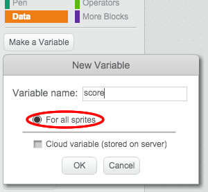
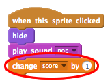
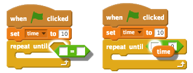
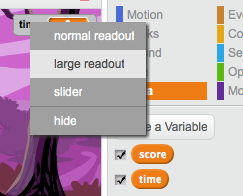

---
title: Ghostbusters
level: Scratch 1
language: ro-RO
stylesheet: scratch
embeds: "*.png"
materials: ["Club Leader Resources/*.*"]
...

## Note: { .challenge .pdf-hidden }
The 'Balloons' project has been moved to the [Additional Scratch Projects](http://projects.codeclub.org.uk/en-GB/03_scratch_bonus/index.html) section.

# Introducere { .intro }

Vei crea jocul ”Vânătorul de fantome”!
 
<div class="scratch-preview">
  <iframe allowtransparency="true" width="485" height="402" src="http://scratch.mit.edu/projects/embed/60787262/?autostart=false" frameborder="0"></iframe>
  
</div>

# Pasul 1: Animează fantoma { .activity }

## Lista de Activități { .check }

+ Deschide un proiect nou în Scratch și șterge sprite-ul pisică pentru a avea un proiect gol.
 
+ Adaugă un sprite nou fantoma și o scenă adecvată.

	

+ Adaugă codul de mai jos pentru fantomă. Dacă l-ai adăugat corect, fantoma ar trebui să apară și dispară tot timpul:

	```blocks
		when flag clicked
		forever
			hide
			wait (1) secs
			show
			wait (1) secs
		end
	```

+ Testează-ți codul prin apăsarea steagului verde.

## Salvează proiectul { .save }


# Pasul 2: Fantome la întâmplare { .activity }

Fantoma ta este foarte ușor de prins pentru că nu se mișcă!

## Lista de Activități { .check }

+ În loc să stea în aceeași poziție, poți lăsa programul să aleagă la întâmplare coordonatele x și y. Adaugă un bloc `go to` {.blockmotion} la codul dedicat fantomei. Codul tău va arăta așa:

	```blocks
		when flag clicked
		forever
			hide
			wait (1) secs
			go to x:(pick random (-150) to (150)) y:(pick random (-150) to (150))
			show
			wait (1) secs
		end
	```

+ Testează-ți fantoma din nou. Ar trebui să apară de fiecare dată în locuri diferite.

## Salvează proiectul { .save }

## Provocare: Și mai multe lucruri întâmplătoare {.challenge}

Poți să controlezi fantoma să aștepte (`wait` {.blockcontrol}) o perioadă de timp aleatorie înainte de să reapară? Poți să utilizezi blocul `set size` {.blocklooks} pentru a modifica fantoma să aibe o altă dimensiune de fiecare data când apare?

## Salvează proiectul { .save }

# Step 3: Să prindem fantomele { .activity }

Haideți să le permitem celor care vor să se joace să prindă fantomele!

## Lista de Activități { .check }

+ Pentru a permite jucătorilor să prindă o fantomă, adaugă codul:

	```blocks
		when this sprite clicked
		hide
	```

+ Testează-ți proiectul. Poți să prinzi fantomele când apar? Dacă e prea dificil să le prinzi, poți juca jocul pe tot ecranul apăsând pe acest buton:

	

## Provocare: Adaugă sunet { .challenge }
Poți să scoți un sunet de fiecare data când prinzi o fantomă?

## Salvează proiectul { .save }

# Pasul 4: Adaugă scorul { .activity .new-page }

Haideți să complicăm un pic lucrurile prin adăugarea scorului. 

## Lista de activități { .check }

+ Pentru a ține scorul, trebuie să ai un loc unde să-l pui. O __variabilă__ este un loc unde poți păstra date care se schimbă, ca un scor. 

	Pentru a crea o nouă variabilă, apasă pe tab-ul 'Scripts', selectează `Data` {.blockdata} și apoi apasă pe 'Make a Variable'.

	

	Schimbă numele variabilei în 'score'. Fii sigur că variabila va apărea pentru toate sprite-urile, apoi apasă 'OK' ca să o creezi. Vei vedea o mulțime de blocuri de cod care se pot folosi cu variabila ta `score` {.blockdata}.

	

	Poți vedea scorul in colțul din stânga-sus al scenei. 

	

+ Când începi nou joc (apăsând pe steagul verde), trebuie să setezi scorul la 0:

	```blocks
	when flag clicked
	set [score v] to [0]
	```

+ În momentul în care jucătorul a prins o fantomă, adaugă 1 la scor:

	

+ Pornește programul și prinde niște fantome. Se schimbă scorul? 

## Salvează proiectul { .save }

# Step 5: Adaugă un cronometru { .activity }

Jocul poate devein mai interesant dacă îi dai jucătorului 10 secunde să prindă cât mai multe fantome. 

## Lista de activități { .check }

+ Poți utiliza o altă variabilă pentru a păstra timpul rămas din joc. Click în scenă și adaugă o nouă variabilă numită 'time':

	

+ Cronometrul ar trebui să arate în felul următor:

	+ Cronometrul trebuie să începă la 10 secunde;
	+ Cronometrul trebuie să numere descrescător în fiecare secundă;
	+ Jocul trebuie oprit când cronometrul ajunge la 0.

	Codul de mai jos va face exact acest lucru. Îl poți adăuga la __scena__ ta:

	```blocks
		when flag clicked
		set [time v] to [10]
		repeat until <(time) = [0]>
			wait (1) secs
			change [time v] by (-1)
		end
		stop [all v]
	```

	Așa adaugi codul `repeat until`{.blockcontrol}`time`{.blockdata}`= 0`{.blockoperators}:

	

+ Mută variabila 'time' să apară în partea dreaptă a scenei. Poți să faci click dreapta pe variabilă și să selectezi 'large readout' pentru a schimba cum apare timpul.

	

+ Cere unui prieten să testeze jocul. Câte puncte a reușit să câștige? Dacă jocul ți se pare prea ușor, poți să faci următoarele:

	+ Dă-i jucătorului mai puțin timp;
	+ Fă fantomele să apară mai rar;
	+ Fă fantomele mai mici.

	Testează jocul de câteva ori până când ești mulțumit de nivelul de dificultate.

## Salvează proiectul { .save }

## Provocare: Mai multe obiecte {.challenge}
Poți să adaugi mai multe obiecte în joc?


Gândește-te la obiectul pe care îl adaugi:

+ Cât de mare este?
+ Va apărea de mai multe sau de mai puține ori decât fantoma?
+ Cum va arăta / ce sunet va face când va fi prins?
+ Câte puncte vei aduna (sau pierde) dacă îl prinzi?

Dacă ai nevoie de ajutor să adaugi un obiect nou, poți să reutilizezi pașii de mai sus!

## Salvează proiectul { .save }

## Community Contributed Translation { .challenge .pdf-hidden }

This project was translated by Catalin Dragomir. Our amazing translation volunteers help us give children around the world the chance to learn to code.  You can help us reach more children by translating a Code Club project via [Github](https://github.com/CodeClub/curriculum_documentation/blob/master/contributing.md) or by getting in touch with us at hello@codeclubworld.