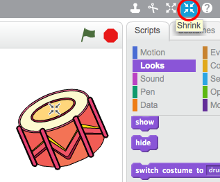
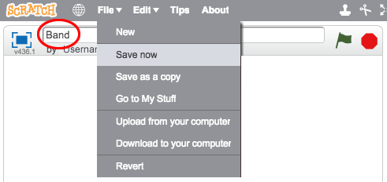
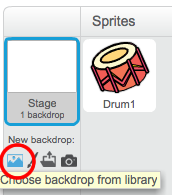
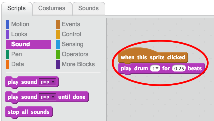
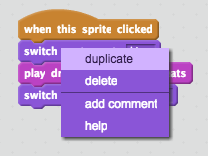

---
title: Rock Band
level: Scratch 1
language: ro-RO
stylesheet: scratch
embeds: "*.png"
materials: ["Club Leader Resources/*.*"]
...

# Introducere { .intro }

În acest proiect vei învăța să creezi propiul tău instrument muzical!

<div class="scratch-preview">
  <iframe allowtransparency="true" width="485" height="402" src="http://scratch.mit.edu/projects/embed/26741186/?autostart=false" frameborder="0"></iframe>
  
</div>

# Pasul 1: Sprites { .activity }

Înainte să începi să animezi ai nevoie să alegi un "actor" pe care să-l
controlezi. În Scratch, aceste "caractere" se numesc __sprites__.

## Lista de Activități { .check }

+ Pentru început, deschide editorul de Scratch. Îl poți vedea online la <a href="http://jumpto.cc/scratch-new">jumpto.cc/scratch-new</a>. Arată cam așa:

	

+ Sprite-ul pisică pe care îl vezi este mascota Scratch. Haide să-l ștergem. Clic dreapta pe mouse și după aceea pe 'delete'.

	

+ După aceea selectează 'Choose sprite from library' ca să deschizi o listă cu toate caracterele din Scratch.

	

+ În dosarul 'Things' caută un 'sprite' tobă (în engleză
'drum'). Selectează-l și apasă 'OK' pentru a-l aduce în
proiectul tău.

	

+ Apasă pe icoana 'shrink' (micșorare), apoi de câteva ori pe tobă ca să o faci
mai mică.

	

## Salvează proiectul { .save }

Dă un nume programului tău. Scrie numele nou în fereastra de
deasupra scenei.

Poți să faci clic pe 'File' și apoi pe 'Save now' ca să-ți salvezi proiectul.



# Pasul 2: Scena { .activity }

__Scena__ este aria din stânga și este locul unde proiectul tău prinde viață.

## Lista de Activități { .check }

+ La început scena este goală și arată cam plictisitor! Haide să-i punem un fundal. Selectează: 'Choose new sprite from file'.

	

+ Din dosarul 'Media' selectează 'Backgrounds' și apoi 'Indoors'.
Din acest dosar alege fundalul pe care vrei să-l alegi pentru scena și apoi pe 'OK'.

	

+ Scena ta ar trebui să arate așa:

	

# Pasul 3: Construiește o Tobă { .activity }

Haide să scriem un script pentru tobă. Vrem ca ea să scoată un sunet când este atinsă.

## Lista de Activități { .check }

+ Vei găsi script-urile în secțiunea 'Scripts'. Toate script-urile sunt grupate pe module reprezentate prin aceeași culoare.
De exemplu toate script-urile care controlează sunetul au culoarea roz si se află în grupul 'Sound'!

Fă clic pe sprite-ul tobă și mută cele două script-uri în aria
de cod din mijloc, având grijă să le conectezi între ele(asemena
unor piese Lego):

	

+ Fă clic pe tobă și testează noul tău instrument muzical!

+ Poti să schimbi cum arată toba atunci când o lovești. Pentru asta trebuie să creezi un costum nou. Apasă pe sectiunea 'Costumes', și vei vedea imaginea tobei.

	

+ Selecteză cu mouse-ul costumul și apoi clic dreapta pe acesta. Clic 'duplicate' ca să creezi o copie a costumului.

	

+ Selectează noul costum(numit 'drum2'), apoi selectează 'line tool' și desenează câteva linii ca și cum toba ar scoate un sunet.

	

+ Numele costumelor nu sunt foarte clare. Haide să le schimbăm cu 'not hit' și "hit" ca și în imaginea de mai jos.

	

+ Acum că ai două costume pentru tobă, poți să alegi ce costum vrei să arăți! Adaugă aceste două blocuri la script-ul tău:

	

	Blocul de cod pentru schimbarea costumelor se găsește în secțiunea 'Looks' {.blocklooks}.

+ Testează-ți toba. Când o atingi, toba ta ar trebui să pară că ar scoate un sunet!

## Salvează proiectul { .save }

##Exercițiu: Să îmbunătățim toba { .challenge }

+ Poți să schimbi sunetul scos de tobă atunci când faci clic pe ea?


+ Poți să faci toba să sune și atunci când apeși tasta 'spacebar' de la tastatură?
Va trebui sa folosesti acest bloc eveniment: 'event' {.blockevents}:

```blocks
	when [space v] key pressed
```

Poți să folosești codul deja existent dacă faci clic dreapta pe el și apoi alegi optiunea 'duplicate'.



## Salvează proiectul { .save }

# Pasul 4: Să construim un cântăreț { .activity .new-page }

Hai să adăugăm un cântăreț în formația noastră!

## Lista de Activități { .check }

+ Adaugă înca două caractere (sprites) pe scena ta: un cântăreț și un microfon.

	

+ Pentru a-l face pe cântăreț să cânte trebuie să adaugăm un sunet sprite-ului tău.
Selectează cântărețul și fă clic pe secțiunea 'Sounds'. Selectează opțiunea 'Choose sound from library' care ne permite să alegem un sunet din biblioteca de fișiere:

	

+ Dacă faci clic pe secțiunea 'Vocals' din partea stângă, vei putea apoi alege un sunet potrivit pentru sprite-ul tău.

	

+ Acum că am adăugat sunetul, putem adăuga acest script cântărețului nostru:

	```blocks
		when this sprite clicked
		play sound [singer1 v] until done
	```

+ Fă clic pe cântărețul tău pentru a verifica dacă acesta cântă atunci când apăsăm pe el.

## Salvează proiectul { .save }

##Exercițiu: Să schimbăm costumul cântărețului { .challenge }
Vrem ca atunci când facem clic pe cântăreț să vedem că acesta cântă. Poți face asta? Daca ai nevoie de ajutor poți folosi instrucțiunile de la pasul 3 "Construind o tobă".


Nu uita să testezi dacă modificările tale funcționează corect!

## Salvează proiectul { .save }

##Exercițiu: Crează propria ta formație { .challenge }
Poți folosi ceea ce ai învățat în acest proiect pentru a crea propria ta formație muzicală!
Poți crea orice instrument dorești. Ca să îți faci întâi o idee, aruncă o privire asupra sunetelor și instrumentelor disponibile în Scratch.


Instrumentele nu trebuie să fie neapărat reale. De exemplu, ai putea să construiești un pian din brioșe!


Pe lângă sprite-urile existente, poți de asemenea să desenezi unele noi.


Dacă ai un microfon, poți să înregistrezi sunetele tale sau poți folosi o camera web pentru a interacționa cu instrumentele.


## Salvează proiectul { .save }

## Community Contributed Translation { .challenge .pdf-hidden }

This project was translated by Catalin Dragomir. Our amazing translation volunteers help us give children around the world the chance to learn to code.  You can help us reach more children by translating a Code Club project via [Github](https://github.com/CodeClub/curriculum_documentation/blob/master/contributing.md) or by getting in touch with us at hello@codeclubworld.

