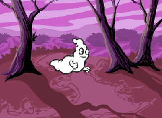
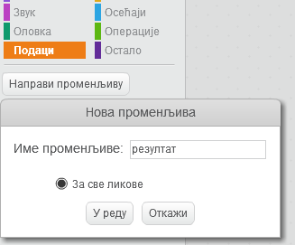
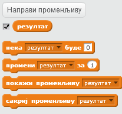
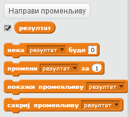
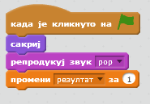
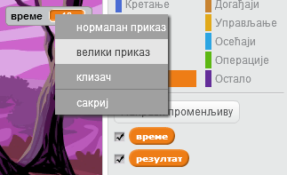
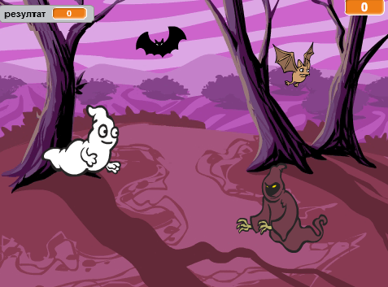

---
title: Истеривачи духова
level: Scratch 1
language: sr-SP
stylesheet: scratch
embeds: "*.png"
materials: ["Ресурси за учитеља/*.*"]
...

## Напомена: { .challenge .pdf-hidden }
Пројекат 'Балони' је премештен у одељак [Додатни Скрач пројекти](http://projects.codeclub.org.uk/en-GB/03_scratch_bonus/index.html).

# Увод { .intro }

Правићемо игру у којој ћемо јурити духове!

# Корак 1: Анимирај духа { .activity }

## Упутство { .check }

+ Отвори нов Скрач пројекат и обриши лик мачке тако да пројекат буде празан.

+ Додај нов спрајт духа и погодну позадину за сцену.

	

+ Додај следећи код духу тако да се стално појављује и нестаје:

	```blocks
		када је кликнуто на ⚑
		понављај
   			сакриј
   			чекај (1) секунду
   			прикажи
   			чекај (1) секунду
		end
	```

+ Испробај код за духа тако што ћеш кликнути на зелену заставицу.

## Сачувај пројекат { .save }

# Корак 2: Насумични духови { .activity }

Твог духа је стварно лако ухватити зато што се не помера!

## Кораци { .check }

+ Уместо да стално стоји у истој позицији, можеш да кажеш Скрачу да бира случајне x и y координате. Додај блок `иди на` {.blockmotion} у код за духа тако да изгледа овако:

	```blocks
		када је кликнуто на ⚑
			понављај
   				сакриј
   				чекај (1) секунду
   				иди на x:(случајан број од (-150) до (150)) y:(случајан број од (-150) до (150))
   				прикажи
   				чекај (1) секунду
		end
	```

+ Поново испробај духа и требало би да приметиш да се сваки пут појављује на другом месту.

## Сачувај пројекат { .save }

## Изазов: Још насумичније {.challenge}
Можеш ли да наместиш да дух `чекај` {.blockcontrol} случајно време пре него што се појави? Како би употребио блок `нека величина буде` {.blocklooks} тако да дух има случајну, променљиву величину кад год се појави?

## Сачувај пројекат { .save }

# Корак 3: Хватање духова { .activity }

Хајде да омогућимо играчу да хвата духове!

## Кораци { .check }

+ Да би играч могао да хвата духове, додај следећи код:

	```blocks
		када је кликнуто на овај лик
		сакриј
	```

+ Испробај пројекат. Можеш ли да ухватиш духове када се појаве? Ако тешко хваташ духове, можеш да играш игру преко целог екрана тако што ћеш кликнути на ово дугме:

	

## Изазов: Додај звук { .challenge }
Можеш ли да испрограмираш да се зачује звук кад год се ухвати дух?

## Сачувај пројекат { .save }

# Корак 4: Додај резултат { .activity .new-page }

Хајде да учинимо игру занимљивијом тако што ћемо бројати колико духова је ухваћено.

## Кораци { .check }

+ Да би пратио резултат играча, потребно ти је место где ћеш чувати тренутни резултат. Место у коме се чувају подаци који се мењају, на пример тренутни резултат играча, зове се __променљива__.

	Да би направио нову променљиву, кликни на картицу 'Програми', изабери `Подаци` {.blockdata} и на крају кликни на 'Направи променљиву'.

	

	Унеси 'резултат' као име за променљиву, постарај се да сви ликови могу да је виде и кликни 'OK' да би је направио. Након тога ћеш видети много блокова кода који се могу користити са променљивом `резултат` {.blockdata}.

	

	Такође ћеш у горњем левом углу сцене видети резултат.

	

+ Када се почне нова игра (тако што ће се кликнути на заставицу), требало би да резултат играча буде 0:

	```blocks
	када је кликнуто на ⚑
	нека [резултат v] буде [0]
	```

+ Кад год ухвати духа, резултат играча мораш да повећаш за 1:

	

+ Покрени програм поново и ухвати неколико духова. Да ли се резултат мења?

## Сачувај пројекат { .save }

# Корак 5: Додај тајмер { .activity }

Можеш да учиниш игру занимљивијом тако што ћеш играчу дати само 10 секунди да ухвати што више духова.

## Кораци { .check }

+ Можеш да употребиш још једну променљиву у којој ћеш чувати преостало време. Кликни на сцену и направи нову променљиву 'време':

	

+ Ево како би тајмер требало да ради:

	+ Почетна вредност тајмера треба да буде 10 секунди;
	+ Тајмер би требало да одбројава сваку секунду;
	+ Игра мора да се заврши када тајмер одброји до 0.

	Ево кода који то ради; додај га у __сцену__:

	```blocks
		када је кликнуто на ⚑
		нека [време v] буде [10]
		понављај док не <(време) = [0]>
   			чекај (1) секунду
   			промени [време v] за (-1)
		end
		заустави [све v]
	```

	Ево како ћеш додати код `понављај док не`{.blockcontrol}`време`{.blockdata}`= 0`{.blockoperators}:

	

+ Превуци приказ променљиве 'време' на десну страну позорнице. Можеш и да кликнеш на приказ променљиве десим тастером миша и да изабереш 'велики приказ' да би променио начин приказа времена.

	

+ Замоли другара да испроба твоју игру. Колико поена могу да освоје? Ако је игра сувише лака, можеш да:

	+ Даш играчу мање времена;
	+ Учиниш да се духови појављују ређе;
	+ Смањиш духове.

	Испробај игру неколико пута док не будеш задовољан тиме колико је тешка за играње.

## Сачувај пројекат { .save }

## Изазов: Још објеката {.challenge}
Можеш ли да додаш још објеката у игру?



Мораћеш да размислиш о објектима које додајеш. Размисли о томе:

+ Колики су?
+ Да ли ће се појављивати чешће или ређе од духова?
+ Како ће изгледати и звучати када се ухвате?
+ Колико поена ће се добијати (или губити) када се ухвате?

Ако ти је потребна помоћ за додавање новог објекта, врати се на претходне кораке!

## Сачувај пројекат { .save }

## Community Contributed Translation { .challenge .pdf-hidden }

This project was translated by Irina Branovic. Our amazing translation volunteers help us give children around the world the chance to learn to code.  You can help us reach more children by translating a Code Club project via [Github](https://github.com/CodeClub/curriculum_documentation/blob/master/contributing.md) or by getting in touch with us at hello@codeclubworld.
