---
title: Програм за цртање
level: Scratch 1
language: sr-SP
stylesheet: scratch
embeds: "*.png"
materials: ["Ресурси за учитеља/*.*","Ресурси за пројекат/*.*"]
...

# Увод { .intro }

У овом пројекту правићемо програм за цртање!

# Корак 1: Направи бојицу { .activity }

Почни тако што ћеш направити бојицу коју ћеш затим користити за цртање по сцени.

## Упутство { .check }

+ Отвори нов Скрач пројекат и обриши лик мачке тако да пројекат буде празан. 

+ Додај лик бојице у пројекат.

	 

+ Кликни на 'Костими' и обриши костим 'pencil-b'.

	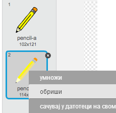 

+ Преименуј костим у 'бојица-плава' и употреби алатку 'Обој облик' да би обојио бојицу у плаво. 

	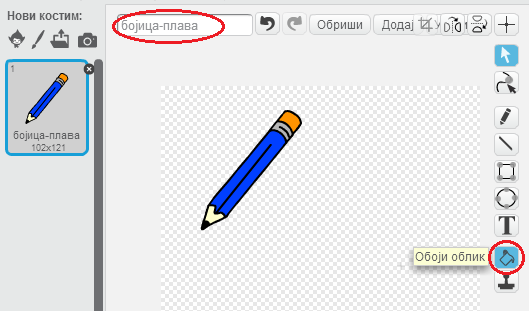 

+ Пошто ћеш за цртање користити миша, мораћеш да направиш да бојица прати миш у петљи `понављај` {.blockcontrol}. Додај следећи код за лик оловке:

	```blocks
		када је кликнуто на ⚑
		понављај
		иди до [показивач миша v]
		end
	```

+ Испробај код тако што ћеш кликнути на заставицу и затим померати миша по сцени. Да ли све ради како очекујеш?

+ Јеси ли приметио да миш прати центар бојице, а не њен врх?

	

	Да би то поправио, кликни на костим 'бојица-плава' лика оловке, а затим кликни на 'Постави центар костима'.

	

+ Требало би да приметиш да се на костиму појављује крстић. Сада можеш да кликнеш мало испод врха оловке, да би ту тачку поставио као центар костима.

	

+ Кликни на картицу 'Програми', а затим поново испробај бојицу. Да ли ради боље него пре?

+ Хајде сада да учинимо да бојица пише `ако` {.blockcontrol} се кликне мишем. Додај следећи код за лик бојице:

	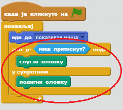	

+ Поново испробај код. Овај пут померај бојицу по сцени док држиш притиснут тастер миша. Можеш ли да црташ твојом бојицом?

	

## Сачувај пројекат { .save }

# Корак 2: Бојице { .activity }

Хајде да додамо бојице различитих боја у пројекат и да омогућимо корисницима да их бирају!

## Упутство { .check }

+ Кликни на лик оловке, кликни на 'Костими' и умножи костим 'бојице-плава'.

	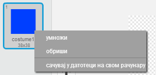

+ Преименуј нов костим у 'бојица-зелена' и обој бојицу у зелено.

	

+ Направи два нова лика која ћеш користити да бираш плаву или зелену бојицу.

	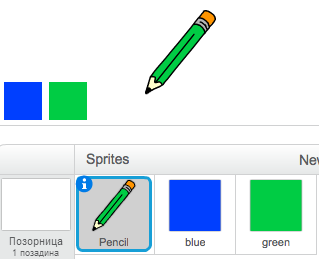

+ Када је кликнута зелена икона селектора, мораш да `разгласиш` {.blockevents} поруку лику бојице, тако да јој кажеш да промени свој костим и боју бојице.

	Да би то урадио, прво додај овај код икони зеленог селектора:

	```blocks
		када је кликнуто на овај лик
		разгласи [green v]
	```

	Да би направио блок `разгласи` {.blockevents}, кликни стрелицу надоле и изабери 'нова порука...'.

	

	Затим можеш да откуцаш 'зелено' да би направио нову поруку.

	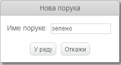

+ Лику бојице мораш да кажеш шта да ради када прими поруку. Лику бојице додај следећи код:

	```blocks
		када примим [green v]
		замени костим са [pencil-green v]
		нека боја оловке буде [#00ff00]
	```

	Да би боју бојице подесио у зелену, кликни на обојено поље у блоку `нека боја оловке буде` {.blockpen}, а затим кликни на икону зеленог бирача да би изабрао да боја бојице буде зелена.

+ Исто можеш да поновиш за икону плаве бојице, и да додаш следећи код за лик плавог бирача:

	```blocks
		када је кликнуто на овај лик
		разгласи [blue v]
	```

	...и овог кода за лик оловке:

	```blocks
		када примим [blue v]
		замени костим са [бојица-плава v]
		нека боја оловке буде [#0000ff]
	```

+ На крају, лику бојице мораш да кажеш који костим и боју бојице треба да изабере, и да обришеш све на екрану када почне пројекат. Додај следећи код испред блока `када је кликнуто на ⚑` {.blockevents} за оловку (пре петље `понављај` {.blockcontrol}):

	```blocks
		обриши
		замени костим са [бојица-плава v]
		нека боја оловке буде [#0000ff]
	```

	Ако ти се тако више свиђа, можеш да почнеш програм са бојицом другачије боје!

+ Испробај пројекат. Можеш ли да мењаш плаву и зелену бојицу?

	

## Сачувај пројекат { .save }

# Корак 3: Грешка { .activity .new-page }

Понекад се дешавају грешке, па хајде да у програм додамо дугме 'обриши' и гумицу!

## Упутство { .check }

+ Хајде да додамо дугме које ће брисати екран. Да би то урадио, додај лик 'X-block' у сцену и обој га у црвено.

	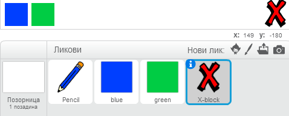

+ Додај код у ново дугме тако да оно обрише садржај сцене када се на њега кликне.

	```blocks
		када је кликнуто на овај лик
		обриши
	```

	Примети да не мораш да шаљеш поруку да би орисао сцену, јер то може да уради било који лик!
	
+ Можеш да направиш и гумицу. Ако ти је учитељ дао директоријум 'Ресурси', кликни на дугме 'Пошаљи костим из датотеке' и додај слику 'eraser.svg'.

	
	
	Ако немаш слику eraser.svg, уместо ње направи нову белу оловку!

+ Слику гумице би требало да додаш као нов бирач ликова. Ево како би требало да изгледа твоја сцена:

	

+ Затим можеш да додаш код у лик бирача гумице, да би бојици рекао да се претвори у гумицу.

	```blocks
		када је кликнуто на овај лик
		разгласи [eraser v]
	```

+ Када бојица прими ову поруку, можеш да направиш гумицу тако што ћеш костим бојице променити у гумицу, а боју бојице променити у боју сцене!

	```blocks
		када примим [eraser v]
		замени костим са [eraser v]
		нека боја оловке буде [#FFFFFF]
	```

+ Испробај пројекат да би се уверио да можеш да бришеш целу сцену.

	

+ Имамо још један проблем са бојицом - можеш да црташ било где по сцени, укључујући и близу икона бирача!

	

	Да би то поправио, мораш да кажеш оловки да црта само ако је миш кликнут  _и_ ако је y-координата миша већа од -110 (`миш y`{.blocksensing}`> -120` {.blockoperators}). Промени наредбу `ако је` {.blockcontrol} за бојицу тако да изгледа овако:

	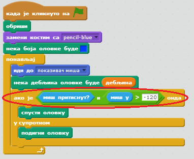

+ Испробај пројекат; сада не би требало више да можеш да црташ близу блокова селектора.

	

## Сачувај пројекат { .save }

# Корак 4: Промена дебљине бојице { .activity .new-page }

Хајде да омогућимо кориснику да црта помоћу бојица различитих дебљина.

## Упутство { .check }

+ Прво додај нову променљиву која ће се звати 'дебљина'. Ако не знаш како се то ради, потражи помоћ у упутству за пројекат 'Балони'.

+ Додај следећу наредбу _у_ петљу `понављај` {.blockcontrol} кода за бојицу:

	```blocks
		нека дебљина оловке буде (дебљина)
	```

	Ширина трага оловке сада ће стално бити постављана на вредност променљиве 'дебљина'.

+ Број који се чува у овој променљивој можеш да промениш тако што ћеш десним тастером миша кликнути на променљиву (на сцени) и изабрати  'клизач'.

	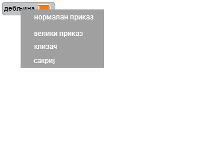

	Сада можеш да вучеш клизач испод променљиве да би јој променио вредност.

	

+ Испробај пројекат и рровери да ли можеш да промениш дебљину бојице.

	

	Ако ти се тако више свиђа, можеш да задаш најмању и највећу вредност 'дебљине' које ће бити дозвољене. Да би то урадио, поново кликни десним тастером миша на променљиву и изабери 'подешавање граничних вредности клизача'. Подеси најмању и навећу вредност за променљиву на нешто што има више смисла, на пример 1 и 20.

	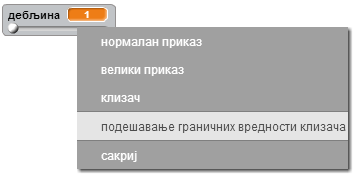

	Настави да испробаваш променљиву 'дебљина' док не будеш задовољан.

## Сачувај пројекат { .save }

## Изазов: Пречице { .challenge }
Можеш ли да направиш пречице са тастатуре за твоје команде? На пример:

+ p = промени у плаву бојицу
+ z = промени у зелену бојицу
+ g = промени у гумицу
+ o = очисти екран

Могао би и да омогућиш кориснику да мења бојице помоћу стрелица на тастатури!

## Сачувај пројекат { .save }

## Изазов: Још оловака { .challenge }
Можеш ли да додаш црвену, жуту и црну бојицу у програм за цртање? Све слике које су ти потребне можеш да пронађеш у директоријуму 'Ресурси'. Не заборави да додаш пречице са тастатуре за нове бојице!

Можеш ли да употребиш своје бојице да нацрташ слику?

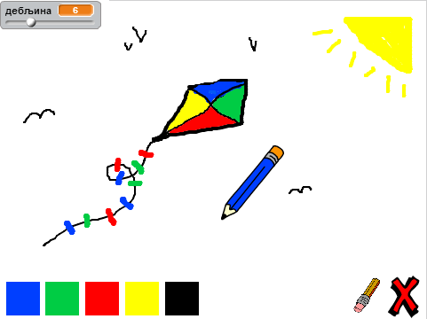

## Community Contributed Translation { .challenge .pdf-hidden }

This project was translated by Irina Branovic. Our amazing translation volunteers help us give children around the world the chance to learn to code.  You can help us reach more children by translating a Code Club project via [Github](https://github.com/CodeClub/curriculum_documentation/blob/master/contributing.md) or by getting in touch with us at hello@codeclubworld.
