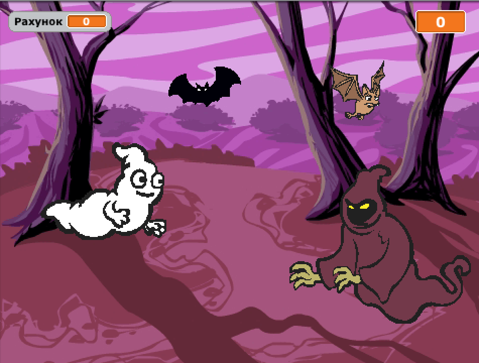
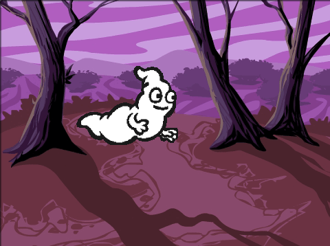
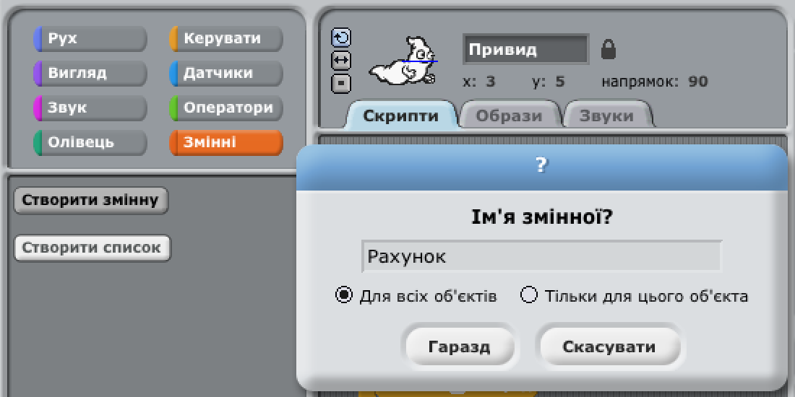
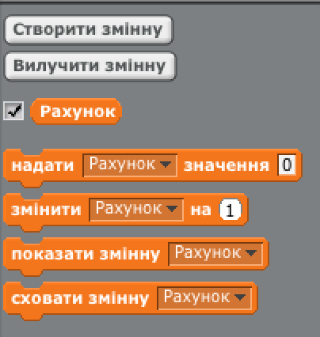
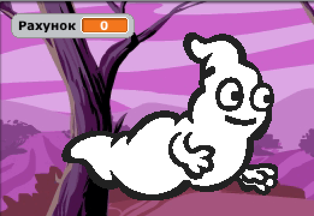
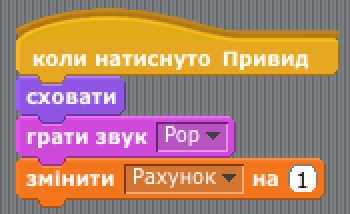
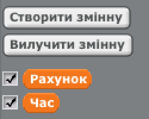
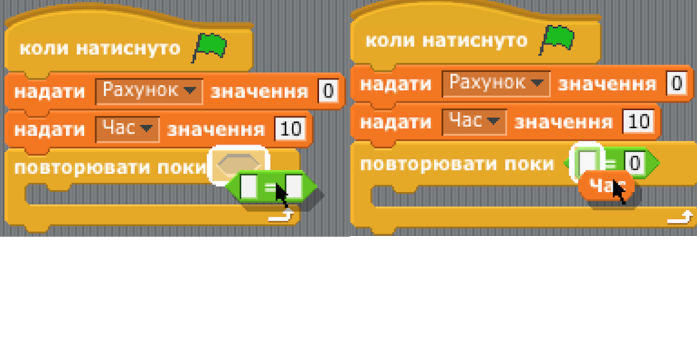

---
title: Мисливці за привидами
level: Scratch 1
language: uk-UA
stylesheet: scratch
embeds: "*.png"
materials: ["Club Leader Resources/*"]
...

## Примітка: {.challenge.pdf-hidden}

Проект "Кулі" був переміщений в розділ [Додаткові скретч-проекти](http://projects.codeclub.org.uk/en-GB/03_scratch_bonus/index.html).

# Передмова {.intro}

Ви створите гру, у якій будете ловити привидів!

<div class="scratch-preview">
  <iframe allowtransparency="true" width="485" height="402" src="http://scratch.mit.edu/projects/embed/60787262/?autostart=false" frameborder="0"></iframe> 
</div>

# Крок 1: Створення привида {.activity}

## Список дій {.check}

+ Створіть новий проект у Скретч та видаліть спрайт кота, так щоб проект став пустим. Онлайн Скретч-редактор знаходиться за посиланням [jumpto.cc/scratch-new](http://jumpto.cc/scratch-new).

+ Додайте новий спрайт привида, та будь-який фон на Ваш смак.
    
    

+ Додайте цей код до привида, щоб він повторював з'являтися і зникати:
    
    ```blocks
    коли натиснуто ⚑
    завжди
        сховати
        чекати (1) секунд
        показати
        чекати (1) секунд
    end
```

+ Перевірте код вашого привида, натиснувши на зелений прапорець.

## Збережіть свій проект {.save}

# Крок 2: Випадкові привиди {.activity}

Зараз привида дуже просто зловити, а все тому що він зовсім не рухається!

## Список дій {.check}

+ Замість того, щоб перебувати в одному положенні, Ви можете дозволити Скретчу вказати випадкові координати x та y. Додайте `перейти до` {.blockmotion} до коду привида, щоб в результаті він виглядав так:
    
    ```blocks
    коли натиснуто ⚑
    завжди
        сховати
        чекати (1) секунд
        перемістити в x:(випадкове від (-150) до (150)) y:(випадкове від (-150) до (150))
        показати
        чекати (1) секунд
    end

```

+ Випробувавши вашого привида знову, ви повинні помітити, що кожного разу він з'являється в іншому місці.

## Збережіть свій проект {.save}

## Виклик: Більше випадковостей {.challenge}

Чи зможе ваш привид `чекати` {.blockcontrol} невизначену кількість часу перед тим як знову з'явитися? Чи ви можете використовувати блок {.blocklooks} `встановлення розміру`, щоб кожного разу, коли привид з'являється, він мав інший розмір?

## Збережіть свій проект {.save}

# Крок 3: Полювання на привидів {.activity}

Давайте надамо гравцеві можливість ловити привидів!

## Список дій {.check}

+ Аби дозволити гравцеві спіймати привида, додайте цей код:
    
    ```blocks
    коли спрайт натиснуто
    сховати
```

+ Перевірте ваш проект. Чи можете ви ловити привидів тоді, коли вони з'являються? Якщо вам важко попасти на привидів, можна грати гру в повноекранному режимі, натиснувши цю кнопку:
    
    

## Виклик: Додаємо звук {.challenge}

Чи ви зможете додати звук для кожного спійманого привида?

## Збережіть свій проект {.save}

# Крок 4: Додаємо рахунок {.activity.new-page}

Давайте зробимо все ще більш цікавим, додавши рахунок балів.

## Список дій {.check}

+ Для нараховування балів вам необхідне окреме місце. **Змінна** є місцем зберігання даних, які можна змінити, в тому числі й балів.
    
    Щоб створити нову змінну, перейдіть до вкладки "Скріпти", виберіть `дані` {.blockdata} та натисніть кнопку "Створити змінну".
    
    
    
    Введіть "Рахунок", як ім'я змінної, переконайтеся, що він доступний для всіх спрайтів і натисніть кнопку "ОК" для його створення. Тоді ви побачите багато блоків коду, які можуть бути використані з вашою змінною `рахунок`{.blockdata}.
    
    
    
    Ви також побачите ваш рахунок у верхній частині сцени ліворуч.
    
    

+ Коли нова гра розпочнеться (після клацання на прапор), потрібно настроїти рахунок гравця на 0:
    
    ```blocks
коли натиснуто ⚑
встановити [score v] в [0]
```

+ Кожного разу, після того як ви зловили привида, необхідно нарахувати 1 бал:
    
    

+ Запустіть програму знову і зловіть кілька привидів. Чи змінюється ваша кількість балів?

## Збережіть свій проект {.save}

# Крок 4: Додаємо таймер {.activity}

Ви можете зробити вашу гру цікавішою, надаючи гравцю лише 10 секунд, аби зловити якомога більше привидів.

## Список дій {.check}

+ Ви можете використовувати іншу змінну для зберігання часу, що залишився. Клацніть на сцені і створіть нову змінну з ім'ям "Час":
    
    

+ Ось так повинен працювати таймер:
    
    + Таймер повинен починатися з 10 секунд;
    + З кожною секундою таймер повинен показувати на одну цифру менше;
    + Гра повинна зупинитись, коли таймер покаже 0.
    
    Ось код для цього, який треба додати до **сцени**:
    
    ```blocks
    коли натиснуто ⚑
    встановити [time v] в [10]
    repeat until < (time) = [0] >
        чекати (1) секунд
        змінити [time v] на (-1)
    end
    зупинити [все v]
```

Так ви додаєте код `Повторювати, доки`{.blockcontrol} `час`{.blockdata} `= 0`{.blockoperators}:



+ Перетягніть дисплей вашої змінної часу у праву частину сцени. З допомогою клацання правої кнопки мишки на дисплей змінної, ви можете вибрати "великий відлік" для змінення способу відображення часу.
    
    

+ Попросіть друзів випробувати вашу гру. Скільки балів вони зможуть отримати? Якщо ваша гра занадто легка, то можна:
    
    + Дати гравцеві менше часу;
    + Зробити так, щоб привиди з'являлися рідше;
    + Зменшити привидів.
    
    Перевірте свою гру кілька разів, аби бути задоволеним рівнем складності.

## Збережіть свій проект {.save}

## Виклик: Більше об'єктів {.challenge}

Ви можете додати інші об'єкти до вашої гри?


Потрібно подумати про об'єкти, які ви додаєте. Подумайте про таке:

+ Наскільки великим є цей об'єкт?
+ Він з'являтиметься частіше чи рідше, ніж привиди?
+ Як він виглядатиме/звучатиме, коли його спіймають?
+ Скільки балів ви отримаєте (або втратите), якщо зловите його?

Якщо вам потрібна допомога з додаванням іншого об'єкту, можна використовувати вищезазначені кроки!

## Збережіть свій проект {.save}