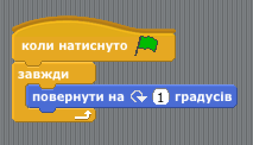
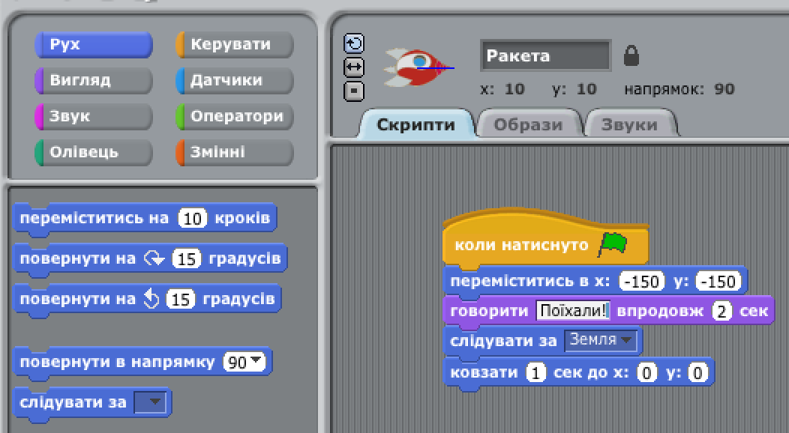
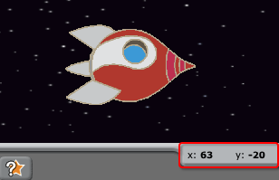
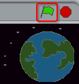
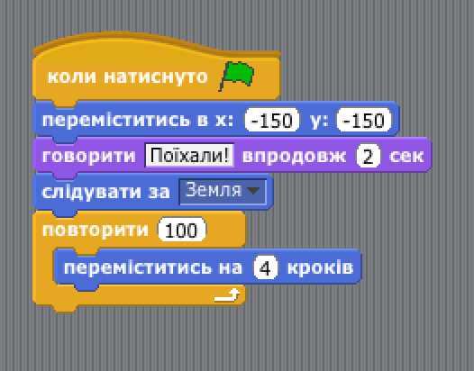
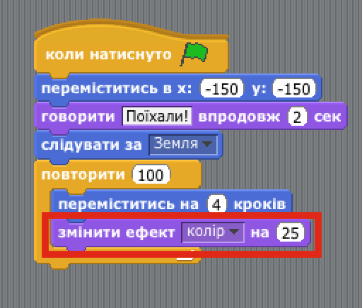
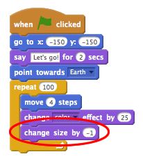
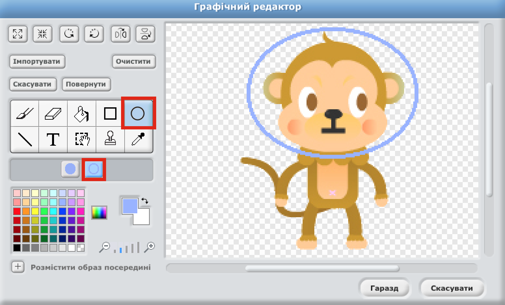
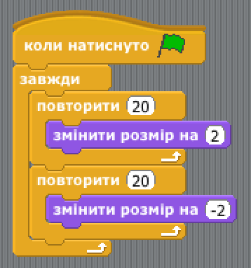

---
title: Заблукалий у космосі
level: Scratch 1
language: uk-UA
stylesheet: scratch
embeds: "*.png"
materials: ["Club Leader Resources/*"]
...

# Передмова {.intro}

У цьому проекті ви навчитесь програмувати власні анімації!

<div class="scratch-preview">
  <iframe allowtransparency="true" width="485" height="402" src="http://scratch.mit.edu/projects/embed/26818098/?autostart=false" frameborder="0"></iframe> 
</div>

# Крок 1: Анімація космічного корабля {.activity.new-page}

Давайте створимо космічний корабель, який прямуватиме до Землі!

## Список дій {.check}

+ Створіть новий проект у Скретч та видаліть спрайт кота, так щоб проект став пустим. Онлайн Скретч-редактор знаходиться за посиланням [jumpto.cc/scratch-new](http://jumpto.cc/scratch-new).

+ Додайте до вашої сцени спрайти "Космічний корабель" і "Земля". Також слід встановити тло «Зірки». Ось, як сцена виглядатиме:
    
    

+ Натисніть на новий спрайт космічного корабля, і натисніть на вкладку "Образи".
    
    

+ Виберіть зображення за допомогою інструмента-стрілки. Потім натисніть на круговий маркер повороту і повертайте зображення, поки воно не опиниться на правильному боці.
    
    

+ Додайте цей код до вашого космічного корабля:
    
    
    
    Змініть числа в блоках коду, так щоб код був точно такий же, як на верхньому зображенні.

+ Якщо ви запустите код, то побачите, як космічний корабель говорить, вмикається і рухається до центру сцени.
    
    
    
    Центр сцени має координати `x:(0) y:(0)` {.blockmotion}. Позиція `x:(-150) y:(-150)` {.blockmotion} знаходиться в нижній лівій частині сцени, а позиція `x:(150) y:(150)` {.blockmotion} — у верхній правій.
    
    
    
    Якщо вам потрібно дізнатись координати якоїсь позиції на сцені, перемістіть вказівник миші на місце, яке вас цікавить і запишіть координати, які з'являться під сценою.
    
    

+ Перевірте вашу анімацію, натиснувши на зелений прапорець якраз над сценою.
    
    

## Виклик: Вдосконалюємо анімацію {.challenge}

Чи можете ви змінити цифри в скрипті анімації, так щоб: + корабель рухався, поки не доторкнеться Землі? + корабель повільніше рухався до Землі?

Потрібно буде змінити цифри у цьому блоці:

```blocks
    ковзати (1) сек до x:(0) y:(0)
```

## Збережіть свій проект {.save}

# Крок 2: Анімація з використанням циклів {.activity.new-page}

Ще один спосіб анімації корабля — вказати йому рухатися потрошку, але багато разів поспіль.

## Список дій {.check}

+ Видаліть з вашого коду блок `ковзати` {.blockmotion}, натиснувши на блоці правою кнопкою, а потім на "вилучити". Код можна також видалити, перетягнувши його з області скриптів назад до області блоків коду.
    
    

+ Після того як ви видалили код, замініть його на ось цей:
    
    
    
    Блок `повторити` {.blockcontrol} використовується, щоб повторювати щось багато разів; таке повторення називається **цикл**.

+ Якщо ви клацнете на прапорець, щоб спробувати цей новий код, ви побачите, що він робить майже те ж саме, що й раніше.

+ Але ми можемо додати в цикл ще більше цікавих блоків. Додайте блок `змінити ефект колір на 25` {.blocklooks} (у розділі "Вигляд"), щоб раз за разом змінювати колір космічного корабля, поки він летітиме:
    
    

+ Натисніть на прапорець, щоб побачити нову анімацію.
    
    

+ Також можна потроху зменшувати космічний корабель, поки він летить до Землі.
    
    

+ Перевірте вашу анімацію. Що станеться, якщо ви клацнете на прапорець вдруге? Чи злітає космічний корабель з потрібним розміром? Ви можете використати цей блок, щоб виправити вашу анімацію:
    
    ```scratch
задати розмір (100)%
```

## Збережіть свій проект {.save}

# Крок 3: Мавпа в невагомості {.activity.new-page}

Давайте додамо до анімації мавпу, яка загубилась у космосі!

## Список дій {.check}

+ Спочатку додайте спрайт мавпи з бібліотеки.
    
    

+ Якщо ви натиснете на новий спрайт мавпи, а потім на вкладку "Образи", то ви зможете відредагувати вигляд мавпи. Виберіть інструмент "Еліпс" і намалюйте білий космічний шолом навколо її голови.
    
    

+ Тепер натисніть "Скрипти" і додайте цей код до мавпи, завдяки якому вона буде повільно обертатися по колу:
    
    ```blocks
    коли натиснуто ⚑
    завжди
        поворот ↻ (1) градусів
    end
```

Блок `завжди` {.blockcontrol} — це ще один цикл, але цей ніколи не зупиняється.

+ Натисніть на прапорець для перевірки вашої мавпи. Щоб зупинити анімацію, потрібно натиснути на кнопку зупинки (червоний кружечок біля прапорця).
    
    

# Крок 4: Блукаючі астероїди {.activity.new-page}

Давайте додамо до вашої анімації блукаючий астероїд.

## Список дій {.check}

+ Додайте спрайт "астероїд" до вашої анімації.
    
    

+ Додайте цей код до вашого астероїду, щоб він відбивався від країв сцени:
    
    ```scratch
коли натиснуто ⚑
слідувати за [Earth v]
завжди
   перемістити на (2) кроків
   відбивати від меж
```

+ Клацніть на прапорець для перевірки вашого астероїда. Чи він відбивається від меж сцени?

# Крок 5: Сяючі зірки {.activity.new-page}

Давайте об'єднаємо декілька циклів, щоб створити сяючу зірку.

## Список дій {.check}

+ Додайте спрайт "зірка" до вашої анімації.
    
    

+ Додайте цей код до зірки:
    
    

+ Натисніть на прапорець, щоб перевірити цю анімацію. Що робить цей код? Спочатку зірка збільшується у 20 разів, а потім зменшується в 20 разів, повертаючись до початкового розміру. Ці 2 цикли знаходяться всередині циклу `завжди` {.blockcontrol}, так що анімація постійно повторюється.

## Збережіть свій проект {.save}

## Виклик: Створюємо свою власну анімацію {.challenge}

Щоб почати новий проект, зупиніть космічну анімацію і натисніть на "Файл", потім натисніть на "Новий".

Використайте нові знання з цього проекту, щоб створити власну анімацію. Це може бути все, що вам заманеться, але анімація має відповідати параметрам. Ось кілька прикладів:


## Збережіть свій проект {.save}