---
title: Набір для малювання
level: Scratch 1
language: uk-UA
stylesheet: scratch
embeds: "*.png"
materials: ["Club Leader Resources/*","Project Resources/*"]
...

# Передмова {.intro}

У цьому проекті ви створите власну програму для малювання!

<div class="scratch-preview">
  <iframe allowtransparency="true" width="485" height="402" src="http://scratch.mit.edu/projects/embed/63473366/?autostart=false" frameborder="0"></iframe> 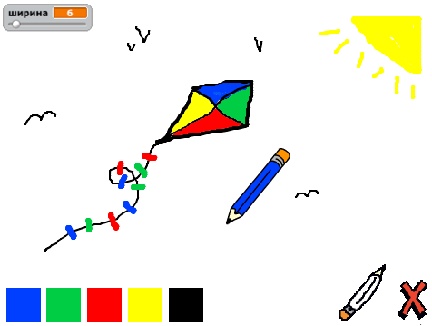
</div>

# Крок 1: Створення олівця {.activity}

Розпочнімо зі створення олівця, яким можна буде малювати на сцені.

## Список дій {.check}

+ Створіть новий проект у Скретч та видаліть спрайт кота, так щоб проект став пустим. Онлайн Скретч-редактор знаходиться за посиланням [jumpto.cc/scratch-new](http://jumpto.cc/scratch-new).

+ Додайте спрайт олівця до проекту.
    
    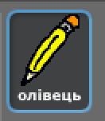

+ Натисніть на вкладку "Образи", та видаліть образ "pencil-b".
    
    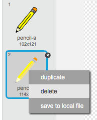

+ Перейменуйте образ олівця на "синій олівець". Та використовуючи інструмент "Колір форми" перефарбуйте олівець у синій колір.
    
    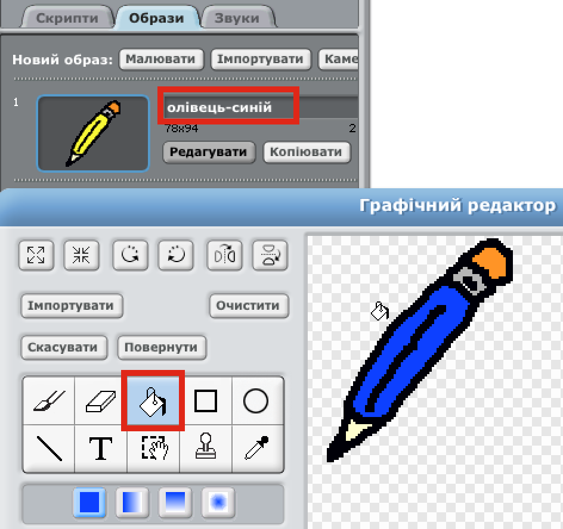

+ Коли ви малюватимете мишкою, ви захочете, щоб олівець `завжди`{.blockcontrol} слідував за курсором мишки. Тож додайте цей код до спрайта олівця:
    
    ```blocks
    коли натиснуто ⚑
    завжди
      перемістити в [mouse pointer v]
    кінець
```

+ Перевірте цей код, натиснувши на прапорець, а потім рухаючи мишкою по сцені. Чи працює все так, як ви очікували?

+ Чи помітили ви, що за курсором слідує центр олівця, а не його кінчик?
    
    
    
    Щоби це виправити, натисніть на образ "синій олівець" вашого спрайта, а потім виберіть "Встановити центр".
    
    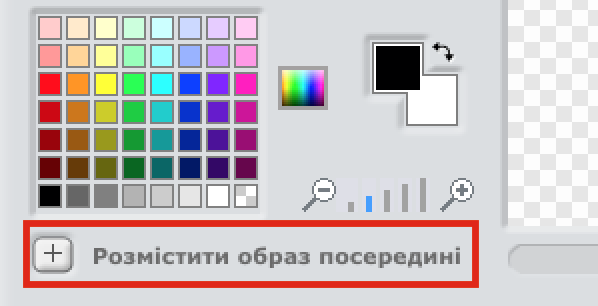

+ Ви повинні помітити, що на образі з'явилися дві перехрещені лінії. Тепер ви можете натиснути трохи нижче кінчика олівця, щоби встановити в тій точці центр образу.
    
    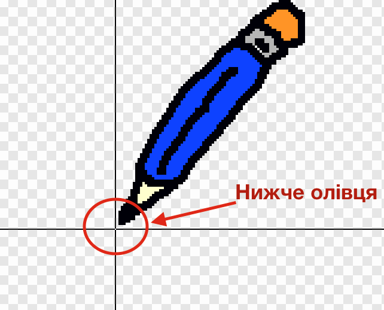

+ Перейдіть на вкладку "Скрипти", а потім перевірте ваш олівець знову - чи працює він краще, ніж раніше?

+ Далі, зробімо так, щоб олівець малював `якщо` {.blockcontrol} мишка натиснута. Додайте цей код до спрайта олівця:
    
    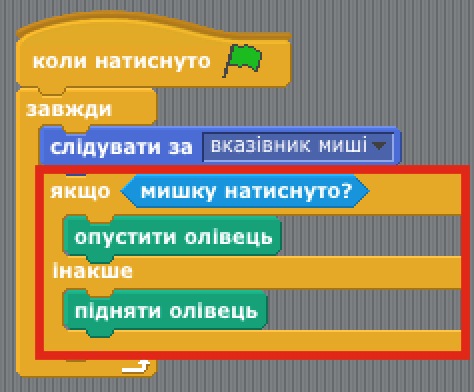

+ Ще раз перевірте ваш код. Цього разу рухайте олівець по сцені з натиснутою кнопкою мишки. Чи малює олівець?
    
    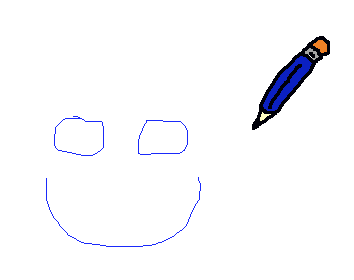

## Збережіть свій проект {.save}

# Крок 2: Кольорові олівці {.activity}

Додаймо до олівця більше кольорів та зробімо так, щоби користувач міг вибирати між ними!

## Список дій {.check}

+ Виберіть спрайт олівця, а потім на вкладці "Образи" продублюйте образ "блакитний олівець".
    
    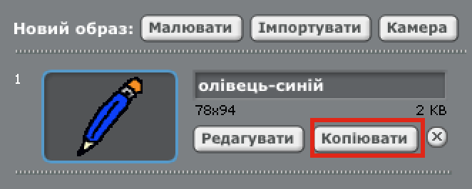

+ Перейменуйте ваш новий образ на "зелений олівець" і змініть його колір на зелений.
    
    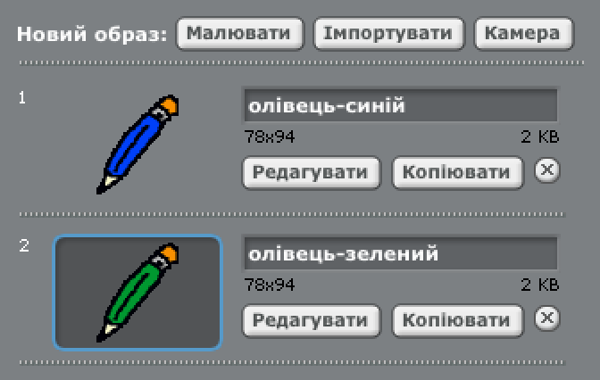

+ Створіть два нових спрайти, які ви будете використовувати, щоб вибрати блакитний або зелений олівці.
    
    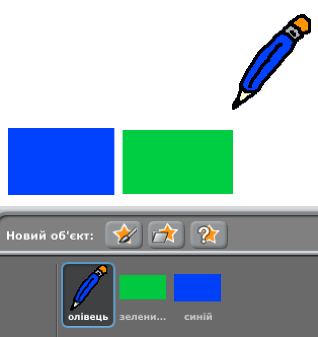

+ Коли натиснуто на зелений значок, вам потрібно `передати` {.blockevents} повідомлення для спрайта олівця, вказуючи, що потрібно змінити колір та образ олівця.
    
    Для цього, спочатку додайте цей код до зеленого значка:
    
    ```blocks
    коли спрайт натиснуто
    оповістити [green v]
```

Щоб створити блок `передати` {.blockevents}, натисніть на стрілку вниз і виберіть "нове повідомлення...".

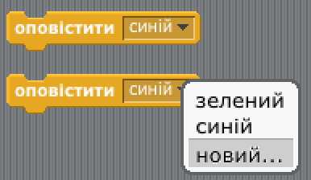

Потім можете ввести "зелений" щоб створити нове повідомлення.

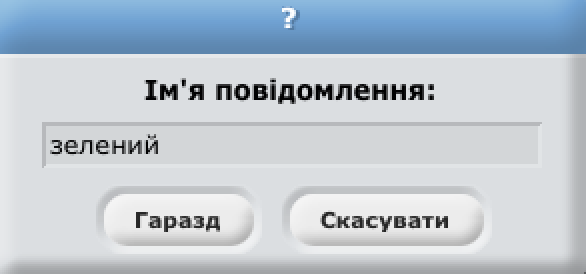

+ Тепер вам слід вказати олівцю, що робити, коли буде виводитись повідомлення. Додайте цей код до олівця:
    
    ```blocks
    коли одержую [green v]
    змінити образ на [pencil-green v]
    задати колір олівця [#00ff00]
```

Щоб олівець малював зеленим кольором, натисніть на кольорову коробку в блоці `встановити колір`{.blockpen}, і натисніть на зелений вказівник, щоб вибрати зелений колір олівця.

+ Ви тепер можете зробити теж саме з значком блакитного олівця, додаючи цей код до блакитного спрайту:
    
    ```blocks
    коли спрайт натиснуто
    оповістити [blue v]
```

і додаючи цей код до спрайту олівця:

```blocks
    коли одержую [blue v]
    змінити образ на [pencil-blue v]
    задати колір олівця [#0000ff]
```

+ Врешті, вам потрібно вказати спрайту олівця який саме образ і який колір олівця обрати, а також очищцвати екран, коли проект розпочався. Додайте цей код на початок коду олівця `коли натиснуто ⚑` {.blockevents} (перед циклом `завжди` {.blockcontrol}):
    
    ```blocks
    очистити
    змінити образ на [blue-pencil v]
    задати колір олівця [#0000ff]
```

Якщо хочете, можете почати з олівцем іншого кольору!

+ Перевірте проект. Ви можете змінити блакитну ручку на зелену і навпаки?
    
    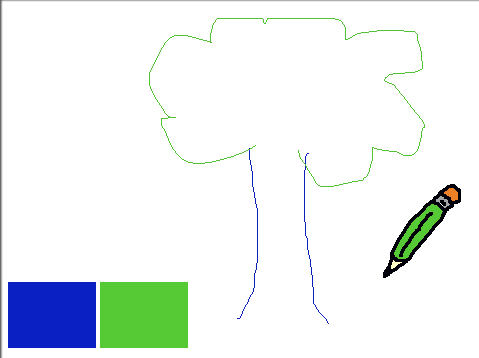

## Збережіть свій проект {.save}

# Крок 3: Виправляємо помилки {.activity.new-page}

Іноді ми помиляємось, так що давайте додамо кнопку "очистити" і стиральну гумку до нашого проекту!

## Список дій {.check}

+ Додамо кнопку, щоб очистити сцену. Для цього додайте спрайт букву 'X-block' на сцену і розфарбуйте її червоним коліром.
    
    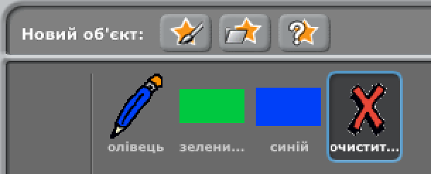

+ Додайте код до вашої нової кнопки скасування, щоб очистити сцену, коли на неї натиснути.
    
    ```blocks
    коли спрайт натиснуто
    очистити
```

Зверніть увагу, що вам не потрібно відправляти повідомлення, щоб очистити сцену, так як будь-який спрайт може це зробити!

+ Ви також можете створити стиральну гумку. Якщо ваш лідер клубу дав вам папку 'Ресурси', натисніть на посилання 'Завантажити образ з файлу' і додайте зображення 'eraser.svg'.
    
    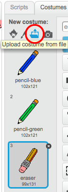
    
    Якщо ви не маєте зображення eraser.svg, просто створіть навтомість нову білу ручку!

+ Слід також додати зображення гумки як новий селектор спрайта. Ваша сцена повинна виглядати ось так:
    
    

+ Потім можете додати цей код до селектора, щоб вказати олівцю переключитись на гумку.
    
    ```blocks
    коли спрайт натиснуто
    оповістити [eraser v]
```

+ Коли олівець отримує це повідомлення, ви можете створити гумку міняючи образ олівця на гумку і міняючи колір олівця на той же колір що й сцена!
    
    ```blocks
    коли одержую [eraser v]
    змінити образ на [eraser v]
    задати колір олівця [#FFFFFF]
```

+ Перевірте ваш проект, щоб побачити чи можете ви очищати і стирати на сцені.
    
    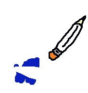

+ Існує ще одна проблема, повязана з олівцем - ви можете малювати в будь-якому місці на сцені, у тому числі біля селектора знаків!
    
    
    
    Щоб це виправити, ви повинні вказати олівцю малювати тільки тоді, коли натиснуто кнопку мишки *і* якщо y-положення мишки більше -110 (`мишка y`{.blocksensing}`> -120` {.blockoperators}). Змініть конструкцію вашого олівця `якщо` {.blockcontrol}, щоб він виглядав наступним чином:
    
    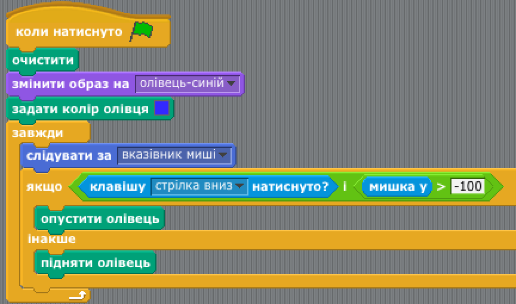

+ Перевірте ваш проект; тепер ви не мали б могти малювати біля блоків селектора.
    
    

## Збережіть свій проект {.save}

# Крок 4: Змінюємо розмір олівця {.activity.new-page}

Давайте дозволимо користувачеві малювати, використовуючи різні розміри олівця.

## Список дій {.check}

+ Спочатку додайте нову змінну під назвою "товщина". Якщо ви не впевнені, як це зробити, проект "Кулі" вам допоможе.

+ Додайте цю лінію *всередину* циклу коду олівця `завжди` {.blockcontrol}:
    
    ```blocks
    задати розмір олівця (width)
```

Тепер, товщина олівця буде постійно встановлюватись згідно зі значенням змінної "товщина".

+ Ви можете змінити число, збережене в цій змінній, натиснувши правою кнопкою мишки на змінну (на сцені) і потім на "повзунок".
    
    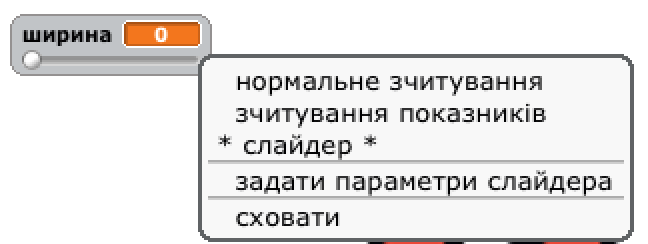
    
    Тепер ви можете перетягнути повзунок нижче змінної щоб змінити його значення.
    
    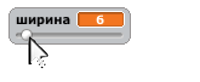

+ Перевірте ваш проект і подивіться, чи можете ви змінити товщину олівця.
    
    
    
    Якщо хочете, можете встановити мінімальне та максимальне значення "ширини", що дозволено. Для цього знову натисніть правою кнопкою мишки на вашу змінну та натисніть "встановити повзунок мін та макс ". Встановіть мінімальні та максимальні значення змінної так, щоб відчутно було різницю, як наприклад 1 і 20.
    
    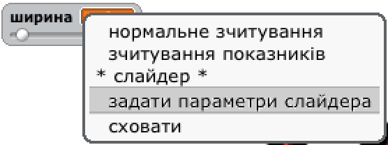
    
    Продовжіть перевіряти вашу змінну "товщина" поки ви не будете нею задоволені.

## Збережіть свій проект {.save}

## Виклик: Комбінації клавіш {.challenge}

Чи можете ви створити комбінації клавіш для ваших команд? Наприклад:

+ b = Перемикати на синю ручку
+ g = Перемкнути на зелену ручку
+ e = Перемкнути на стиральну гумку
+ c = Очистити екран

Ви б могли навіть дати можливість користувачеві змінити товщину ручки за допомогою клавіш зі стрілками!

## Збережіть свій проект {.save}

## Виклик: Ще більше олівців {.challenge}

Чи можете ви додати червоні, жовті, чорні ручки до вашої програми малювання? Ви знайдете всі зображення що вам потрібні у папці "Ресурси". Не забудьте додати ярлики для цих нових ручок!

Чи можете ви використовувати ваші ручки щоб намалювати картину?

