---
title: Створи свій власний світ
level: Scratch 2
language: uk-UA
stylesheet: scratch
embeds: "*.png"
materials: ["Club Leader Resources/*","Project Resources/*"]
...

# Вступ {.intro}

В цьому проекті Ви дізнаєтесь, як створити свою власну пригодницьку гру жанру "відкритий світ".

<div class="scratch-preview">
  <iframe allowtransparency="true" width="485" height="402" src="http://scratch.mit.edu/projects/embed/34248822/?autostart=false" frameborder="0"></iframe> 
</div>

# Крок 1: Кодування персонажа {.activity}

Розпочнемо зі створення персонажа, який може переміщуватися вашим світом.

## Список дій {.check}

+ Створіть новий проект у Скретч та видаліть спрайт кота, так щоб проект став пустим. Онлайн Скретч-редактор знаходиться за посиланням [jumpto.cc/scratch-new](http://jumpto.cc/scratch-new).

+ Для цього проекту ти повинен мати теку "Засоби проекту", що містить всі зображення, які тобі знадобляться. Переконайся, що можеш знайти цю теку, або запитай керівника свого клубу, якщо не можеш цього зробити.
    
    

+ Додайте зображення "кімната1.png" як фону для нової платформи, та зображення "персонаж.png" як фон для нового графічного об'єкта. Якщо ви не маєтк цих зображень, можете намалювати їх! Далі описано, як повинен виглядати проект:
    
    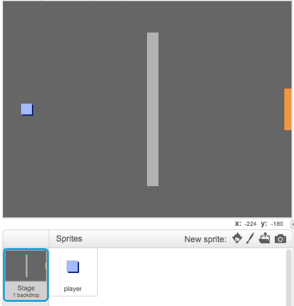

+ Використовуй клавіші зі стрілками для переміщення персонажа. Коли ти натискаєш стрілку вгору, персонаж повинен рухатись вгору, змінюючи свою у-координату. Додай цей код до спрайту персонажу:
    
    ```blocks
    коли натиснуто ⚑
    завжди
        if <key [стрілка вгору v] pressed? > then
            змінити y на (2)
        end
    end
```

+ Перевір свого персонажа, натиснувши ⚑, а потім утримуючи стрілку вгору. Чи рухається персонаж вгору?
    
    

+ Щоб перемістити персонажа вліво, тобі потрібно додати ще один блок до персонажа `if` {.blockcontrol}, який змінює координату х:
    
    ```blocks
    коли натиснуто ⚑
    завжди
        якщо < клавиша [стрілка вгору v] натиснута? > тоді
            змінити y на (2)
        кінець
        якщо < клавиша [стрілка вліво v] натиснута? > тоді
            змінити x на (-2)
        кінець
    кінець
```

## Виклик: Переміщення у всі чотири сторони {.challenge}

Ти можеш додати більше кодів до свого персонажа, так що вони зможуть рухатися вгору, вниз, вліво і вправо. Використовуй код, який вже маєш, щоб створити інші!

## Збережіть свій проект {.save}

+ Перевір свого персонажа знову, і ти побачиш, що він має здатність проходити крізь світло-сірі стіни.
    
    

+ Щоб виправити це, тобі потрібно перемістити персонажа, але потім помістити його назад, якщо він торкатиметься світло-сірої стіни. Ось код, який тобі знадобиться:
    
    ```blocks
    коли натиснуто ⚑
    завжди
        if <key [стрілка вгору v] pressed? > then
            змінити y на (2)
            if < touching color [#BABABA]? > тоді 
                змінити y на (-2)
            кінець
        кінець
    кінець
```

Зверни увагу, що новий блок `if`{.blockcontrol}`touching color`{.blocksensing} знаходиться всередині блоку `if`{.blockcontrol}`key [up arrow]`{.blocksensing}.

+ Перевір цей новий код, рухаючись до стіни - якщо все правильно, ти не зможеш переміститися всередину стіни.
    
    

+ Зробімо те ж саме для стрілки ліворуч, перемістившись назад, якщо персонаж торкається стіни. Ось як на цей час має виглядати код персонажа:
    
    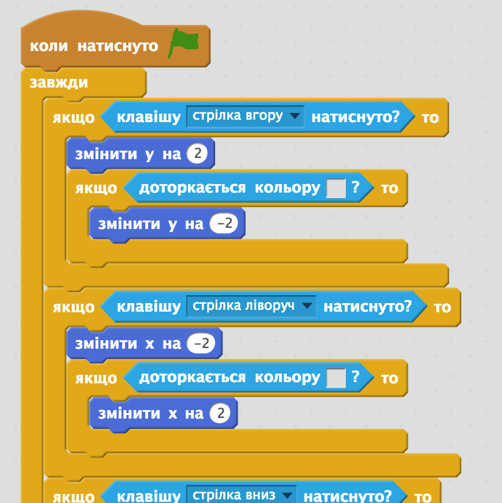

## Виклик: Закріплення рухів твого персонажа {.challenge}

Додай код до свого гравця, так щоб він не зміг проходити крізь стіни в жодному з напрямків. Щоб було простіше, використовуй код, який вже маєш!

## Збережіть свій проект {.save}

# Крок 2: Кодування твого світу {.activity}

Тепер навчимо персонажа проходити через двері до інших кімнати!

## Список дій {.check}

+ Додай ще два фони до своєї платформи ('room2.png' та 'room3.png') так, щоб в сумі мати три фони. Переконайся, що вони розташовані в правильному порядку - це допоможе тобі пізніше.
    
    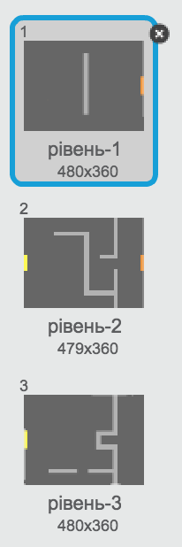

+ Тобі знадобиться нова змінна `room`{.blockdata}, щоб стежити за тим, в якій кімнаті знаходиться персонаж.
    
    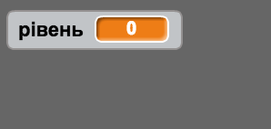

+ Коли персонаж торкається оранжевих дверей в першій кімнаті, повинен з'явитися інший фон, а персонаж повинен переміститися до лівої частини сцени. Ось код, який знадобиться - він повинен бути всередині циклу персонажа `назавжди`{.blockcontrol}:
    
    ```blocks
    if < touching color [#F2A24A] > then
        змінити тло на [наступне тло v]
        перемістити в x:(-200) y:(0)
        змінити [room v] на (1)
    end
```

+ Додайте цей код на *початок* коду персонажа (перед циклом `назавжди`{.blockcontrol}), щоб переконатися, що все скинеться до початкового положення при натисканні ⚑:
    
    ```blocks
    встановити [room v] в (1)
    перемістити в x:(-200) y:(0)
    змінити тло на [room1 v]
```

+ Натисни ⚑ та проведи свого персонажа через оранжеві двері. Чи перейшов твій персонаж на наступний екран? Чи змінилася змінна `кімната`{.blockdata} на 2?
    
    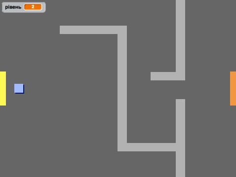

## Виклик: Перехід до попередньої кімнати {.challenge}

Чи можете змусити свого персонажа перейти до попередньої кімнати, коли він торкається жовтих дверей? Пам'ятай, що це код буде *дуже* схожим до коду, який ви вже додали для переміщення до наступної кімнати.

## Збережіть свій проект {.save}

# Крок 3: Знаки {.activity}

Додамо знаки до твого світу, щоб можна було керувати твоїм персонажем в його подорожі.

## Список дій {.check}

+ Завантажте зображення "sign.svg" як новий спрайт, перейменуйте спрайт на "знак: ласкаво просимо".
    
    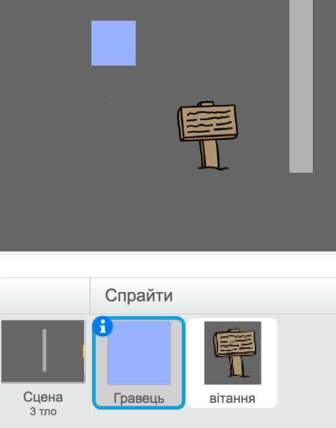

+ Цей знак відображатиметься лише в кімнаті 1, тож, аби переконатися, додамо такий код до знаку:
    
    ```blocks
    коли натиснуто ⚑
    завжди
        if < (room) = [1] > then
            показати
        інакше
            сховати
        end
    end
```

+ Протестуй свій знак, переміщаючись між кімнатами. Твій знак має відображатися лише в кімнаті 1.
    
    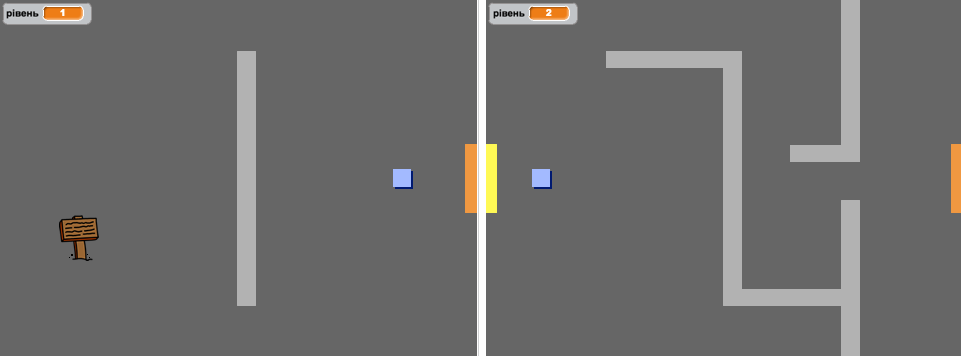

+ Знак ні для чого не годиться, якщо не має повідомлення! Додаймо інший код (в окремому блоці) щоб відобрадалось повідомлення, коли знак торкається персонажа:
    
    ```blocks
    коли натиснуто ⚑
    завжди
        if < touching [player v] ? > then
            говорити [Welcome! Can you get to the treasure?]
        інакше
            говорити []
        end
    end
```

+ Протестуйте знак: коли персонаж торкається знаку, повинно відображатися повідомлення.
    
    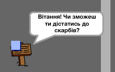

## Збережіть свій проект {.save}

## Виклик: Скарб! {.challenge}

Чи можемо додати спрайт скрині із скарбом, використовуючи зображення "chest.svg"? Цю скриню із скарбом потрібно розмістити в кімнаті 3, а коли персонаж торкається її, повинно з'являтися повідомлення "Молодець!".

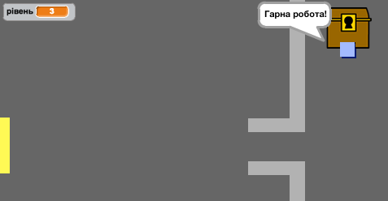

## Збережіть свій проект {.save}

# Крок 4: Люди {.activity}

Додамо інших людей до твого світу, щоб твій персонаж міг з ними взаємодіяти.

## Список дій {.check}

+ Додайте новий спрайт людини, використовуючи зображення "person.png".
    
    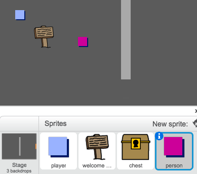

+ Додайте цей код, щоб людина змогла розмовляти з твоїм персонажем. Цей код дуже схожий з кодом для знаку:
    
    ```blocks
    коли натиснуто ⚑
    перемістити в x:(-200) y:(0)
    завжди
        if < touching [player v]? > then
            говорити [Did you know that you can go through orange and yellow doors?]
        інакше
            говорити []
        end
    end
```

+ За допомогою цих двох блоків можна дозволити персонажу пересуватися:
    
    ```blocks
    перемістити на (1) кроків
    відбивати від меж
```

Ваш персонаж буде діяти по-різному в залежності від того, де буде розміщений код: всередині циклу `назавжди` {.blockcontrol} петлі або {.blockcontrol} чи у блоку "`Якщо`". Спробуйте обидва варіанти і виберіть найкращій.

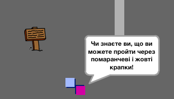

+ Чи ти помітив, що твій персонаж перевертається догори ногами? Щоб зупинити це, натисни на знак інформації на спрайті (`і`{.blockmotion}), а потім настисни на крапку, щоб виправити перевертання.
    
    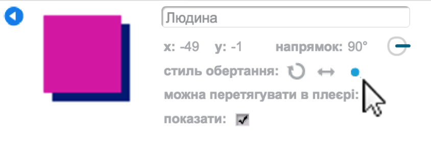

## Виклик: Удосконалення людини {.challenge}

Чи зможемо додати код до нашої нової людини так, щоб він з'являвся лише в кімнаті 1? Протестуй новий код!

## Збережіть свій проект {.save}

+ Також можете додати рухомих ворогів, через яких гра закінчується, якщо персонаж торкається до них. Додайте новий спрайт ворога та змініть стиль повертання так само, як зі спрайтом "людина".

+ Додайте код до ворогів так, щоб вони з'являлися лише в кімнаті 2.

+ Також потрібно додати код для переміщення ворога та закінчення гри, якщо ворог торкаєтсья до персонажа. Простіше це зробити в окремих блоках коду. Нижче описано, яким повинен бути код ворога:
    
    

+ Протестуй ворога і переконайся, що:
    
    + Він видимий лише в кімнаті 2;
    + Він патрулює кімнату;
    + Гра закінчуєтсья, якщо персонаж торкається до нього.

## Збережіть свій проект {.save}

## Виклик: Більше ворогів {.challenge}

Чи можемо створити іншого ворога в кімнаті 3, який би переміщався вверх-вниз через прогалину у стіні?


## Збережіть свій проект {.save}

# Крок 5: Збирання монет {.activity}

## Список дій {.check}

+ Додайте нову змінну `монети`{.blockdata} до проекту.

+ Додайте новий спрайт "монети" до проекту.


+ Додайте код до монети так, щоб вона з'являлася лише в кімнаті 1.

+ Додайте код до спрайту монети, щоб кожен раз як монету підбирають до `монети`{.blockdata} додавався 1:
    
    ```blocks
    коли натиснуто ⚑
    wait until <touching [player v] ?>
    змінити [coins v] на (1)
    зупинити [інші скрипти цього спрайту v]
    сховати
```

Код `зупинити всі інші скріпти`{.blockcontrol} потрібен для того, щоб монети в кімнаті 1 зникали після того, як їх було зібрано.

+ Також потрібно додати код, щоб встановити змінну`монети`{.blockdata} на 0 на початку гри.

+ Протестуйте проект: збирання монет повинно змінювати рахунок з 0 до 1.

## Виклик: Більше монет {.challenge}

Чи можемо додати більше монет до гри? Вони можуть знаходитись в різних кімнатах, а деякі монети навіть можуть охоронятися ворогами, які їх патрулюють.

# Крок 6: Двері і ключі {.activity}

## Список дій {.check}

+ Створіть новий спрайт з допомогою зображення "key-blue.svg". Перейдіть на тло 3 і помістіть ключ там, де було б складно досягти!
    
    

+ Переконайтесь, що ключ видно тільки в кімнаті номер 3.

+ Створить новий список змінних з ім'ям {.blockdata} `склад`. В ньому будуть зберігатися всі елементи, які збирає ваш гравець.

+ Код для збору ключів дуже схожий на код для збору монет. Різниця полягає в тому, що ви додаєте ключ до вашого складу.
    
    ```blocks
    коли натиснуто ⚑
    wait until <touching [player v] ?>
    додати [blue key] до [inventory v]
    зупинити [інші скрипти цього спрайту v]
    сховати
```

+ Перевірте ключ, щоб впевнитися, що ви можете взяти його та додати його до вашого складу. Не забудьте додати код, щоб очистити ваш склад на початку гри.
    
    ```blocks
    вилучити (все v) з [inventory v]
```

+ Створити новий спрайт з вашого зображення "door-blue.png" і розмістіть двері синього кольору у розриві між двох стін.
    
    

+ Додай код до дверей так, щоб вони були видимими лише в кімнаті 3.

+ Потрібно приховати двері синього кольору, щоб гравець пройшов повз них після того, як ключ синього кольору буде на вашому складі.
    
    ```blocks
    коли натиснуто ⚑
    wait until < [inventory v] contains [blue key] >
    зупинити [інші скрипти цього спрайту v]
    сховати
```

+ Протестуйте свію програму, щоб впевнитися, що ви можете збирати ключі синього кольору для відкривання дверей!

## Збережіть свій проект {.save}

## Завдання: Створи свій власний світ {.challenge}

Тепер можете продовжувати створення власного світу. Нижче наводиться кілька ідей:

+ Змініть налаштування гри та ігрову графіку;
+ Додайте до гри звукові ефекти та музику;
+ Додайте більше людей, ворогів, знаків та монет;
+ Додайте червоні та жовті двері, до яких потрібно створити власні ключі для відкривання;
+ Додайте більше кімнат до вашого світу;
+ Додайте інші корисні елементи до вашої гри;

+ Використовуйте монети для отримання інформації від інших людей;
    
    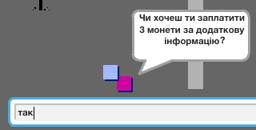

+ Можна також додати Північні та Південні двері, щоб гравець міг переміщатися між кімнатами у всіх чотирьох напрямках. Наприклад, якщо буде 9 кімнат, ви можете уявити їх у вигляді майданчика розміром 3x3 кімнати. Потім ви можете додати цифру 3 до номеру кімнати, щоб перейти на один рівень нижче.
    
    

## Збережіть свій проект {.save}