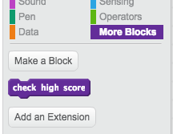

---
title: Catch the Dots
level: Scratch 2
language: zh-CN
stylesheet: scratch
embeds: "*.png"
materials: ["Club Leader Resources/*", "Project Resources/*"]
beta: true
...

# 简介 { .intro }

在这个项目中，你将学习如何构建一个颜色匹配游戏。游戏中你要操控控制器让控制器的颜色部分与小点的颜色匹配。

<div class="scratch-preview">
  <iframe allowtransparency="true" width="485" height="402" src="http://scratch.mit.edu/projects/embed/44942820/?autostart=false" frameborder="0"></iframe>
  
</div>

# 第1步: 创建控制器 { .activity }

让我们从创建控制器开始。控制器用于收集色点。

## 行动清单 { .check }

+ 新建一个Scratch项目，删除默认的小猫精灵，让项目变成一个空白项目。您可以在 <a href="http://jumpto.cc/scratch-new">jumpto.cc/scratch-new</a> 找到在线Scratch编辑器。

+ 如果你的老师给了你“资源”文件夹，点击“从本地文件中上传角色”，然后添加 'controller.svg' 图片。你要将此精灵移动到舞台的中央。

	
	
	如果你没有这张图，你可以自己画一个！
	
+ 当右箭头键按下时，控制器右转：

	```blocks
		点击绿旗时
		重复执行
		  如果 <按键 [右移键 v] 是否按下？> 那么
		      转动CW (3) 度
		  结束
		结束
	```
+ 测试你的控制器 -- 它应该向右转。

## 保存项目 { .save }

## 挑战: 向左旋转 {.challenge}
当左箭头键按下时，你能让控制器向左旋转吗？

## 保存项目 { .save }

# 第2步: 收集色点 { .activity }

让我们加入一些色点让玩家通过控制器来收集。

## 行动清单 { .check }

+ 新建一个叫'red'的精灵。这个精灵是一个红色小点。

	

+ 为'red'精灵添加如下代码，让它每隔几秒克隆一个新点：

	```blocks
		点击绿旗时
		隐藏
		等待 (2) 秒
		重复执行
		  克隆 [自己 v]
		  等待 (在 (5) 到 (10) 间随机选一个数) 秒
		结束
	```

+ 每一个克隆体创建出来后，你要把它放在舞台的4个角。

	

	要实现上述功能，首先要创建一个名叫 `start positions` 的列表变量，然后点击 `(+)` 按钮添加 `-180` 和 `180` 两个值。

	

+ 你可以用这2个列表项随机选择舞台角落。为色点精灵添加如下代码，让每一个克隆体移动到随机角落然后慢慢移向控制器。

	```blocks
		当作为克隆体启动时
		移到 x:(链表 (random v) 的第 [start positions v] 项) y:(链表 (random v) 的第 [start positions v] 项)
		面向 [controller v]
		显示
		重复执行直到 <碰到 [controller v]>
		  移动 (1) 步
		结束
	```

	上面的代码随机从`-180` 或 `180` 种选择x _和_ y的位置，这意味着每个小点会随机地出现在舞台的一个角落。

+ 测试你的项目。你应该看到很多红点出现在屏幕的每个角落，然后缓慢地移向控制器。

	

+ 创建2个变量，分别叫 `lives` {.blockdata} 和 `score` {.blockdata}。

+ 为舞台添加代码，当游戏开始时，将 `lives` {.blockdata} 设为3，将 `score` {.blockdata} 设为0。

+ 你需要在红点的`when I start as a clone` {.blockcontrol} 代码块末尾添加代码，当控制器颜色与色点颜色匹配时 `score` {.blockdata} 加1，当不匹配时 `lives` {.blockdata} 减1。

	```blocks
		移动 (5) 步
		如果 <碰到颜色 [#FF0000]> 那么
		  将变量 [score v] 的值增加 (1)
		  播放声音 [pop v]
		否则
		  将变量 [lives v] 的值增加 (-1)
		  播放声音 [laser1 v]
		结束
		删除本克隆体
	```

+ 在舞台代码的末尾添加如下代码，当玩家失去所有生命时游戏结束：

	```blocks
		在 <(lives) < [1]> 之前一直等待
		停止 [全部 v]
	```

+ 测试你的游戏，确保代码工作正常。

## 保存项目 { .save }

## 挑战: 更多色点 {.challenge}
将创建“红色”色点精灵的步骤重复2次，创建“黄色”和“蓝色”色点。


编辑精灵（包括代码），确保每个色点可以匹配控制器上正确的颜色。记得测试你的项目，确保你可以正确地得分或失去生命，并且确保游戏既不过分简单，又不太难！


## 保存项目 { .save }

# 第3步: 提高难度 { .activity .new-page}

让我们通过慢慢减小色点出现的时间间隔来让游戏越来越难。

## 行动清单 { .check }

+ 创建一个名为 `delay` {.blockdata} 的变量。

+ 在舞台上，创建一个代码将delay变量设一个较高的初始值，然后缓慢地减小延迟时间。

	```blocks
		点击绿旗时
		将变量 [delay v] 的值设定为 (8)
		重复执行直到 <(delay) = (2)>
		  等待 (10) 秒
		  将变量 [delay v] 的值增加 (-0.5)
		结束
	```

	注意，这里与游戏计时器非常的相似！

+ 最后，你可以在红色、黄色和蓝色色点上使用 `delay` {.blockdata} 变量。移除两次克隆间等待随机秒的代码，替换为新建的 `delay` {.blockdata} 变量： 

	```blocks
		等待 (delay) 秒
	```

+ 测试新建的 `delay` {.blockdata} 变量，观察小球出现的间隔是否在缓慢减少。`delay` {.blockdata} 变量对3种颜色的小球都适用吗？你能看到  `delay` {.blockdata} 变量的值在减少吗？

## 保存项目 { .save }

## 挑战: 加速色点移动 {.challenge}
你能通过添加 `speed` {.blockdata} 变量来让小球逐渐加快速度吗？实现方法跟上面的 `delay` {.blockdata} 变量非常相似。你可以参考 `delay` {.blockdata} 变量的实现方法。

## 保存项目 { .save }

# 第4步: 最高分 { .activity }

让我们保存最高分，让我家知道自己玩得到底怎么样。

## 行动清单 { .check }

+ 创建一个名叫 `high score` {.blockdata} 的变量。

+ 点击舞台，创建一个自定义模块，名叫`check high score` {.blockmoreblocks}。

	

+ 在游戏结束前，加入该自定义模块。

	

+ 向自定义模块中加入如下代码，`如果` {.blockcontrol} 当前 `score` {.blockdata} 是最高分的话，则将当前 `score` {.blockdata} 保存为 `high score` {.blockdata} 

	```blocks
		定义 [object Object]
		如果 <(score) > (high score)> 那么
		  将变量 [high score v] 的值设定为 (score)
		结束
	```

+ 测试新加入的代码。检查 `high score` {.blockdata} 是否被正确地更新。

## 保存项目 { .save }

## 挑战: 优化游戏! {.challenge}
你能想到其他优化游戏的方法吗？比如，你可以创建特殊色点：

+ 双倍分数;
+ 减慢速度;
+ 隐藏屏幕上所有其他色点!

## 保存项目 { .save }

## 挑战: 游戏菜单 {.challenge}
你能为你的游戏添加一个菜单（带按钮）吗？你可以添加一个引导界面，或者一大单独显示最高分的界面。如果你觉得有困难，可以参考'Brain Game'项目。


